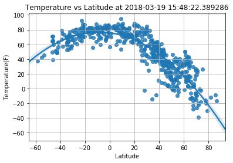
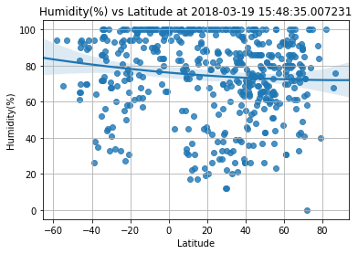
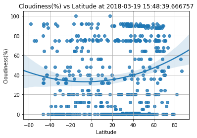
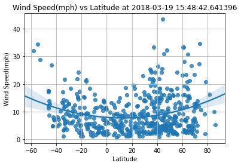
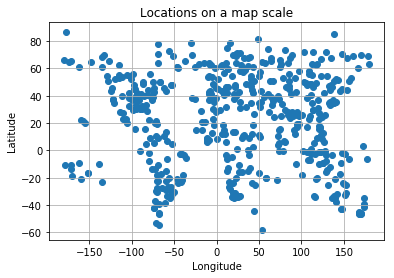

# WeatherPy - A Random sampling of weather across 500 points on the globe

### These are the trends of analysis from the plots:

<table>
<tr><th>Serial #</th><th>Observation</th></tr>
<tr><td>1</td><td>The temperatures vary parabolically from North pole to the South pole being at the peak near the equator.</td></tr>
<tr><td>2</td><td>The temparatures in the Northern Hemisphere towards the North pole are lower than those in the Southern hemisphere nearer to the South pole as it is winter here and summer in the southern hemisphere. </td></tr>
<tr><td>3</td><td>The wind speeds increase as you get closer to the poles</td></tr>
</table>

#### Import the main libraries to get points across the globe


```python
##Import all necessary libraries
from citipy import citipy

import numpy as np

import pandas as pd

import requests

import json

from pprint import pprint
```

#### Generate 500 random coordinates across the globe - Latitude between -90 and 90, Longitude between -180 and 180


```python
##Generate 500 unique cities and store their lat and long
cityData = {}
dupcities = 0
while(len(cityData.keys()) <500):
    latmultiplier = np.random.choice([90,-90])
    lat = latmultiplier * np.random.ranf()
    longmultipler = np.random.choice([180,-180])
    lng = longmultipler*np.random.ranf()
    city = citipy.nearest_city(lat,lng)
    if(city.city_name in cityData.keys()):
        dupcities = dupcities+1
    cityData[city.city_name] = {"lat":lat,"long":lng}
    

citynames = cityData.keys()


```

#### Create the base URL to query OpenWeatherMap


```python
#Build the base URL for querying
url = "http://api.openweathermap.org/data/2.5/weather?APPID=759e0be245e547516d5ec03ed956d772&units=imperial"
```

#### Create a method to extract the data we are interested in


```python
# Method to extract weather data we are interested in
def extractWeatherData(jsondata):
    weatherdata = {}
    weatherdata["lat"] = jsondata["coord"]["lat"]
    weatherdata["lon"] = jsondata["coord"]["lon"]
    weatherdata["temp"] = jsondata["main"]["temp"]
    weatherdata["humidity"] = jsondata["main"]["humidity"]
    weatherdata["cloudiness"] = jsondata["clouds"]["all"]
    weatherdata["windspeed"] = jsondata["wind"]["speed"]
    return weatherdata
```

#### Start querying for the city data we have. If city name fails, use just lat and long to query. Log the queries as they happen


```python
#Query open weather API for weather data
#Create a dictionary of the data
#First query by name and if that fails use lat and long

extractedweatherdata = {}
index = 1
print("--------------------------------------------------------------------------------------------")
print("Beginning data retrieval")
print("--------------------------------------------------------------------------------------------")
for city in cityData.keys():
    requrl = url+"&q="+city+"&lat="+str(cityData[city]["lat"])  +"&lon="+str(cityData[city]["long"])
    print("Processing Record " + str(index) + " of Set 1 | " + city)
    index = index+1
    print(requrl)
    try:
        jsonData = requests.get(requrl).json()
        extractedweatherdata[city] = extractWeatherData(jsonData)
    except KeyError:
        print(f"Unable to get {city} data by name using lat and long instead")
        requrl = url+"&lat="+str(cityData[city]["lat"])  +"&lon="+str(cityData[city]["long"])
        print("Processing Record " + str(index-1) + " using lat and long of Set 1 | " + city)
        jsonData = requests.get(requrl).json()
        extractedweatherdata[city] = extractWeatherData(jsonData)

print("--------------------------------------------------------------------------------------------")
print("Data retrieval complete")
print("--------------------------------------------------------------------------------------------")
```

    --------------------------------------------------------------------------------------------
    Beginning data retrieval
    --------------------------------------------------------------------------------------------
    Processing Record 1 of Set 1 | hilo
    http://api.openweathermap.org/data/2.5/weather?APPID=759e0be245e547516d5ec03ed956d772&units=imperial&q=hilo&lat=21.264214362&lon=-143.380629157
    Processing Record 2 of Set 1 | plouzane
    http://api.openweathermap.org/data/2.5/weather?APPID=759e0be245e547516d5ec03ed956d772&units=imperial&q=plouzane&lat=48.2524271847&lon=-4.91222674236
    Processing Record 3 of Set 1 | port-cartier
    http://api.openweathermap.org/data/2.5/weather?APPID=759e0be245e547516d5ec03ed956d772&units=imperial&q=port-cartier&lat=55.5485799654&lon=-68.8710427569
    Processing Record 4 of Set 1 | ilulissat
    http://api.openweathermap.org/data/2.5/weather?APPID=759e0be245e547516d5ec03ed956d772&units=imperial&q=ilulissat&lat=78.5598976324&lon=-43.8651537129
    Processing Record 5 of Set 1 | faanui
    http://api.openweathermap.org/data/2.5/weather?APPID=759e0be245e547516d5ec03ed956d772&units=imperial&q=faanui&lat=-15.4693843826&lon=-151.987390277
    Processing Record 6 of Set 1 | clarence town
    http://api.openweathermap.org/data/2.5/weather?APPID=759e0be245e547516d5ec03ed956d772&units=imperial&q=clarence town&lat=23.3256731732&lon=-76.4540144989
    Processing Record 7 of Set 1 | muros
    http://api.openweathermap.org/data/2.5/weather?APPID=759e0be245e547516d5ec03ed956d772&units=imperial&q=muros&lat=41.6029283595&lon=-14.6399816182
    Processing Record 8 of Set 1 | kaitangata
    http://api.openweathermap.org/data/2.5/weather?APPID=759e0be245e547516d5ec03ed956d772&units=imperial&q=kaitangata&lat=-50.9402332387&lon=170.443538799
    Processing Record 9 of Set 1 | punta arenas
    http://api.openweathermap.org/data/2.5/weather?APPID=759e0be245e547516d5ec03ed956d772&units=imperial&q=punta arenas&lat=-82.6806262058&lon=-98.3394666959
    Processing Record 10 of Set 1 | castro
    http://api.openweathermap.org/data/2.5/weather?APPID=759e0be245e547516d5ec03ed956d772&units=imperial&q=castro&lat=-51.3080044265&lon=-108.914246797
    Processing Record 11 of Set 1 | provideniya
    http://api.openweathermap.org/data/2.5/weather?APPID=759e0be245e547516d5ec03ed956d772&units=imperial&q=provideniya&lat=46.9122666332&lon=-177.812737438
    Processing Record 12 of Set 1 | port alfred
    http://api.openweathermap.org/data/2.5/weather?APPID=759e0be245e547516d5ec03ed956d772&units=imperial&q=port alfred&lat=-55.1667210561&lon=39.4741532561
    Processing Record 13 of Set 1 | muzhi
    http://api.openweathermap.org/data/2.5/weather?APPID=759e0be245e547516d5ec03ed956d772&units=imperial&q=muzhi&lat=64.8690092188&lon=65.2110588958
    Processing Record 14 of Set 1 | chuy
    http://api.openweathermap.org/data/2.5/weather?APPID=759e0be245e547516d5ec03ed956d772&units=imperial&q=chuy&lat=-45.8321647202&lon=-40.9431509308
    Processing Record 15 of Set 1 | copiapo
    http://api.openweathermap.org/data/2.5/weather?APPID=759e0be245e547516d5ec03ed956d772&units=imperial&q=copiapo&lat=-27.4015163162&lon=-69.1058692231
    Processing Record 16 of Set 1 | tuktoyaktuk
    http://api.openweathermap.org/data/2.5/weather?APPID=759e0be245e547516d5ec03ed956d772&units=imperial&q=tuktoyaktuk&lat=71.9518915527&lon=-132.245490436
    Processing Record 17 of Set 1 | ribeira grande
    http://api.openweathermap.org/data/2.5/weather?APPID=759e0be245e547516d5ec03ed956d772&units=imperial&q=ribeira grande&lat=41.0002230232&lon=-37.3655568203
    Processing Record 18 of Set 1 | hermanus
    http://api.openweathermap.org/data/2.5/weather?APPID=759e0be245e547516d5ec03ed956d772&units=imperial&q=hermanus&lat=-50.2182834943&lon=14.9699400985
    Processing Record 19 of Set 1 | drayton valley
    http://api.openweathermap.org/data/2.5/weather?APPID=759e0be245e547516d5ec03ed956d772&units=imperial&q=drayton valley&lat=53.0374376141&lon=-115.699403934
    Processing Record 20 of Set 1 | albany
    http://api.openweathermap.org/data/2.5/weather?APPID=759e0be245e547516d5ec03ed956d772&units=imperial&q=albany&lat=-86.0088935153&lon=108.991525451
    Processing Record 21 of Set 1 | portpatrick
    http://api.openweathermap.org/data/2.5/weather?APPID=759e0be245e547516d5ec03ed956d772&units=imperial&q=portpatrick&lat=54.0619623503&lon=-4.9412015386
    Unable to get portpatrick data by name using lat and long instead
    Processing Record 21 using lat and long of Set 1 | portpatrick
    Processing Record 22 of Set 1 | pevek
    http://api.openweathermap.org/data/2.5/weather?APPID=759e0be245e547516d5ec03ed956d772&units=imperial&q=pevek&lat=78.7967556984&lon=172.171753558
    Processing Record 23 of Set 1 | taolanaro
    http://api.openweathermap.org/data/2.5/weather?APPID=759e0be245e547516d5ec03ed956d772&units=imperial&q=taolanaro&lat=-58.1477072611&lon=53.9139003945
    Unable to get taolanaro data by name using lat and long instead
    Processing Record 23 using lat and long of Set 1 | taolanaro
    Processing Record 24 of Set 1 | namibe
    http://api.openweathermap.org/data/2.5/weather?APPID=759e0be245e547516d5ec03ed956d772&units=imperial&q=namibe&lat=-18.6013347605&lon=4.11315859138
    Processing Record 25 of Set 1 | port-de-paix
    http://api.openweathermap.org/data/2.5/weather?APPID=759e0be245e547516d5ec03ed956d772&units=imperial&q=port-de-paix&lat=20.2603241252&lon=-72.6851031258
    Unable to get port-de-paix data by name using lat and long instead
    Processing Record 25 using lat and long of Set 1 | port-de-paix
    Processing Record 26 of Set 1 | monrovia
    http://api.openweathermap.org/data/2.5/weather?APPID=759e0be245e547516d5ec03ed956d772&units=imperial&q=monrovia&lat=3.63713992473&lon=-12.4310747357
    Processing Record 27 of Set 1 | muroto
    http://api.openweathermap.org/data/2.5/weather?APPID=759e0be245e547516d5ec03ed956d772&units=imperial&q=muroto&lat=32.9385780255&lon=134.196779603
    Processing Record 28 of Set 1 | roald
    http://api.openweathermap.org/data/2.5/weather?APPID=759e0be245e547516d5ec03ed956d772&units=imperial&q=roald&lat=71.004344591&lon=2.29913991096
    Processing Record 29 of Set 1 | luangwa
    http://api.openweathermap.org/data/2.5/weather?APPID=759e0be245e547516d5ec03ed956d772&units=imperial&q=luangwa&lat=-15.0617259033&lon=30.1994692354
    Processing Record 30 of Set 1 | plettenberg bay
    http://api.openweathermap.org/data/2.5/weather?APPID=759e0be245e547516d5ec03ed956d772&units=imperial&q=plettenberg bay&lat=-35.5567224244&lon=23.1836514267
    Processing Record 31 of Set 1 | vaitape
    http://api.openweathermap.org/data/2.5/weather?APPID=759e0be245e547516d5ec03ed956d772&units=imperial&q=vaitape&lat=-17.5160039431&lon=-152.580699086
    Processing Record 32 of Set 1 | torbay
    http://api.openweathermap.org/data/2.5/weather?APPID=759e0be245e547516d5ec03ed956d772&units=imperial&q=torbay&lat=35.7255342981&lon=-43.9028300568
    Processing Record 33 of Set 1 | caravelas
    http://api.openweathermap.org/data/2.5/weather?APPID=759e0be245e547516d5ec03ed956d772&units=imperial&q=caravelas&lat=-18.8981135285&lon=-30.2126306353
    Processing Record 34 of Set 1 | thompson
    http://api.openweathermap.org/data/2.5/weather?APPID=759e0be245e547516d5ec03ed956d772&units=imperial&q=thompson&lat=63.3704281196&lon=-90.1920465533
    Processing Record 35 of Set 1 | yellowknife
    http://api.openweathermap.org/data/2.5/weather?APPID=759e0be245e547516d5ec03ed956d772&units=imperial&q=yellowknife&lat=67.6577569667&lon=-118.778653511
    Processing Record 36 of Set 1 | grand river south east
    http://api.openweathermap.org/data/2.5/weather?APPID=759e0be245e547516d5ec03ed956d772&units=imperial&q=grand river south east&lat=-21.7700450851&lon=71.1902255981
    Unable to get grand river south east data by name using lat and long instead
    Processing Record 36 using lat and long of Set 1 | grand river south east
    Processing Record 37 of Set 1 | pudozh
    http://api.openweathermap.org/data/2.5/weather?APPID=759e0be245e547516d5ec03ed956d772&units=imperial&q=pudozh&lat=61.8791451112&lon=37.4270854604
    Processing Record 38 of Set 1 | kapaa
    http://api.openweathermap.org/data/2.5/weather?APPID=759e0be245e547516d5ec03ed956d772&units=imperial&q=kapaa&lat=22.4889671128&lon=-170.192721946
    Processing Record 39 of Set 1 | chokurdakh
    http://api.openweathermap.org/data/2.5/weather?APPID=759e0be245e547516d5ec03ed956d772&units=imperial&q=chokurdakh&lat=85.7191221199&lon=144.024967527
    Processing Record 40 of Set 1 | saleaula
    http://api.openweathermap.org/data/2.5/weather?APPID=759e0be245e547516d5ec03ed956d772&units=imperial&q=saleaula&lat=-10.3732860178&lon=-171.34152892
    Unable to get saleaula data by name using lat and long instead
    Processing Record 40 using lat and long of Set 1 | saleaula
    Processing Record 41 of Set 1 | talawdi
    http://api.openweathermap.org/data/2.5/weather?APPID=759e0be245e547516d5ec03ed956d772&units=imperial&q=talawdi&lat=10.2006766874&lon=30.9158428908
    Unable to get talawdi data by name using lat and long instead
    Processing Record 41 using lat and long of Set 1 | talawdi
    Processing Record 42 of Set 1 | ushuaia
    http://api.openweathermap.org/data/2.5/weather?APPID=759e0be245e547516d5ec03ed956d772&units=imperial&q=ushuaia&lat=-86.2916263529&lon=-56.8756273212
    Processing Record 43 of Set 1 | sitka
    http://api.openweathermap.org/data/2.5/weather?APPID=759e0be245e547516d5ec03ed956d772&units=imperial&q=sitka&lat=55.2977141772&lon=-140.930562116
    Processing Record 44 of Set 1 | port moresby
    http://api.openweathermap.org/data/2.5/weather?APPID=759e0be245e547516d5ec03ed956d772&units=imperial&q=port moresby&lat=-10.665260468&lon=145.695226759
    Processing Record 45 of Set 1 | tiksi
    http://api.openweathermap.org/data/2.5/weather?APPID=759e0be245e547516d5ec03ed956d772&units=imperial&q=tiksi&lat=85.9586002004&lon=127.421632939
    Processing Record 46 of Set 1 | jamestown
    http://api.openweathermap.org/data/2.5/weather?APPID=759e0be245e547516d5ec03ed956d772&units=imperial&q=jamestown&lat=-34.918180461&lon=-19.3817146166
    Processing Record 47 of Set 1 | cockburn town
    http://api.openweathermap.org/data/2.5/weather?APPID=759e0be245e547516d5ec03ed956d772&units=imperial&q=cockburn town&lat=24.7179348269&lon=-73.1122514083
    Processing Record 48 of Set 1 | minuri
    http://api.openweathermap.org/data/2.5/weather?APPID=759e0be245e547516d5ec03ed956d772&units=imperial&q=minuri&lat=16.0823544094&lon=122.639030106
    Processing Record 49 of Set 1 | bogorodskoye
    http://api.openweathermap.org/data/2.5/weather?APPID=759e0be245e547516d5ec03ed956d772&units=imperial&q=bogorodskoye&lat=57.1695016874&lon=40.9696274663
    Processing Record 50 of Set 1 | vaini
    http://api.openweathermap.org/data/2.5/weather?APPID=759e0be245e547516d5ec03ed956d772&units=imperial&q=vaini&lat=-57.3800615025&lon=-168.180890265
    Processing Record 51 of Set 1 | avarua
    http://api.openweathermap.org/data/2.5/weather?APPID=759e0be245e547516d5ec03ed956d772&units=imperial&q=avarua&lat=-13.0687142253&lon=-159.450051443
    Processing Record 52 of Set 1 | new norfolk
    http://api.openweathermap.org/data/2.5/weather?APPID=759e0be245e547516d5ec03ed956d772&units=imperial&q=new norfolk&lat=-87.5963315634&lon=125.63507538
    Processing Record 53 of Set 1 | hobart
    http://api.openweathermap.org/data/2.5/weather?APPID=759e0be245e547516d5ec03ed956d772&units=imperial&q=hobart&lat=-46.8472349125&lon=156.610143414
    Processing Record 54 of Set 1 | kruisfontein
    http://api.openweathermap.org/data/2.5/weather?APPID=759e0be245e547516d5ec03ed956d772&units=imperial&q=kruisfontein&lat=-52.1771647812&lon=26.2850403519
    Processing Record 55 of Set 1 | tasiilaq
    http://api.openweathermap.org/data/2.5/weather?APPID=759e0be245e547516d5ec03ed956d772&units=imperial&q=tasiilaq&lat=55.2870886149&lon=-35.4683585119
    Processing Record 56 of Set 1 | paraiba do sul
    http://api.openweathermap.org/data/2.5/weather?APPID=759e0be245e547516d5ec03ed956d772&units=imperial&q=paraiba do sul&lat=-22.1121970374&lon=-43.4752875418
    Processing Record 57 of Set 1 | puerto ayora
    http://api.openweathermap.org/data/2.5/weather?APPID=759e0be245e547516d5ec03ed956d772&units=imperial&q=puerto ayora&lat=2.17203639888&lon=-98.7975279259
    Processing Record 58 of Set 1 | khatanga
    http://api.openweathermap.org/data/2.5/weather?APPID=759e0be245e547516d5ec03ed956d772&units=imperial&q=khatanga&lat=87.5123228512&lon=97.6114838743
    Processing Record 59 of Set 1 | mindelo
    http://api.openweathermap.org/data/2.5/weather?APPID=759e0be245e547516d5ec03ed956d772&units=imperial&q=mindelo&lat=15.6107719987&lon=-27.6519219729
    Processing Record 60 of Set 1 | pokhara
    http://api.openweathermap.org/data/2.5/weather?APPID=759e0be245e547516d5ec03ed956d772&units=imperial&q=pokhara&lat=29.8711100814&lon=85.381888534
    Processing Record 61 of Set 1 | galle
    http://api.openweathermap.org/data/2.5/weather?APPID=759e0be245e547516d5ec03ed956d772&units=imperial&q=galle&lat=2.76398132658&lon=78.1912782623
    Processing Record 62 of Set 1 | ancud
    http://api.openweathermap.org/data/2.5/weather?APPID=759e0be245e547516d5ec03ed956d772&units=imperial&q=ancud&lat=-40.8940864907&lon=-102.238374179
    Processing Record 63 of Set 1 | touros
    http://api.openweathermap.org/data/2.5/weather?APPID=759e0be245e547516d5ec03ed956d772&units=imperial&q=touros&lat=4.51549451227&lon=-30.2035762805
    Processing Record 64 of Set 1 | mataura
    http://api.openweathermap.org/data/2.5/weather?APPID=759e0be245e547516d5ec03ed956d772&units=imperial&q=mataura&lat=-43.5384626833&lon=-151.751039478
    Processing Record 65 of Set 1 | vermilion
    http://api.openweathermap.org/data/2.5/weather?APPID=759e0be245e547516d5ec03ed956d772&units=imperial&q=vermilion&lat=53.1366801678&lon=-111.066571893
    Processing Record 66 of Set 1 | kodiak
    http://api.openweathermap.org/data/2.5/weather?APPID=759e0be245e547516d5ec03ed956d772&units=imperial&q=kodiak&lat=43.9676676197&lon=-156.159512177
    Processing Record 67 of Set 1 | asayita
    http://api.openweathermap.org/data/2.5/weather?APPID=759e0be245e547516d5ec03ed956d772&units=imperial&q=asayita&lat=12.0736694941&lon=41.9649814427
    Unable to get asayita data by name using lat and long instead
    Processing Record 67 using lat and long of Set 1 | asayita
    Processing Record 68 of Set 1 | rikitea
    http://api.openweathermap.org/data/2.5/weather?APPID=759e0be245e547516d5ec03ed956d772&units=imperial&q=rikitea&lat=-55.2520334896&lon=-119.010067705
    Processing Record 69 of Set 1 | busselton
    http://api.openweathermap.org/data/2.5/weather?APPID=759e0be245e547516d5ec03ed956d772&units=imperial&q=busselton&lat=-73.2503608937&lon=81.3436785231
    Processing Record 70 of Set 1 | karwar
    http://api.openweathermap.org/data/2.5/weather?APPID=759e0be245e547516d5ec03ed956d772&units=imperial&q=karwar&lat=13.3671345975&lon=71.4885780274
    Processing Record 71 of Set 1 | payson
    http://api.openweathermap.org/data/2.5/weather?APPID=759e0be245e547516d5ec03ed956d772&units=imperial&q=payson&lat=39.462215935&lon=-111.735899021
    Processing Record 72 of Set 1 | ailigandi
    http://api.openweathermap.org/data/2.5/weather?APPID=759e0be245e547516d5ec03ed956d772&units=imperial&q=ailigandi&lat=9.65045147715&lon=-77.9216281307
    Processing Record 73 of Set 1 | mechetinskaya
    http://api.openweathermap.org/data/2.5/weather?APPID=759e0be245e547516d5ec03ed956d772&units=imperial&q=mechetinskaya&lat=46.5412150883&lon=40.3945194193
    Processing Record 74 of Set 1 | zaysan
    http://api.openweathermap.org/data/2.5/weather?APPID=759e0be245e547516d5ec03ed956d772&units=imperial&q=zaysan&lat=46.8044738706&lon=84.9838131651
    Processing Record 75 of Set 1 | butaritari
    http://api.openweathermap.org/data/2.5/weather?APPID=759e0be245e547516d5ec03ed956d772&units=imperial&q=butaritari&lat=18.8191502728&lon=161.240599099
    Processing Record 76 of Set 1 | belushya guba
    http://api.openweathermap.org/data/2.5/weather?APPID=759e0be245e547516d5ec03ed956d772&units=imperial&q=belushya guba&lat=81.7136033021&lon=49.0263279653
    Unable to get belushya guba data by name using lat and long instead
    Processing Record 76 using lat and long of Set 1 | belushya guba
    Processing Record 77 of Set 1 | hazorasp
    http://api.openweathermap.org/data/2.5/weather?APPID=759e0be245e547516d5ec03ed956d772&units=imperial&q=hazorasp&lat=40.1382281243&lon=60.3032947174
    Processing Record 78 of Set 1 | qaanaaq
    http://api.openweathermap.org/data/2.5/weather?APPID=759e0be245e547516d5ec03ed956d772&units=imperial&q=qaanaaq&lat=87.8736404668&lon=-86.3326578447
    Processing Record 79 of Set 1 | lithakia
    http://api.openweathermap.org/data/2.5/weather?APPID=759e0be245e547516d5ec03ed956d772&units=imperial&q=lithakia&lat=37.1482243201&lon=20.3700834955
    Processing Record 80 of Set 1 | clyde river
    http://api.openweathermap.org/data/2.5/weather?APPID=759e0be245e547516d5ec03ed956d772&units=imperial&q=clyde river&lat=68.910935759&lon=-69.3108566548
    Processing Record 81 of Set 1 | georgetown
    http://api.openweathermap.org/data/2.5/weather?APPID=759e0be245e547516d5ec03ed956d772&units=imperial&q=georgetown&lat=33.5308921695&lon=-79.6586263098
    Processing Record 82 of Set 1 | sao joao da barra
    http://api.openweathermap.org/data/2.5/weather?APPID=759e0be245e547516d5ec03ed956d772&units=imperial&q=sao joao da barra&lat=-34.2865534163&lon=-23.0963378119
    Processing Record 83 of Set 1 | remedios
    http://api.openweathermap.org/data/2.5/weather?APPID=759e0be245e547516d5ec03ed956d772&units=imperial&q=remedios&lat=7.102568758&lon=-74.2430119196
    Processing Record 84 of Set 1 | filadelfia
    http://api.openweathermap.org/data/2.5/weather?APPID=759e0be245e547516d5ec03ed956d772&units=imperial&q=filadelfia&lat=-21.2503082625&lon=-60.4722693489
    Processing Record 85 of Set 1 | yanchukan
    http://api.openweathermap.org/data/2.5/weather?APPID=759e0be245e547516d5ec03ed956d772&units=imperial&q=yanchukan&lat=55.5218132517&lon=112.777027346
    Unable to get yanchukan data by name using lat and long instead
    Processing Record 85 using lat and long of Set 1 | yanchukan
    Processing Record 86 of Set 1 | karpathos
    http://api.openweathermap.org/data/2.5/weather?APPID=759e0be245e547516d5ec03ed956d772&units=imperial&q=karpathos&lat=33.5324106577&lon=28.5512921653
    Processing Record 87 of Set 1 | west plains
    http://api.openweathermap.org/data/2.5/weather?APPID=759e0be245e547516d5ec03ed956d772&units=imperial&q=west plains&lat=36.551573599&lon=-91.3380156121
    Processing Record 88 of Set 1 | attawapiskat
    http://api.openweathermap.org/data/2.5/weather?APPID=759e0be245e547516d5ec03ed956d772&units=imperial&q=attawapiskat&lat=55.6247380938&lon=-78.8810825801
    Unable to get attawapiskat data by name using lat and long instead
    Processing Record 88 using lat and long of Set 1 | attawapiskat
    Processing Record 89 of Set 1 | oksfjord
    http://api.openweathermap.org/data/2.5/weather?APPID=759e0be245e547516d5ec03ed956d772&units=imperial&q=oksfjord&lat=73.0118455722&lon=22.1486135414
    Processing Record 90 of Set 1 | darhan
    http://api.openweathermap.org/data/2.5/weather?APPID=759e0be245e547516d5ec03ed956d772&units=imperial&q=darhan&lat=46.0963870905&lon=109.249619773
    Processing Record 91 of Set 1 | mar del plata
    http://api.openweathermap.org/data/2.5/weather?APPID=759e0be245e547516d5ec03ed956d772&units=imperial&q=mar del plata&lat=-59.3334310205&lon=-31.9441655504
    Processing Record 92 of Set 1 | yatsuo
    http://api.openweathermap.org/data/2.5/weather?APPID=759e0be245e547516d5ec03ed956d772&units=imperial&q=yatsuo&lat=36.4649880436&lon=137.183677626
    Processing Record 93 of Set 1 | pekin
    http://api.openweathermap.org/data/2.5/weather?APPID=759e0be245e547516d5ec03ed956d772&units=imperial&q=pekin&lat=40.4388964834&lon=-89.6985662026
    Processing Record 94 of Set 1 | illoqqortoormiut
    http://api.openweathermap.org/data/2.5/weather?APPID=759e0be245e547516d5ec03ed956d772&units=imperial&q=illoqqortoormiut&lat=78.8449206159&lon=-29.7932306008
    Unable to get illoqqortoormiut data by name using lat and long instead
    Processing Record 94 using lat and long of Set 1 | illoqqortoormiut
    Processing Record 95 of Set 1 | east london
    http://api.openweathermap.org/data/2.5/weather?APPID=759e0be245e547516d5ec03ed956d772&units=imperial&q=east london&lat=-63.4687051974&lon=50.2248370305
    Processing Record 96 of Set 1 | toungoo
    http://api.openweathermap.org/data/2.5/weather?APPID=759e0be245e547516d5ec03ed956d772&units=imperial&q=toungoo&lat=19.0896811112&lon=96.7914094629
    Unable to get toungoo data by name using lat and long instead
    Processing Record 96 using lat and long of Set 1 | toungoo
    Processing Record 97 of Set 1 | vardo
    http://api.openweathermap.org/data/2.5/weather?APPID=759e0be245e547516d5ec03ed956d772&units=imperial&q=vardo&lat=87.9630666638&lon=38.0046073841
    Processing Record 98 of Set 1 | ostrovnoy
    http://api.openweathermap.org/data/2.5/weather?APPID=759e0be245e547516d5ec03ed956d772&units=imperial&q=ostrovnoy&lat=74.9851409803&lon=39.0270359002
    Processing Record 99 of Set 1 | kavaratti
    http://api.openweathermap.org/data/2.5/weather?APPID=759e0be245e547516d5ec03ed956d772&units=imperial&q=kavaratti&lat=9.62635588633&lon=73.1862252407
    Processing Record 100 of Set 1 | svetlyy
    http://api.openweathermap.org/data/2.5/weather?APPID=759e0be245e547516d5ec03ed956d772&units=imperial&q=svetlyy&lat=50.9127090445&lon=62.3872281922
    Unable to get svetlyy data by name using lat and long instead
    Processing Record 100 using lat and long of Set 1 | svetlyy
    Processing Record 101 of Set 1 | cayenne
    http://api.openweathermap.org/data/2.5/weather?APPID=759e0be245e547516d5ec03ed956d772&units=imperial&q=cayenne&lat=13.0900885674&lon=-44.301775114
    Processing Record 102 of Set 1 | guerrero negro
    http://api.openweathermap.org/data/2.5/weather?APPID=759e0be245e547516d5ec03ed956d772&units=imperial&q=guerrero negro&lat=12.856349368&lon=-130.738516993
    Processing Record 103 of Set 1 | puqi
    http://api.openweathermap.org/data/2.5/weather?APPID=759e0be245e547516d5ec03ed956d772&units=imperial&q=puqi&lat=29.3835018375&lon=113.727858202
    Processing Record 104 of Set 1 | bluff
    http://api.openweathermap.org/data/2.5/weather?APPID=759e0be245e547516d5ec03ed956d772&units=imperial&q=bluff&lat=-70.2691777859&lon=170.487390378
    Processing Record 105 of Set 1 | carnarvon
    http://api.openweathermap.org/data/2.5/weather?APPID=759e0be245e547516d5ec03ed956d772&units=imperial&q=carnarvon&lat=-21.5827467156&lon=99.6764356643
    Processing Record 106 of Set 1 | saldanha
    http://api.openweathermap.org/data/2.5/weather?APPID=759e0be245e547516d5ec03ed956d772&units=imperial&q=saldanha&lat=-36.6440248826&lon=4.33572497198
    Processing Record 107 of Set 1 | soyo
    http://api.openweathermap.org/data/2.5/weather?APPID=759e0be245e547516d5ec03ed956d772&units=imperial&q=soyo&lat=-7.22866369101&lon=10.0676414511
    Processing Record 108 of Set 1 | korla
    http://api.openweathermap.org/data/2.5/weather?APPID=759e0be245e547516d5ec03ed956d772&units=imperial&q=korla&lat=41.6085061747&lon=87.4335810497
    Unable to get korla data by name using lat and long instead
    Processing Record 108 using lat and long of Set 1 | korla
    Processing Record 109 of Set 1 | leh
    http://api.openweathermap.org/data/2.5/weather?APPID=759e0be245e547516d5ec03ed956d772&units=imperial&q=leh&lat=34.5986941282&lon=78.3722602474
    Processing Record 110 of Set 1 | arraial do cabo
    http://api.openweathermap.org/data/2.5/weather?APPID=759e0be245e547516d5ec03ed956d772&units=imperial&q=arraial do cabo&lat=-31.8727766985&lon=-38.4447553057
    Processing Record 111 of Set 1 | leningradskiy
    http://api.openweathermap.org/data/2.5/weather?APPID=759e0be245e547516d5ec03ed956d772&units=imperial&q=leningradskiy&lat=82.8699928285&lon=178.099777314
    Processing Record 112 of Set 1 | hajdunanas
    http://api.openweathermap.org/data/2.5/weather?APPID=759e0be245e547516d5ec03ed956d772&units=imperial&q=hajdunanas&lat=47.8154995465&lon=21.4171127756
    Processing Record 113 of Set 1 | sentyabrskiy
    http://api.openweathermap.org/data/2.5/weather?APPID=759e0be245e547516d5ec03ed956d772&units=imperial&q=sentyabrskiy&lat=44.426874261&lon=153.264707536
    Unable to get sentyabrskiy data by name using lat and long instead
    Processing Record 113 using lat and long of Set 1 | sentyabrskiy
    Processing Record 114 of Set 1 | flin flon
    http://api.openweathermap.org/data/2.5/weather?APPID=759e0be245e547516d5ec03ed956d772&units=imperial&q=flin flon&lat=55.1539613937&lon=-101.571882509
    Processing Record 115 of Set 1 | springdale
    http://api.openweathermap.org/data/2.5/weather?APPID=759e0be245e547516d5ec03ed956d772&units=imperial&q=springdale&lat=50.425414938&lon=-56.8020892075
    Processing Record 116 of Set 1 | karamay
    http://api.openweathermap.org/data/2.5/weather?APPID=759e0be245e547516d5ec03ed956d772&units=imperial&q=karamay&lat=45.0258228599&lon=85.0213426181
    Unable to get karamay data by name using lat and long instead
    Processing Record 116 using lat and long of Set 1 | karamay
    Processing Record 117 of Set 1 | maldonado
    http://api.openweathermap.org/data/2.5/weather?APPID=759e0be245e547516d5ec03ed956d772&units=imperial&q=maldonado&lat=-35.388133447&lon=-54.7622810816
    Processing Record 118 of Set 1 | villa bruzual
    http://api.openweathermap.org/data/2.5/weather?APPID=759e0be245e547516d5ec03ed956d772&units=imperial&q=villa bruzual&lat=8.37051093788&lon=-68.7332452341
    Processing Record 119 of Set 1 | cape town
    http://api.openweathermap.org/data/2.5/weather?APPID=759e0be245e547516d5ec03ed956d772&units=imperial&q=cape town&lat=-46.3732431397&lon=5.36061068489
    Processing Record 120 of Set 1 | fairbanks
    http://api.openweathermap.org/data/2.5/weather?APPID=759e0be245e547516d5ec03ed956d772&units=imperial&q=fairbanks&lat=64.9655056409&lon=-147.57096004
    Processing Record 121 of Set 1 | taitung
    http://api.openweathermap.org/data/2.5/weather?APPID=759e0be245e547516d5ec03ed956d772&units=imperial&q=taitung&lat=21.7257759842&lon=121.348184032
    Processing Record 122 of Set 1 | anito
    http://api.openweathermap.org/data/2.5/weather?APPID=759e0be245e547516d5ec03ed956d772&units=imperial&q=anito&lat=12.5438817694&lon=125.572150089
    Processing Record 123 of Set 1 | tsihombe
    http://api.openweathermap.org/data/2.5/weather?APPID=759e0be245e547516d5ec03ed956d772&units=imperial&q=tsihombe&lat=-44.1126143429&lon=44.0112943478
    Unable to get tsihombe data by name using lat and long instead
    Processing Record 123 using lat and long of Set 1 | tsihombe
    Processing Record 124 of Set 1 | kunyang
    http://api.openweathermap.org/data/2.5/weather?APPID=759e0be245e547516d5ec03ed956d772&units=imperial&q=kunyang&lat=27.9112387207&lon=120.267670934
    Processing Record 125 of Set 1 | vila velha
    http://api.openweathermap.org/data/2.5/weather?APPID=759e0be245e547516d5ec03ed956d772&units=imperial&q=vila velha&lat=-23.6791391124&lon=-32.4261233386
    Processing Record 126 of Set 1 | moca
    http://api.openweathermap.org/data/2.5/weather?APPID=759e0be245e547516d5ec03ed956d772&units=imperial&q=moca&lat=19.4031729431&lon=-70.6207342104
    Processing Record 127 of Set 1 | likasi
    http://api.openweathermap.org/data/2.5/weather?APPID=759e0be245e547516d5ec03ed956d772&units=imperial&q=likasi&lat=-9.93061736409&lon=27.4545790035
    Processing Record 128 of Set 1 | igarka
    http://api.openweathermap.org/data/2.5/weather?APPID=759e0be245e547516d5ec03ed956d772&units=imperial&q=igarka&lat=68.1479937099&lon=85.5384532514
    Processing Record 129 of Set 1 | shimoda
    http://api.openweathermap.org/data/2.5/weather?APPID=759e0be245e547516d5ec03ed956d772&units=imperial&q=shimoda&lat=32.2129237942&lon=140.004905913
    Processing Record 130 of Set 1 | saint-joseph
    http://api.openweathermap.org/data/2.5/weather?APPID=759e0be245e547516d5ec03ed956d772&units=imperial&q=saint-joseph&lat=-31.5628467739&lon=55.7424862963
    Processing Record 131 of Set 1 | graniceri
    http://api.openweathermap.org/data/2.5/weather?APPID=759e0be245e547516d5ec03ed956d772&units=imperial&q=graniceri&lat=46.4672796031&lon=21.2881329675
    Processing Record 132 of Set 1 | noyabrsk
    http://api.openweathermap.org/data/2.5/weather?APPID=759e0be245e547516d5ec03ed956d772&units=imperial&q=noyabrsk&lat=62.5870672965&lon=75.4217162891
    Processing Record 133 of Set 1 | porto novo
    http://api.openweathermap.org/data/2.5/weather?APPID=759e0be245e547516d5ec03ed956d772&units=imperial&q=porto novo&lat=15.995388509&lon=-27.2347331097
    Processing Record 134 of Set 1 | alikalia
    http://api.openweathermap.org/data/2.5/weather?APPID=759e0be245e547516d5ec03ed956d772&units=imperial&q=alikalia&lat=9.4479968408&lon=-11.0827487959
    Processing Record 135 of Set 1 | pumiao
    http://api.openweathermap.org/data/2.5/weather?APPID=759e0be245e547516d5ec03ed956d772&units=imperial&q=pumiao&lat=22.6173384775&lon=108.880815922
    Processing Record 136 of Set 1 | warqla
    http://api.openweathermap.org/data/2.5/weather?APPID=759e0be245e547516d5ec03ed956d772&units=imperial&q=warqla&lat=29.2363980571&lon=3.53983010134
    Unable to get warqla data by name using lat and long instead
    Processing Record 136 using lat and long of Set 1 | warqla
    Processing Record 137 of Set 1 | saint-philippe
    http://api.openweathermap.org/data/2.5/weather?APPID=759e0be245e547516d5ec03ed956d772&units=imperial&q=saint-philippe&lat=-54.2929557654&lon=70.2209902022
    Processing Record 138 of Set 1 | tumannyy
    http://api.openweathermap.org/data/2.5/weather?APPID=759e0be245e547516d5ec03ed956d772&units=imperial&q=tumannyy&lat=67.4014868219&lon=36.904096608
    Unable to get tumannyy data by name using lat and long instead
    Processing Record 138 using lat and long of Set 1 | tumannyy
    Processing Record 139 of Set 1 | kawalu
    http://api.openweathermap.org/data/2.5/weather?APPID=759e0be245e547516d5ec03ed956d772&units=imperial&q=kawalu&lat=-14.3735333249&lon=106.447372304
    Processing Record 140 of Set 1 | dikson
    http://api.openweathermap.org/data/2.5/weather?APPID=759e0be245e547516d5ec03ed956d772&units=imperial&q=dikson&lat=89.1931304618&lon=84.3748735679
    Processing Record 141 of Set 1 | zhanaozen
    http://api.openweathermap.org/data/2.5/weather?APPID=759e0be245e547516d5ec03ed956d772&units=imperial&q=zhanaozen&lat=42.04474008&lon=54.4366566123
    Processing Record 142 of Set 1 | luderitz
    http://api.openweathermap.org/data/2.5/weather?APPID=759e0be245e547516d5ec03ed956d772&units=imperial&q=luderitz&lat=-28.3300302231&lon=10.8647148519
    Processing Record 143 of Set 1 | souillac
    http://api.openweathermap.org/data/2.5/weather?APPID=759e0be245e547516d5ec03ed956d772&units=imperial&q=souillac&lat=-36.9891819492&lon=67.0272084012
    Processing Record 144 of Set 1 | lavrentiya
    http://api.openweathermap.org/data/2.5/weather?APPID=759e0be245e547516d5ec03ed956d772&units=imperial&q=lavrentiya&lat=64.4039992975&lon=-170.432716101
    Processing Record 145 of Set 1 | atar
    http://api.openweathermap.org/data/2.5/weather?APPID=759e0be245e547516d5ec03ed956d772&units=imperial&q=atar&lat=23.6143309304&lon=-12.8513137218
    Processing Record 146 of Set 1 | khash
    http://api.openweathermap.org/data/2.5/weather?APPID=759e0be245e547516d5ec03ed956d772&units=imperial&q=khash&lat=28.1090167423&lon=62.4992895014
    Processing Record 147 of Set 1 | monchegorsk
    http://api.openweathermap.org/data/2.5/weather?APPID=759e0be245e547516d5ec03ed956d772&units=imperial&q=monchegorsk&lat=67.9082194122&lon=32.9339063459
    Processing Record 148 of Set 1 | apopka
    http://api.openweathermap.org/data/2.5/weather?APPID=759e0be245e547516d5ec03ed956d772&units=imperial&q=apopka&lat=28.7418468959&lon=-81.4804331567
    Processing Record 149 of Set 1 | tilichiki
    http://api.openweathermap.org/data/2.5/weather?APPID=759e0be245e547516d5ec03ed956d772&units=imperial&q=tilichiki&lat=60.525581406&lon=169.999253465
    Processing Record 150 of Set 1 | tanout
    http://api.openweathermap.org/data/2.5/weather?APPID=759e0be245e547516d5ec03ed956d772&units=imperial&q=tanout&lat=15.2385419668&lon=8.13989136271
    Processing Record 151 of Set 1 | maningrida
    http://api.openweathermap.org/data/2.5/weather?APPID=759e0be245e547516d5ec03ed956d772&units=imperial&q=maningrida&lat=-9.16686717938&lon=132.916295709
    Processing Record 152 of Set 1 | pacific grove
    http://api.openweathermap.org/data/2.5/weather?APPID=759e0be245e547516d5ec03ed956d772&units=imperial&q=pacific grove&lat=29.1634605968&lon=-134.376998388
    Processing Record 153 of Set 1 | araouane
    http://api.openweathermap.org/data/2.5/weather?APPID=759e0be245e547516d5ec03ed956d772&units=imperial&q=araouane&lat=18.4864557659&lon=-6.4481880212
    Processing Record 154 of Set 1 | alekseyevsk
    http://api.openweathermap.org/data/2.5/weather?APPID=759e0be245e547516d5ec03ed956d772&units=imperial&q=alekseyevsk&lat=58.034855404&lon=110.04448691
    Processing Record 155 of Set 1 | ondorhaan
    http://api.openweathermap.org/data/2.5/weather?APPID=759e0be245e547516d5ec03ed956d772&units=imperial&q=ondorhaan&lat=48.8318895096&lon=110.445052562
    Unable to get ondorhaan data by name using lat and long instead
    Processing Record 155 using lat and long of Set 1 | ondorhaan
    Processing Record 156 of Set 1 | atuona
    http://api.openweathermap.org/data/2.5/weather?APPID=759e0be245e547516d5ec03ed956d772&units=imperial&q=atuona&lat=-0.976177408612&lon=-147.410393084
    Processing Record 157 of Set 1 | chapais
    http://api.openweathermap.org/data/2.5/weather?APPID=759e0be245e547516d5ec03ed956d772&units=imperial&q=chapais&lat=54.1711099824&lon=-73.2998043886
    Processing Record 158 of Set 1 | myitkyina
    http://api.openweathermap.org/data/2.5/weather?APPID=759e0be245e547516d5ec03ed956d772&units=imperial&q=myitkyina&lat=26.0261132482&lon=98.1482324534
    Processing Record 159 of Set 1 | san patricio
    http://api.openweathermap.org/data/2.5/weather?APPID=759e0be245e547516d5ec03ed956d772&units=imperial&q=san patricio&lat=3.65603108896&lon=-116.817436068
    Processing Record 160 of Set 1 | norman wells
    http://api.openweathermap.org/data/2.5/weather?APPID=759e0be245e547516d5ec03ed956d772&units=imperial&q=norman wells&lat=67.4345356254&lon=-125.46879684
    Processing Record 161 of Set 1 | talaya
    http://api.openweathermap.org/data/2.5/weather?APPID=759e0be245e547516d5ec03ed956d772&units=imperial&q=talaya&lat=59.2466047895&lon=153.94844761
    Processing Record 162 of Set 1 | vaitupu
    http://api.openweathermap.org/data/2.5/weather?APPID=759e0be245e547516d5ec03ed956d772&units=imperial&q=vaitupu&lat=-11.0383767035&lon=-178.719895217
    Unable to get vaitupu data by name using lat and long instead
    Processing Record 162 using lat and long of Set 1 | vaitupu
    Processing Record 163 of Set 1 | waitara
    http://api.openweathermap.org/data/2.5/weather?APPID=759e0be245e547516d5ec03ed956d772&units=imperial&q=waitara&lat=-38.8996340516&lon=174.324088602
    Processing Record 164 of Set 1 | ahuimanu
    http://api.openweathermap.org/data/2.5/weather?APPID=759e0be245e547516d5ec03ed956d772&units=imperial&q=ahuimanu&lat=33.109988559&lon=-153.620547086
    Processing Record 165 of Set 1 | qarqin
    http://api.openweathermap.org/data/2.5/weather?APPID=759e0be245e547516d5ec03ed956d772&units=imperial&q=qarqin&lat=37.1327862711&lon=65.7423387747
    Processing Record 166 of Set 1 | bredasdorp
    http://api.openweathermap.org/data/2.5/weather?APPID=759e0be245e547516d5ec03ed956d772&units=imperial&q=bredasdorp&lat=-45.8997713255&lon=19.0653374497
    Processing Record 167 of Set 1 | katangli
    http://api.openweathermap.org/data/2.5/weather?APPID=759e0be245e547516d5ec03ed956d772&units=imperial&q=katangli&lat=52.4668367371&lon=145.682593857
    Processing Record 168 of Set 1 | benguela
    http://api.openweathermap.org/data/2.5/weather?APPID=759e0be245e547516d5ec03ed956d772&units=imperial&q=benguela&lat=-11.8773745416&lon=11.9284634223
    Processing Record 169 of Set 1 | pangody
    http://api.openweathermap.org/data/2.5/weather?APPID=759e0be245e547516d5ec03ed956d772&units=imperial&q=pangody&lat=70.1999496822&lon=74.873986298
    Processing Record 170 of Set 1 | nizhneyansk
    http://api.openweathermap.org/data/2.5/weather?APPID=759e0be245e547516d5ec03ed956d772&units=imperial&q=nizhneyansk&lat=85.4520224856&lon=137.825239996
    Unable to get nizhneyansk data by name using lat and long instead
    Processing Record 170 using lat and long of Set 1 | nizhneyansk
    Processing Record 171 of Set 1 | manzhouli
    http://api.openweathermap.org/data/2.5/weather?APPID=759e0be245e547516d5ec03ed956d772&units=imperial&q=manzhouli&lat=46.53575402&lon=116.569631459
    Processing Record 172 of Set 1 | barentsburg
    http://api.openweathermap.org/data/2.5/weather?APPID=759e0be245e547516d5ec03ed956d772&units=imperial&q=barentsburg&lat=74.9540640573&lon=12.0662361221
    Unable to get barentsburg data by name using lat and long instead
    Processing Record 172 using lat and long of Set 1 | barentsburg
    Processing Record 173 of Set 1 | dimitrovgrad
    http://api.openweathermap.org/data/2.5/weather?APPID=759e0be245e547516d5ec03ed956d772&units=imperial&q=dimitrovgrad&lat=42.1210851841&lon=25.5832578698
    Processing Record 174 of Set 1 | ferry pass
    http://api.openweathermap.org/data/2.5/weather?APPID=759e0be245e547516d5ec03ed956d772&units=imperial&q=ferry pass&lat=30.5346385048&lon=-86.9221481677
    Processing Record 175 of Set 1 | sao miguel do oeste
    http://api.openweathermap.org/data/2.5/weather?APPID=759e0be245e547516d5ec03ed956d772&units=imperial&q=sao miguel do oeste&lat=-26.8846930989&lon=-53.4273097128
    Unable to get sao miguel do oeste data by name using lat and long instead
    Processing Record 175 using lat and long of Set 1 | sao miguel do oeste
    Processing Record 176 of Set 1 | bereda
    http://api.openweathermap.org/data/2.5/weather?APPID=759e0be245e547516d5ec03ed956d772&units=imperial&q=bereda&lat=12.562691049&lon=54.335171385
    Processing Record 177 of Set 1 | zhoucheng
    http://api.openweathermap.org/data/2.5/weather?APPID=759e0be245e547516d5ec03ed956d772&units=imperial&q=zhoucheng&lat=23.98637579&lon=102.278852416
    Processing Record 178 of Set 1 | oum hadjer
    http://api.openweathermap.org/data/2.5/weather?APPID=759e0be245e547516d5ec03ed956d772&units=imperial&q=oum hadjer&lat=12.8455930837&lon=19.9283469059
    Processing Record 179 of Set 1 | port lincoln
    http://api.openweathermap.org/data/2.5/weather?APPID=759e0be245e547516d5ec03ed956d772&units=imperial&q=port lincoln&lat=-47.203249007&lon=131.133910141
    Processing Record 180 of Set 1 | goya
    http://api.openweathermap.org/data/2.5/weather?APPID=759e0be245e547516d5ec03ed956d772&units=imperial&q=goya&lat=-30.2237778946&lon=-59.239321666
    Processing Record 181 of Set 1 | coquimbo
    http://api.openweathermap.org/data/2.5/weather?APPID=759e0be245e547516d5ec03ed956d772&units=imperial&q=coquimbo&lat=-28.7098177881&lon=-88.9702189985
    Processing Record 182 of Set 1 | toliary
    http://api.openweathermap.org/data/2.5/weather?APPID=759e0be245e547516d5ec03ed956d772&units=imperial&q=toliary&lat=-24.0652624612&lon=42.0597613693
    Unable to get toliary data by name using lat and long instead
    Processing Record 182 using lat and long of Set 1 | toliary
    Processing Record 183 of Set 1 | longyearbyen
    http://api.openweathermap.org/data/2.5/weather?APPID=759e0be245e547516d5ec03ed956d772&units=imperial&q=longyearbyen&lat=88.7812844473&lon=23.5510137054
    Processing Record 184 of Set 1 | swan river
    http://api.openweathermap.org/data/2.5/weather?APPID=759e0be245e547516d5ec03ed956d772&units=imperial&q=swan river&lat=52.2003851143&lon=-101.026230571
    Processing Record 185 of Set 1 | ikon-khalk
    http://api.openweathermap.org/data/2.5/weather?APPID=759e0be245e547516d5ec03ed956d772&units=imperial&q=ikon-khalk&lat=44.3415988886&lon=41.868017498
    Processing Record 186 of Set 1 | ponta do sol
    http://api.openweathermap.org/data/2.5/weather?APPID=759e0be245e547516d5ec03ed956d772&units=imperial&q=ponta do sol&lat=23.4298803759&lon=-23.3750619682
    Processing Record 187 of Set 1 | robertsport
    http://api.openweathermap.org/data/2.5/weather?APPID=759e0be245e547516d5ec03ed956d772&units=imperial&q=robertsport&lat=6.65950599603&lon=-11.1173125908
    Processing Record 188 of Set 1 | ulaanbaatar
    http://api.openweathermap.org/data/2.5/weather?APPID=759e0be245e547516d5ec03ed956d772&units=imperial&q=ulaanbaatar&lat=48.0993979564&lon=105.516058066
    Processing Record 189 of Set 1 | seddon
    http://api.openweathermap.org/data/2.5/weather?APPID=759e0be245e547516d5ec03ed956d772&units=imperial&q=seddon&lat=-42.0792561579&lon=173.513480419
    Processing Record 190 of Set 1 | severo-kurilsk
    http://api.openweathermap.org/data/2.5/weather?APPID=759e0be245e547516d5ec03ed956d772&units=imperial&q=severo-kurilsk&lat=49.9247882956&lon=157.926025298
    Processing Record 191 of Set 1 | krasnoselkup
    http://api.openweathermap.org/data/2.5/weather?APPID=759e0be245e547516d5ec03ed956d772&units=imperial&q=krasnoselkup&lat=64.2759161574&lon=84.6415951801
    Unable to get krasnoselkup data by name using lat and long instead
    Processing Record 191 using lat and long of Set 1 | krasnoselkup
    Processing Record 192 of Set 1 | cabo san lucas
    http://api.openweathermap.org/data/2.5/weather?APPID=759e0be245e547516d5ec03ed956d772&units=imperial&q=cabo san lucas&lat=18.4437333404&lon=-111.481070219
    Processing Record 193 of Set 1 | mangrol
    http://api.openweathermap.org/data/2.5/weather?APPID=759e0be245e547516d5ec03ed956d772&units=imperial&q=mangrol&lat=16.5624905607&lon=66.0684749002
    Processing Record 194 of Set 1 | camocim
    http://api.openweathermap.org/data/2.5/weather?APPID=759e0be245e547516d5ec03ed956d772&units=imperial&q=camocim&lat=5.55348593758&lon=-40.6912458494
    Processing Record 195 of Set 1 | hasaki
    http://api.openweathermap.org/data/2.5/weather?APPID=759e0be245e547516d5ec03ed956d772&units=imperial&q=hasaki&lat=25.3679159875&lon=154.616027658
    Processing Record 196 of Set 1 | damavand
    http://api.openweathermap.org/data/2.5/weather?APPID=759e0be245e547516d5ec03ed956d772&units=imperial&q=damavand&lat=35.7784761123&lon=52.041494918
    Processing Record 197 of Set 1 | pochutla
    http://api.openweathermap.org/data/2.5/weather?APPID=759e0be245e547516d5ec03ed956d772&units=imperial&q=pochutla&lat=7.62424805078&lon=-97.6989860849
    Processing Record 198 of Set 1 | tagusao
    http://api.openweathermap.org/data/2.5/weather?APPID=759e0be245e547516d5ec03ed956d772&units=imperial&q=tagusao&lat=11.7186472583&lon=116.169546552
    Processing Record 199 of Set 1 | cabimas
    http://api.openweathermap.org/data/2.5/weather?APPID=759e0be245e547516d5ec03ed956d772&units=imperial&q=cabimas&lat=10.3311528696&lon=-71.3638602481
    Processing Record 200 of Set 1 | amderma
    http://api.openweathermap.org/data/2.5/weather?APPID=759e0be245e547516d5ec03ed956d772&units=imperial&q=amderma&lat=73.8954022444&lon=60.6972569889
    Unable to get amderma data by name using lat and long instead
    Processing Record 200 using lat and long of Set 1 | amderma
    Processing Record 201 of Set 1 | severobaykalsk
    http://api.openweathermap.org/data/2.5/weather?APPID=759e0be245e547516d5ec03ed956d772&units=imperial&q=severobaykalsk&lat=55.2146525437&lon=108.406996717
    Processing Record 202 of Set 1 | lyubytino
    http://api.openweathermap.org/data/2.5/weather?APPID=759e0be245e547516d5ec03ed956d772&units=imperial&q=lyubytino&lat=58.7911906498&lon=33.6885602749
    Processing Record 203 of Set 1 | aranos
    http://api.openweathermap.org/data/2.5/weather?APPID=759e0be245e547516d5ec03ed956d772&units=imperial&q=aranos&lat=-24.7291904648&lon=19.3338188323
    Processing Record 204 of Set 1 | mount gambier
    http://api.openweathermap.org/data/2.5/weather?APPID=759e0be245e547516d5ec03ed956d772&units=imperial&q=mount gambier&lat=-57.56192794&lon=128.797720606
    Processing Record 205 of Set 1 | bandarbeyla
    http://api.openweathermap.org/data/2.5/weather?APPID=759e0be245e547516d5ec03ed956d772&units=imperial&q=bandarbeyla&lat=8.2303977609&lon=51.6227422844
    Processing Record 206 of Set 1 | pisco
    http://api.openweathermap.org/data/2.5/weather?APPID=759e0be245e547516d5ec03ed956d772&units=imperial&q=pisco&lat=-23.1014457751&lon=-90.7878375791
    Processing Record 207 of Set 1 | izhma
    http://api.openweathermap.org/data/2.5/weather?APPID=759e0be245e547516d5ec03ed956d772&units=imperial&q=izhma&lat=65.4647239231&lon=55.235112616
    Processing Record 208 of Set 1 | la seyne-sur-mer
    http://api.openweathermap.org/data/2.5/weather?APPID=759e0be245e547516d5ec03ed956d772&units=imperial&q=la seyne-sur-mer&lat=43.0673277013&lon=5.85862976017
    Processing Record 209 of Set 1 | katsuura
    http://api.openweathermap.org/data/2.5/weather?APPID=759e0be245e547516d5ec03ed956d772&units=imperial&q=katsuura&lat=19.4611646368&lon=155.642588333
    Processing Record 210 of Set 1 | tura
    http://api.openweathermap.org/data/2.5/weather?APPID=759e0be245e547516d5ec03ed956d772&units=imperial&q=tura&lat=64.4673871442&lon=102.947921728
    Processing Record 211 of Set 1 | yima
    http://api.openweathermap.org/data/2.5/weather?APPID=759e0be245e547516d5ec03ed956d772&units=imperial&q=yima&lat=35.0847318015&lon=111.569373539
    Processing Record 212 of Set 1 | wooster
    http://api.openweathermap.org/data/2.5/weather?APPID=759e0be245e547516d5ec03ed956d772&units=imperial&q=wooster&lat=40.7141743791&lon=-81.9294070832
    Processing Record 213 of Set 1 | vila franca do campo
    http://api.openweathermap.org/data/2.5/weather?APPID=759e0be245e547516d5ec03ed956d772&units=imperial&q=vila franca do campo&lat=38.7488047324&lon=-23.1293064235
    Processing Record 214 of Set 1 | sayat
    http://api.openweathermap.org/data/2.5/weather?APPID=759e0be245e547516d5ec03ed956d772&units=imperial&q=sayat&lat=37.3717960128&lon=63.7639168545
    Processing Record 215 of Set 1 | sept-iles
    http://api.openweathermap.org/data/2.5/weather?APPID=759e0be245e547516d5ec03ed956d772&units=imperial&q=sept-iles&lat=51.4998865347&lon=-66.0792845255
    Processing Record 216 of Set 1 | mahibadhoo
    http://api.openweathermap.org/data/2.5/weather?APPID=759e0be245e547516d5ec03ed956d772&units=imperial&q=mahibadhoo&lat=3.87454714519&lon=70.7575348951
    Processing Record 217 of Set 1 | nabire
    http://api.openweathermap.org/data/2.5/weather?APPID=759e0be245e547516d5ec03ed956d772&units=imperial&q=nabire&lat=-2.53748312544&lon=134.950050863
    Processing Record 218 of Set 1 | mentok
    http://api.openweathermap.org/data/2.5/weather?APPID=759e0be245e547516d5ec03ed956d772&units=imperial&q=mentok&lat=-1.37907231436&lon=106.272324325
    Unable to get mentok data by name using lat and long instead
    Processing Record 218 using lat and long of Set 1 | mentok
    Processing Record 219 of Set 1 | roma
    http://api.openweathermap.org/data/2.5/weather?APPID=759e0be245e547516d5ec03ed956d772&units=imperial&q=roma&lat=-26.9768925284&lon=148.355398265
    Processing Record 220 of Set 1 | chernyshevskiy
    http://api.openweathermap.org/data/2.5/weather?APPID=759e0be245e547516d5ec03ed956d772&units=imperial&q=chernyshevskiy&lat=62.3636060853&lon=112.609401222
    Processing Record 221 of Set 1 | port hawkesbury
    http://api.openweathermap.org/data/2.5/weather?APPID=759e0be245e547516d5ec03ed956d772&units=imperial&q=port hawkesbury&lat=40.2935855496&lon=-60.3943584586
    Processing Record 222 of Set 1 | rio grande
    http://api.openweathermap.org/data/2.5/weather?APPID=759e0be245e547516d5ec03ed956d772&units=imperial&q=rio grande&lat=-46.4631282628&lon=-36.3078365468
    Processing Record 223 of Set 1 | belmonte
    http://api.openweathermap.org/data/2.5/weather?APPID=759e0be245e547516d5ec03ed956d772&units=imperial&q=belmonte&lat=-16.7024547246&lon=-33.017661627
    Processing Record 224 of Set 1 | port elizabeth
    http://api.openweathermap.org/data/2.5/weather?APPID=759e0be245e547516d5ec03ed956d772&units=imperial&q=port elizabeth&lat=-71.3222625467&lon=31.9494171056
    Processing Record 225 of Set 1 | tomatlan
    http://api.openweathermap.org/data/2.5/weather?APPID=759e0be245e547516d5ec03ed956d772&units=imperial&q=tomatlan&lat=18.4169128488&lon=-109.238919034
    Processing Record 226 of Set 1 | bentiu
    http://api.openweathermap.org/data/2.5/weather?APPID=759e0be245e547516d5ec03ed956d772&units=imperial&q=bentiu&lat=9.17111717535&lon=30.3771852108
    Unable to get bentiu data by name using lat and long instead
    Processing Record 226 using lat and long of Set 1 | bentiu
    Processing Record 227 of Set 1 | zakamensk
    http://api.openweathermap.org/data/2.5/weather?APPID=759e0be245e547516d5ec03ed956d772&units=imperial&q=zakamensk&lat=50.7403296075&lon=102.916890834
    Processing Record 228 of Set 1 | yinchuan
    http://api.openweathermap.org/data/2.5/weather?APPID=759e0be245e547516d5ec03ed956d772&units=imperial&q=yinchuan&lat=37.2443218496&lon=106.77737085
    Processing Record 229 of Set 1 | colimes
    http://api.openweathermap.org/data/2.5/weather?APPID=759e0be245e547516d5ec03ed956d772&units=imperial&q=colimes&lat=-1.61954861965&lon=-80.036231125
    Processing Record 230 of Set 1 | tat
    http://api.openweathermap.org/data/2.5/weather?APPID=759e0be245e547516d5ec03ed956d772&units=imperial&q=tat&lat=47.7596693803&lon=18.6289022774
    Processing Record 231 of Set 1 | marsa matruh
    http://api.openweathermap.org/data/2.5/weather?APPID=759e0be245e547516d5ec03ed956d772&units=imperial&q=marsa matruh&lat=32.8680397025&lon=27.2722173584
    Processing Record 232 of Set 1 | upernavik
    http://api.openweathermap.org/data/2.5/weather?APPID=759e0be245e547516d5ec03ed956d772&units=imperial&q=upernavik&lat=71.3215646875&lon=-61.3051431358
    Processing Record 233 of Set 1 | roebourne
    http://api.openweathermap.org/data/2.5/weather?APPID=759e0be245e547516d5ec03ed956d772&units=imperial&q=roebourne&lat=-22.8882919374&lon=117.675500162
    Processing Record 234 of Set 1 | nalut
    http://api.openweathermap.org/data/2.5/weather?APPID=759e0be245e547516d5ec03ed956d772&units=imperial&q=nalut&lat=30.3352878206&lon=10.4128373501
    Processing Record 235 of Set 1 | mahdalynivka
    http://api.openweathermap.org/data/2.5/weather?APPID=759e0be245e547516d5ec03ed956d772&units=imperial&q=mahdalynivka&lat=49.0968729635&lon=34.8592711651
    Processing Record 236 of Set 1 | liberty
    http://api.openweathermap.org/data/2.5/weather?APPID=759e0be245e547516d5ec03ed956d772&units=imperial&q=liberty&lat=30.0170046934&lon=-94.9726523946
    Processing Record 237 of Set 1 | fortuna
    http://api.openweathermap.org/data/2.5/weather?APPID=759e0be245e547516d5ec03ed956d772&units=imperial&q=fortuna&lat=37.507683283&lon=-129.071740062
    Processing Record 238 of Set 1 | samusu
    http://api.openweathermap.org/data/2.5/weather?APPID=759e0be245e547516d5ec03ed956d772&units=imperial&q=samusu&lat=-9.08497865585&lon=-162.495994421
    Unable to get samusu data by name using lat and long instead
    Processing Record 238 using lat and long of Set 1 | samusu
    Processing Record 239 of Set 1 | voi
    http://api.openweathermap.org/data/2.5/weather?APPID=759e0be245e547516d5ec03ed956d772&units=imperial&q=voi&lat=-2.59057506204&lon=38.6944599013
    Processing Record 240 of Set 1 | barrow
    http://api.openweathermap.org/data/2.5/weather?APPID=759e0be245e547516d5ec03ed956d772&units=imperial&q=barrow&lat=72.8664649945&lon=-164.121476633
    Processing Record 241 of Set 1 | nyurba
    http://api.openweathermap.org/data/2.5/weather?APPID=759e0be245e547516d5ec03ed956d772&units=imperial&q=nyurba&lat=63.9265085517&lon=116.718704177
    Processing Record 242 of Set 1 | havoysund
    http://api.openweathermap.org/data/2.5/weather?APPID=759e0be245e547516d5ec03ed956d772&units=imperial&q=havoysund&lat=79.318990032&lon=24.8352166614
    Processing Record 243 of Set 1 | lola
    http://api.openweathermap.org/data/2.5/weather?APPID=759e0be245e547516d5ec03ed956d772&units=imperial&q=lola&lat=8.23772377771&lon=-8.57039914143
    Processing Record 244 of Set 1 | nara
    http://api.openweathermap.org/data/2.5/weather?APPID=759e0be245e547516d5ec03ed956d772&units=imperial&q=nara&lat=17.9199702614&lon=-7.16585513078
    Processing Record 245 of Set 1 | wladyslawowo
    http://api.openweathermap.org/data/2.5/weather?APPID=759e0be245e547516d5ec03ed956d772&units=imperial&q=wladyslawowo&lat=55.8818992599&lon=18.7171259435
    Processing Record 246 of Set 1 | pemberton
    http://api.openweathermap.org/data/2.5/weather?APPID=759e0be245e547516d5ec03ed956d772&units=imperial&q=pemberton&lat=50.6497115422&lon=-123.592040469
    Processing Record 247 of Set 1 | port macquarie
    http://api.openweathermap.org/data/2.5/weather?APPID=759e0be245e547516d5ec03ed956d772&units=imperial&q=port macquarie&lat=-36.2094148816&lon=160.874307579
    Processing Record 248 of Set 1 | airai
    http://api.openweathermap.org/data/2.5/weather?APPID=759e0be245e547516d5ec03ed956d772&units=imperial&q=airai&lat=15.4575026976&lon=139.633541761
    Processing Record 249 of Set 1 | dali
    http://api.openweathermap.org/data/2.5/weather?APPID=759e0be245e547516d5ec03ed956d772&units=imperial&q=dali&lat=28.1914236281&lon=99.3374088883
    Processing Record 250 of Set 1 | tabuk
    http://api.openweathermap.org/data/2.5/weather?APPID=759e0be245e547516d5ec03ed956d772&units=imperial&q=tabuk&lat=29.3864547741&lon=37.0342246538
    Processing Record 251 of Set 1 | lompoc
    http://api.openweathermap.org/data/2.5/weather?APPID=759e0be245e547516d5ec03ed956d772&units=imperial&q=lompoc&lat=18.7357960543&lon=-133.076097224
    Processing Record 252 of Set 1 | cherskiy
    http://api.openweathermap.org/data/2.5/weather?APPID=759e0be245e547516d5ec03ed956d772&units=imperial&q=cherskiy&lat=73.3052041821&lon=160.888249277
    Processing Record 253 of Set 1 | iqaluit
    http://api.openweathermap.org/data/2.5/weather?APPID=759e0be245e547516d5ec03ed956d772&units=imperial&q=iqaluit&lat=64.4219107823&lon=-66.8610364791
    Processing Record 254 of Set 1 | bengkulu
    http://api.openweathermap.org/data/2.5/weather?APPID=759e0be245e547516d5ec03ed956d772&units=imperial&q=bengkulu&lat=-9.97392881415&lon=93.4811699274
    Unable to get bengkulu data by name using lat and long instead
    Processing Record 254 using lat and long of Set 1 | bengkulu
    Processing Record 255 of Set 1 | hami
    http://api.openweathermap.org/data/2.5/weather?APPID=759e0be245e547516d5ec03ed956d772&units=imperial&q=hami&lat=42.5326176265&lon=94.7196433504
    Processing Record 256 of Set 1 | broome
    http://api.openweathermap.org/data/2.5/weather?APPID=759e0be245e547516d5ec03ed956d772&units=imperial&q=broome&lat=-14.4103783763&lon=122.405050344
    Processing Record 257 of Set 1 | cividale del friuli
    http://api.openweathermap.org/data/2.5/weather?APPID=759e0be245e547516d5ec03ed956d772&units=imperial&q=cividale del friuli&lat=45.9691456968&lon=13.4232059811
    Processing Record 258 of Set 1 | algiers
    http://api.openweathermap.org/data/2.5/weather?APPID=759e0be245e547516d5ec03ed956d772&units=imperial&q=algiers&lat=37.0309179768&lon=2.12794439831
    Processing Record 259 of Set 1 | bolungarvik
    http://api.openweathermap.org/data/2.5/weather?APPID=759e0be245e547516d5ec03ed956d772&units=imperial&q=bolungarvik&lat=69.7225161834&lon=-28.6856404889
    Unable to get bolungarvik data by name using lat and long instead
    Processing Record 259 using lat and long of Set 1 | bolungarvik
    Processing Record 260 of Set 1 | yueyang
    http://api.openweathermap.org/data/2.5/weather?APPID=759e0be245e547516d5ec03ed956d772&units=imperial&q=yueyang&lat=28.7445110939&lon=113.66884037
    Processing Record 261 of Set 1 | labutta
    http://api.openweathermap.org/data/2.5/weather?APPID=759e0be245e547516d5ec03ed956d772&units=imperial&q=labutta&lat=15.268443592&lon=91.6545846115
    Unable to get labutta data by name using lat and long instead
    Processing Record 261 using lat and long of Set 1 | labutta
    Processing Record 262 of Set 1 | gurskoye
    http://api.openweathermap.org/data/2.5/weather?APPID=759e0be245e547516d5ec03ed956d772&units=imperial&q=gurskoye&lat=50.6727406114&lon=138.364394368
    Unable to get gurskoye data by name using lat and long instead
    Processing Record 262 using lat and long of Set 1 | gurskoye
    Processing Record 263 of Set 1 | shelburne
    http://api.openweathermap.org/data/2.5/weather?APPID=759e0be245e547516d5ec03ed956d772&units=imperial&q=shelburne&lat=38.4676426067&lon=-65.3996479938
    Processing Record 264 of Set 1 | alofi
    http://api.openweathermap.org/data/2.5/weather?APPID=759e0be245e547516d5ec03ed956d772&units=imperial&q=alofi&lat=-17.1281768925&lon=-170.454511729
    Processing Record 265 of Set 1 | senno
    http://api.openweathermap.org/data/2.5/weather?APPID=759e0be245e547516d5ec03ed956d772&units=imperial&q=senno&lat=54.0356510393&lon=29.2514533106
    Processing Record 266 of Set 1 | alghero
    http://api.openweathermap.org/data/2.5/weather?APPID=759e0be245e547516d5ec03ed956d772&units=imperial&q=alghero&lat=39.7836398199&lon=6.48047252904
    Processing Record 267 of Set 1 | geraldton
    http://api.openweathermap.org/data/2.5/weather?APPID=759e0be245e547516d5ec03ed956d772&units=imperial&q=geraldton&lat=-29.5230548477&lon=112.233161301
    Processing Record 268 of Set 1 | ambon
    http://api.openweathermap.org/data/2.5/weather?APPID=759e0be245e547516d5ec03ed956d772&units=imperial&q=ambon&lat=-4.04870467514&lon=128.71963178
    Processing Record 269 of Set 1 | mahebourg
    http://api.openweathermap.org/data/2.5/weather?APPID=759e0be245e547516d5ec03ed956d772&units=imperial&q=mahebourg&lat=-33.4721377402&lon=70.8858985768
    Processing Record 270 of Set 1 | dharchula
    http://api.openweathermap.org/data/2.5/weather?APPID=759e0be245e547516d5ec03ed956d772&units=imperial&q=dharchula&lat=31.8890064965&lon=81.70329063
    Processing Record 271 of Set 1 | lamar
    http://api.openweathermap.org/data/2.5/weather?APPID=759e0be245e547516d5ec03ed956d772&units=imperial&q=lamar&lat=37.7413979892&lon=-101.978929939
    Processing Record 272 of Set 1 | brae
    http://api.openweathermap.org/data/2.5/weather?APPID=759e0be245e547516d5ec03ed956d772&units=imperial&q=brae&lat=61.2731873929&lon=-2.504952987
    Processing Record 273 of Set 1 | atambua
    http://api.openweathermap.org/data/2.5/weather?APPID=759e0be245e547516d5ec03ed956d772&units=imperial&q=atambua&lat=-8.752866801&lon=126.295918685
    Processing Record 274 of Set 1 | sterling
    http://api.openweathermap.org/data/2.5/weather?APPID=759e0be245e547516d5ec03ed956d772&units=imperial&q=sterling&lat=40.5005809952&lon=-102.869417074
    Processing Record 275 of Set 1 | aquidauana
    http://api.openweathermap.org/data/2.5/weather?APPID=759e0be245e547516d5ec03ed956d772&units=imperial&q=aquidauana&lat=-20.4492349183&lon=-55.9328371397
    Processing Record 276 of Set 1 | port hedland
    http://api.openweathermap.org/data/2.5/weather?APPID=759e0be245e547516d5ec03ed956d772&units=imperial&q=port hedland&lat=-19.7570524247&lon=118.340837472
    Processing Record 277 of Set 1 | gazanjyk
    http://api.openweathermap.org/data/2.5/weather?APPID=759e0be245e547516d5ec03ed956d772&units=imperial&q=gazanjyk&lat=39.4528735943&lon=55.7654291864
    Processing Record 278 of Set 1 | japura
    http://api.openweathermap.org/data/2.5/weather?APPID=759e0be245e547516d5ec03ed956d772&units=imperial&q=japura&lat=-1.0730336474&lon=-68.3629004405
    Processing Record 279 of Set 1 | mount isa
    http://api.openweathermap.org/data/2.5/weather?APPID=759e0be245e547516d5ec03ed956d772&units=imperial&q=mount isa&lat=-24.4947272955&lon=141.362702644
    Processing Record 280 of Set 1 | port blair
    http://api.openweathermap.org/data/2.5/weather?APPID=759e0be245e547516d5ec03ed956d772&units=imperial&q=port blair&lat=6.96392470843&lon=88.3933943436
    Processing Record 281 of Set 1 | kendal
    http://api.openweathermap.org/data/2.5/weather?APPID=759e0be245e547516d5ec03ed956d772&units=imperial&q=kendal&lat=54.2072306174&lon=-2.60972895024
    Processing Record 282 of Set 1 | petropavlovsk-kamchatskiy
    http://api.openweathermap.org/data/2.5/weather?APPID=759e0be245e547516d5ec03ed956d772&units=imperial&q=petropavlovsk-kamchatskiy&lat=46.7362098018&lon=163.846615626
    Processing Record 283 of Set 1 | poum
    http://api.openweathermap.org/data/2.5/weather?APPID=759e0be245e547516d5ec03ed956d772&units=imperial&q=poum&lat=-20.1582515539&lon=160.342340097
    Processing Record 284 of Set 1 | livingston
    http://api.openweathermap.org/data/2.5/weather?APPID=759e0be245e547516d5ec03ed956d772&units=imperial&q=livingston&lat=45.3013080044&lon=-110.282007105
    Processing Record 285 of Set 1 | san quintin
    http://api.openweathermap.org/data/2.5/weather?APPID=759e0be245e547516d5ec03ed956d772&units=imperial&q=san quintin&lat=23.6377162783&lon=-123.596485128
    Processing Record 286 of Set 1 | dunedin
    http://api.openweathermap.org/data/2.5/weather?APPID=759e0be245e547516d5ec03ed956d772&units=imperial&q=dunedin&lat=-49.2802037402&lon=175.802726932
    Processing Record 287 of Set 1 | nguiu
    http://api.openweathermap.org/data/2.5/weather?APPID=759e0be245e547516d5ec03ed956d772&units=imperial&q=nguiu&lat=-7.91098502816&lon=129.097323433
    Unable to get nguiu data by name using lat and long instead
    Processing Record 287 using lat and long of Set 1 | nguiu
    Processing Record 288 of Set 1 | ahipara
    http://api.openweathermap.org/data/2.5/weather?APPID=759e0be245e547516d5ec03ed956d772&units=imperial&q=ahipara&lat=-36.387080922&lon=164.243399064
    Processing Record 289 of Set 1 | hambantota
    http://api.openweathermap.org/data/2.5/weather?APPID=759e0be245e547516d5ec03ed956d772&units=imperial&q=hambantota&lat=0.361554794772&lon=87.9533949788
    Processing Record 290 of Set 1 | abu kamal
    http://api.openweathermap.org/data/2.5/weather?APPID=759e0be245e547516d5ec03ed956d772&units=imperial&q=abu kamal&lat=32.2519910206&lon=40.8808769517
    Processing Record 291 of Set 1 | barra patuca
    http://api.openweathermap.org/data/2.5/weather?APPID=759e0be245e547516d5ec03ed956d772&units=imperial&q=barra patuca&lat=17.3769798876&lon=-84.4908279156
    Processing Record 292 of Set 1 | nemuro
    http://api.openweathermap.org/data/2.5/weather?APPID=759e0be245e547516d5ec03ed956d772&units=imperial&q=nemuro&lat=36.9063486666&lon=151.226184539
    Processing Record 293 of Set 1 | zhigansk
    http://api.openweathermap.org/data/2.5/weather?APPID=759e0be245e547516d5ec03ed956d772&units=imperial&q=zhigansk&lat=72.164907345&lon=122.336686898
    Processing Record 294 of Set 1 | tromso
    http://api.openweathermap.org/data/2.5/weather?APPID=759e0be245e547516d5ec03ed956d772&units=imperial&q=tromso&lat=70.7273518056&lon=18.5097352387
    Processing Record 295 of Set 1 | santa maria
    http://api.openweathermap.org/data/2.5/weather?APPID=759e0be245e547516d5ec03ed956d772&units=imperial&q=santa maria&lat=20.5226208739&lon=-22.8620419306
    Processing Record 296 of Set 1 | narsaq
    http://api.openweathermap.org/data/2.5/weather?APPID=759e0be245e547516d5ec03ed956d772&units=imperial&q=narsaq&lat=87.5621416905&lon=-64.822627469
    Processing Record 297 of Set 1 | amahai
    http://api.openweathermap.org/data/2.5/weather?APPID=759e0be245e547516d5ec03ed956d772&units=imperial&q=amahai&lat=-2.11063231432&lon=128.956774113
    Processing Record 298 of Set 1 | jacareacanga
    http://api.openweathermap.org/data/2.5/weather?APPID=759e0be245e547516d5ec03ed956d772&units=imperial&q=jacareacanga&lat=-7.02706374695&lon=-56.5797597489
    Processing Record 299 of Set 1 | sorvag
    http://api.openweathermap.org/data/2.5/weather?APPID=759e0be245e547516d5ec03ed956d772&units=imperial&q=sorvag&lat=63.6690908601&lon=-9.29232367793
    Unable to get sorvag data by name using lat and long instead
    Processing Record 299 using lat and long of Set 1 | sorvag
    Processing Record 300 of Set 1 | dingle
    http://api.openweathermap.org/data/2.5/weather?APPID=759e0be245e547516d5ec03ed956d772&units=imperial&q=dingle&lat=56.0107771321&lon=-16.7481493838
    Processing Record 301 of Set 1 | klaksvik
    http://api.openweathermap.org/data/2.5/weather?APPID=759e0be245e547516d5ec03ed956d772&units=imperial&q=klaksvik&lat=77.3211772381&lon=-7.17548995914
    Processing Record 302 of Set 1 | bethel
    http://api.openweathermap.org/data/2.5/weather?APPID=759e0be245e547516d5ec03ed956d772&units=imperial&q=bethel&lat=54.0908948889&lon=-169.101187973
    Processing Record 303 of Set 1 | lufilufi
    http://api.openweathermap.org/data/2.5/weather?APPID=759e0be245e547516d5ec03ed956d772&units=imperial&q=lufilufi&lat=-11.226560525&lon=-170.536395271
    Processing Record 304 of Set 1 | lolua
    http://api.openweathermap.org/data/2.5/weather?APPID=759e0be245e547516d5ec03ed956d772&units=imperial&q=lolua&lat=-6.2628941381&lon=177.19014971
    Unable to get lolua data by name using lat and long instead
    Processing Record 304 using lat and long of Set 1 | lolua
    Processing Record 305 of Set 1 | general roca
    http://api.openweathermap.org/data/2.5/weather?APPID=759e0be245e547516d5ec03ed956d772&units=imperial&q=general roca&lat=-37.4644751299&lon=-67.3657965734
    Processing Record 306 of Set 1 | aklavik
    http://api.openweathermap.org/data/2.5/weather?APPID=759e0be245e547516d5ec03ed956d772&units=imperial&q=aklavik&lat=78.0680387519&lon=-142.121381833
    Processing Record 307 of Set 1 | luwuk
    http://api.openweathermap.org/data/2.5/weather?APPID=759e0be245e547516d5ec03ed956d772&units=imperial&q=luwuk&lat=-1.46376396856&lon=123.405615514
    Processing Record 308 of Set 1 | basoko
    http://api.openweathermap.org/data/2.5/weather?APPID=759e0be245e547516d5ec03ed956d772&units=imperial&q=basoko&lat=0.699970464297&lon=22.5903588051
    Processing Record 309 of Set 1 | pasighat
    http://api.openweathermap.org/data/2.5/weather?APPID=759e0be245e547516d5ec03ed956d772&units=imperial&q=pasighat&lat=33.4691448422&lon=96.4978153369
    Processing Record 310 of Set 1 | seminole
    http://api.openweathermap.org/data/2.5/weather?APPID=759e0be245e547516d5ec03ed956d772&units=imperial&q=seminole&lat=27.4840678604&lon=-84.4976498853
    Processing Record 311 of Set 1 | tacna
    http://api.openweathermap.org/data/2.5/weather?APPID=759e0be245e547516d5ec03ed956d772&units=imperial&q=tacna&lat=-18.1425671129&lon=-70.5085319431
    Processing Record 312 of Set 1 | palmer
    http://api.openweathermap.org/data/2.5/weather?APPID=759e0be245e547516d5ec03ed956d772&units=imperial&q=palmer&lat=60.8331084502&lon=-144.555908094
    Processing Record 313 of Set 1 | esperance
    http://api.openweathermap.org/data/2.5/weather?APPID=759e0be245e547516d5ec03ed956d772&units=imperial&q=esperance&lat=-36.9674730776&lon=126.031790583
    Processing Record 314 of Set 1 | kautokeino
    http://api.openweathermap.org/data/2.5/weather?APPID=759e0be245e547516d5ec03ed956d772&units=imperial&q=kautokeino&lat=68.5576072466&lon=22.2534197125
    Processing Record 315 of Set 1 | batagay
    http://api.openweathermap.org/data/2.5/weather?APPID=759e0be245e547516d5ec03ed956d772&units=imperial&q=batagay&lat=67.3759881355&lon=137.470552453
    Processing Record 316 of Set 1 | north bend
    http://api.openweathermap.org/data/2.5/weather?APPID=759e0be245e547516d5ec03ed956d772&units=imperial&q=north bend&lat=44.2953576242&lon=-131.708841339
    Processing Record 317 of Set 1 | vinderup
    http://api.openweathermap.org/data/2.5/weather?APPID=759e0be245e547516d5ec03ed956d772&units=imperial&q=vinderup&lat=56.4617842786&lon=8.82187444894
    Processing Record 318 of Set 1 | deh rawud
    http://api.openweathermap.org/data/2.5/weather?APPID=759e0be245e547516d5ec03ed956d772&units=imperial&q=deh rawud&lat=33.2277152143&lon=65.1908475506
    Unable to get deh rawud data by name using lat and long instead
    Processing Record 318 using lat and long of Set 1 | deh rawud
    Processing Record 319 of Set 1 | urdzhar
    http://api.openweathermap.org/data/2.5/weather?APPID=759e0be245e547516d5ec03ed956d772&units=imperial&q=urdzhar&lat=46.6919510288&lon=81.3467426126
    Unable to get urdzhar data by name using lat and long instead
    Processing Record 319 using lat and long of Set 1 | urdzhar
    Processing Record 320 of Set 1 | gamba
    http://api.openweathermap.org/data/2.5/weather?APPID=759e0be245e547516d5ec03ed956d772&units=imperial&q=gamba&lat=-9.4910198094&lon=2.54978615666
    Processing Record 321 of Set 1 | ames
    http://api.openweathermap.org/data/2.5/weather?APPID=759e0be245e547516d5ec03ed956d772&units=imperial&q=ames&lat=41.9997138451&lon=-93.4274162214
    Processing Record 322 of Set 1 | hamada
    http://api.openweathermap.org/data/2.5/weather?APPID=759e0be245e547516d5ec03ed956d772&units=imperial&q=hamada&lat=35.5910989376&lon=131.299048502
    Processing Record 323 of Set 1 | oranjemund
    http://api.openweathermap.org/data/2.5/weather?APPID=759e0be245e547516d5ec03ed956d772&units=imperial&q=oranjemund&lat=-31.5009954573&lon=11.7395663795
    Processing Record 324 of Set 1 | mazatlan
    http://api.openweathermap.org/data/2.5/weather?APPID=759e0be245e547516d5ec03ed956d772&units=imperial&q=mazatlan&lat=23.5609843327&lon=-106.386859271
    Processing Record 325 of Set 1 | viligili
    http://api.openweathermap.org/data/2.5/weather?APPID=759e0be245e547516d5ec03ed956d772&units=imperial&q=viligili&lat=-0.341291321478&lon=78.5151410845
    Unable to get viligili data by name using lat and long instead
    Processing Record 325 using lat and long of Set 1 | viligili
    Processing Record 326 of Set 1 | avera
    http://api.openweathermap.org/data/2.5/weather?APPID=759e0be245e547516d5ec03ed956d772&units=imperial&q=avera&lat=-32.2568218606&lon=-156.948643972
    Processing Record 327 of Set 1 | mys shmidta
    http://api.openweathermap.org/data/2.5/weather?APPID=759e0be245e547516d5ec03ed956d772&units=imperial&q=mys shmidta&lat=86.4235749722&lon=-176.7550707
    Unable to get mys shmidta data by name using lat and long instead
    Processing Record 327 using lat and long of Set 1 | mys shmidta
    Processing Record 328 of Set 1 | te anau
    http://api.openweathermap.org/data/2.5/weather?APPID=759e0be245e547516d5ec03ed956d772&units=imperial&q=te anau&lat=-41.2622831664&lon=164.041768864
    Processing Record 329 of Set 1 | yakovlevka
    http://api.openweathermap.org/data/2.5/weather?APPID=759e0be245e547516d5ec03ed956d772&units=imperial&q=yakovlevka&lat=44.4490634375&lon=133.742970955
    Processing Record 330 of Set 1 | palabuhanratu
    http://api.openweathermap.org/data/2.5/weather?APPID=759e0be245e547516d5ec03ed956d772&units=imperial&q=palabuhanratu&lat=-18.129587006&lon=100.138079456
    Unable to get palabuhanratu data by name using lat and long instead
    Processing Record 330 using lat and long of Set 1 | palabuhanratu
    Processing Record 331 of Set 1 | san ignacio
    http://api.openweathermap.org/data/2.5/weather?APPID=759e0be245e547516d5ec03ed956d772&units=imperial&q=san ignacio&lat=6.46024608724&lon=127.561599983
    Processing Record 332 of Set 1 | laguna
    http://api.openweathermap.org/data/2.5/weather?APPID=759e0be245e547516d5ec03ed956d772&units=imperial&q=laguna&lat=-38.8676297304&lon=-37.3263077444
    Processing Record 333 of Set 1 | khani
    http://api.openweathermap.org/data/2.5/weather?APPID=759e0be245e547516d5ec03ed956d772&units=imperial&q=khani&lat=59.2123508787&lon=119.608207365
    Processing Record 334 of Set 1 | pontes e lacerda
    http://api.openweathermap.org/data/2.5/weather?APPID=759e0be245e547516d5ec03ed956d772&units=imperial&q=pontes e lacerda&lat=-14.4863396554&lon=-60.2585137713
    Processing Record 335 of Set 1 | kyra
    http://api.openweathermap.org/data/2.5/weather?APPID=759e0be245e547516d5ec03ed956d772&units=imperial&q=kyra&lat=48.5988016588&lon=111.78742892
    Unable to get kyra data by name using lat and long instead
    Processing Record 335 using lat and long of Set 1 | kyra
    Processing Record 336 of Set 1 | kpandae
    http://api.openweathermap.org/data/2.5/weather?APPID=759e0be245e547516d5ec03ed956d772&units=imperial&q=kpandae&lat=7.66826650572&lon=-0.347300107316
    Processing Record 337 of Set 1 | hithadhoo
    http://api.openweathermap.org/data/2.5/weather?APPID=759e0be245e547516d5ec03ed956d772&units=imperial&q=hithadhoo&lat=-4.17633457013&lon=68.2326251032
    Processing Record 338 of Set 1 | gizo
    http://api.openweathermap.org/data/2.5/weather?APPID=759e0be245e547516d5ec03ed956d772&units=imperial&q=gizo&lat=-9.47687556633&lon=155.267359924
    Processing Record 339 of Set 1 | fujin
    http://api.openweathermap.org/data/2.5/weather?APPID=759e0be245e547516d5ec03ed956d772&units=imperial&q=fujin&lat=46.9294138438&lon=132.559850778
    Processing Record 340 of Set 1 | bulungu
    http://api.openweathermap.org/data/2.5/weather?APPID=759e0be245e547516d5ec03ed956d772&units=imperial&q=bulungu&lat=-4.43484789743&lon=18.8710261637
    Processing Record 341 of Set 1 | pathein
    http://api.openweathermap.org/data/2.5/weather?APPID=759e0be245e547516d5ec03ed956d772&units=imperial&q=pathein&lat=16.6252810616&lon=92.5483849338
    Processing Record 342 of Set 1 | dong hoi
    http://api.openweathermap.org/data/2.5/weather?APPID=759e0be245e547516d5ec03ed956d772&units=imperial&q=dong hoi&lat=18.0470064217&lon=108.200240003
    Processing Record 343 of Set 1 | chimore
    http://api.openweathermap.org/data/2.5/weather?APPID=759e0be245e547516d5ec03ed956d772&units=imperial&q=chimore&lat=-17.1067032996&lon=-65.4328385282
    Processing Record 344 of Set 1 | lebu
    http://api.openweathermap.org/data/2.5/weather?APPID=759e0be245e547516d5ec03ed956d772&units=imperial&q=lebu&lat=-35.2285647552&lon=-76.955570595
    Processing Record 345 of Set 1 | tocopilla
    http://api.openweathermap.org/data/2.5/weather?APPID=759e0be245e547516d5ec03ed956d772&units=imperial&q=tocopilla&lat=-21.5472689415&lon=-73.0067811678
    Processing Record 346 of Set 1 | norfolk
    http://api.openweathermap.org/data/2.5/weather?APPID=759e0be245e547516d5ec03ed956d772&units=imperial&q=norfolk&lat=42.3865510918&lon=-97.8757221561
    Processing Record 347 of Set 1 | poso
    http://api.openweathermap.org/data/2.5/weather?APPID=759e0be245e547516d5ec03ed956d772&units=imperial&q=poso&lat=-0.254867414437&lon=121.553018192
    Processing Record 348 of Set 1 | cairns
    http://api.openweathermap.org/data/2.5/weather?APPID=759e0be245e547516d5ec03ed956d772&units=imperial&q=cairns&lat=-14.9505438045&lon=148.952509809
    Processing Record 349 of Set 1 | mananara
    http://api.openweathermap.org/data/2.5/weather?APPID=759e0be245e547516d5ec03ed956d772&units=imperial&q=mananara&lat=-16.5537608124&lon=49.9389961305
    Unable to get mananara data by name using lat and long instead
    Processing Record 349 using lat and long of Set 1 | mananara
    Processing Record 350 of Set 1 | beringovskiy
    http://api.openweathermap.org/data/2.5/weather?APPID=759e0be245e547516d5ec03ed956d772&units=imperial&q=beringovskiy&lat=55.8185173895&lon=177.478120969
    Processing Record 351 of Set 1 | mrirt
    http://api.openweathermap.org/data/2.5/weather?APPID=759e0be245e547516d5ec03ed956d772&units=imperial&q=mrirt&lat=30.2088522037&lon=-4.65003756948
    Unable to get mrirt data by name using lat and long instead
    Processing Record 351 using lat and long of Set 1 | mrirt
    Processing Record 352 of Set 1 | nador
    http://api.openweathermap.org/data/2.5/weather?APPID=759e0be245e547516d5ec03ed956d772&units=imperial&q=nador&lat=35.1336331304&lon=-3.10863061968
    Processing Record 353 of Set 1 | ballina
    http://api.openweathermap.org/data/2.5/weather?APPID=759e0be245e547516d5ec03ed956d772&units=imperial&q=ballina&lat=-31.5578555168&lon=163.018628156
    Processing Record 354 of Set 1 | matara
    http://api.openweathermap.org/data/2.5/weather?APPID=759e0be245e547516d5ec03ed956d772&units=imperial&q=matara&lat=1.36970502314&lon=80.9550181495
    Processing Record 355 of Set 1 | nikolskoye
    http://api.openweathermap.org/data/2.5/weather?APPID=759e0be245e547516d5ec03ed956d772&units=imperial&q=nikolskoye&lat=33.0869041973&lon=175.710551714
    Processing Record 356 of Set 1 | bambous virieux
    http://api.openweathermap.org/data/2.5/weather?APPID=759e0be245e547516d5ec03ed956d772&units=imperial&q=bambous virieux&lat=-40.3542557662&lon=82.9938285656
    Processing Record 357 of Set 1 | kilmez
    http://api.openweathermap.org/data/2.5/weather?APPID=759e0be245e547516d5ec03ed956d772&units=imperial&q=kilmez&lat=57.0331158898&lon=51.4765950729
    Unable to get kilmez data by name using lat and long instead
    Processing Record 357 using lat and long of Set 1 | kilmez
    Processing Record 358 of Set 1 | guilin
    http://api.openweathermap.org/data/2.5/weather?APPID=759e0be245e547516d5ec03ed956d772&units=imperial&q=guilin&lat=25.9062840058&lon=108.969670802
    Processing Record 359 of Set 1 | burica
    http://api.openweathermap.org/data/2.5/weather?APPID=759e0be245e547516d5ec03ed956d772&units=imperial&q=burica&lat=4.55566021841&lon=-83.0433030734
    Unable to get burica data by name using lat and long instead
    Processing Record 359 using lat and long of Set 1 | burica
    Processing Record 360 of Set 1 | humberto de campos
    http://api.openweathermap.org/data/2.5/weather?APPID=759e0be245e547516d5ec03ed956d772&units=imperial&q=humberto de campos&lat=-0.644827354331&lon=-42.8525442212
    Processing Record 361 of Set 1 | scottsbluff
    http://api.openweathermap.org/data/2.5/weather?APPID=759e0be245e547516d5ec03ed956d772&units=imperial&q=scottsbluff&lat=41.4728418094&lon=-102.862766632
    Processing Record 362 of Set 1 | nome
    http://api.openweathermap.org/data/2.5/weather?APPID=759e0be245e547516d5ec03ed956d772&units=imperial&q=nome&lat=58.0303290367&lon=-169.075986836
    Processing Record 363 of Set 1 | faya
    http://api.openweathermap.org/data/2.5/weather?APPID=759e0be245e547516d5ec03ed956d772&units=imperial&q=faya&lat=17.0223798577&lon=18.8906858789
    Processing Record 364 of Set 1 | raniganj
    http://api.openweathermap.org/data/2.5/weather?APPID=759e0be245e547516d5ec03ed956d772&units=imperial&q=raniganj&lat=23.6038693703&lon=87.0974493389
    Processing Record 365 of Set 1 | monzon
    http://api.openweathermap.org/data/2.5/weather?APPID=759e0be245e547516d5ec03ed956d772&units=imperial&q=monzon&lat=41.8250024364&lon=-0.0740109691075
    Processing Record 366 of Set 1 | chicama
    http://api.openweathermap.org/data/2.5/weather?APPID=759e0be245e547516d5ec03ed956d772&units=imperial&q=chicama&lat=-15.2007894032&lon=-90.7022673795
    Processing Record 367 of Set 1 | brasileia
    http://api.openweathermap.org/data/2.5/weather?APPID=759e0be245e547516d5ec03ed956d772&units=imperial&q=brasileia&lat=-10.9120889033&lon=-68.7972209625
    Unable to get brasileia data by name using lat and long instead
    Processing Record 367 using lat and long of Set 1 | brasileia
    Processing Record 368 of Set 1 | derzhavinsk
    http://api.openweathermap.org/data/2.5/weather?APPID=759e0be245e547516d5ec03ed956d772&units=imperial&q=derzhavinsk&lat=51.1505723685&lon=65.7993147863
    Processing Record 369 of Set 1 | san cayetano
    http://api.openweathermap.org/data/2.5/weather?APPID=759e0be245e547516d5ec03ed956d772&units=imperial&q=san cayetano&lat=5.29040599415&lon=-74.1013819331
    Processing Record 370 of Set 1 | marathon
    http://api.openweathermap.org/data/2.5/weather?APPID=759e0be245e547516d5ec03ed956d772&units=imperial&q=marathon&lat=47.8621883915&lon=-86.4048803274
    Processing Record 371 of Set 1 | montepuez
    http://api.openweathermap.org/data/2.5/weather?APPID=759e0be245e547516d5ec03ed956d772&units=imperial&q=montepuez&lat=-13.2901729399&lon=38.92599524
    Processing Record 372 of Set 1 | sao filipe
    http://api.openweathermap.org/data/2.5/weather?APPID=759e0be245e547516d5ec03ed956d772&units=imperial&q=sao filipe&lat=8.18387923827&lon=-31.7088903899
    Processing Record 373 of Set 1 | labuhan
    http://api.openweathermap.org/data/2.5/weather?APPID=759e0be245e547516d5ec03ed956d772&units=imperial&q=labuhan&lat=-15.7514643174&lon=96.3781369342
    Processing Record 374 of Set 1 | tidore
    http://api.openweathermap.org/data/2.5/weather?APPID=759e0be245e547516d5ec03ed956d772&units=imperial&q=tidore&lat=-0.210697728648&lon=127.378071396
    Unable to get tidore data by name using lat and long instead
    Processing Record 374 using lat and long of Set 1 | tidore
    Processing Record 375 of Set 1 | westport
    http://api.openweathermap.org/data/2.5/weather?APPID=759e0be245e547516d5ec03ed956d772&units=imperial&q=westport&lat=54.5613673248&lon=-9.89450330399
    Processing Record 376 of Set 1 | ugoofaaru
    http://api.openweathermap.org/data/2.5/weather?APPID=759e0be245e547516d5ec03ed956d772&units=imperial&q=ugoofaaru&lat=5.15772770908&lon=62.6353340009
    Processing Record 377 of Set 1 | adre
    http://api.openweathermap.org/data/2.5/weather?APPID=759e0be245e547516d5ec03ed956d772&units=imperial&q=adre&lat=13.4672891432&lon=21.8798171815
    Processing Record 378 of Set 1 | nouadhibou
    http://api.openweathermap.org/data/2.5/weather?APPID=759e0be245e547516d5ec03ed956d772&units=imperial&q=nouadhibou&lat=20.7090577566&lon=-16.8025591627
    Processing Record 379 of Set 1 | mehamn
    http://api.openweathermap.org/data/2.5/weather?APPID=759e0be245e547516d5ec03ed956d772&units=imperial&q=mehamn&lat=77.6468523085&lon=29.2012073187
    Processing Record 380 of Set 1 | whitehorse
    http://api.openweathermap.org/data/2.5/weather?APPID=759e0be245e547516d5ec03ed956d772&units=imperial&q=whitehorse&lat=60.7315796483&lon=-134.410462064
    Processing Record 381 of Set 1 | slave lake
    http://api.openweathermap.org/data/2.5/weather?APPID=759e0be245e547516d5ec03ed956d772&units=imperial&q=slave lake&lat=56.7314633749&lon=-113.540506092
    Processing Record 382 of Set 1 | itoman
    http://api.openweathermap.org/data/2.5/weather?APPID=759e0be245e547516d5ec03ed956d772&units=imperial&q=itoman&lat=22.5978624998&lon=129.612493709
    Processing Record 383 of Set 1 | lokosovo
    http://api.openweathermap.org/data/2.5/weather?APPID=759e0be245e547516d5ec03ed956d772&units=imperial&q=lokosovo&lat=59.7224220579&lon=74.3199522608
    Processing Record 384 of Set 1 | nishihara
    http://api.openweathermap.org/data/2.5/weather?APPID=759e0be245e547516d5ec03ed956d772&units=imperial&q=nishihara&lat=18.4908396087&lon=134.775792102
    Processing Record 385 of Set 1 | leland
    http://api.openweathermap.org/data/2.5/weather?APPID=759e0be245e547516d5ec03ed956d772&units=imperial&q=leland&lat=65.9338001616&lon=12.9903469209
    Processing Record 386 of Set 1 | santiago del estero
    http://api.openweathermap.org/data/2.5/weather?APPID=759e0be245e547516d5ec03ed956d772&units=imperial&q=santiago del estero&lat=-27.9539817807&lon=-63.8284337629
    Processing Record 387 of Set 1 | vuktyl
    http://api.openweathermap.org/data/2.5/weather?APPID=759e0be245e547516d5ec03ed956d772&units=imperial&q=vuktyl&lat=63.9694562723&lon=56.9769777693
    Processing Record 388 of Set 1 | sakaiminato
    http://api.openweathermap.org/data/2.5/weather?APPID=759e0be245e547516d5ec03ed956d772&units=imperial&q=sakaiminato&lat=37.3318334642&lon=133.169632341
    Processing Record 389 of Set 1 | saskylakh
    http://api.openweathermap.org/data/2.5/weather?APPID=759e0be245e547516d5ec03ed956d772&units=imperial&q=saskylakh&lat=86.1436639932&lon=108.833218868
    Processing Record 390 of Set 1 | georgiyevka
    http://api.openweathermap.org/data/2.5/weather?APPID=759e0be245e547516d5ec03ed956d772&units=imperial&q=georgiyevka&lat=42.8915427628&lon=74.6497986414
    Processing Record 391 of Set 1 | vostok
    http://api.openweathermap.org/data/2.5/weather?APPID=759e0be245e547516d5ec03ed956d772&units=imperial&q=vostok&lat=48.3908056778&lon=148.71330766
    Processing Record 392 of Set 1 | olden
    http://api.openweathermap.org/data/2.5/weather?APPID=759e0be245e547516d5ec03ed956d772&units=imperial&q=olden&lat=64.7699232278&lon=9.34961691356
    Processing Record 393 of Set 1 | kuloy
    http://api.openweathermap.org/data/2.5/weather?APPID=759e0be245e547516d5ec03ed956d772&units=imperial&q=kuloy&lat=60.7190337644&lon=42.5489461199
    Processing Record 394 of Set 1 | boguchany
    http://api.openweathermap.org/data/2.5/weather?APPID=759e0be245e547516d5ec03ed956d772&units=imperial&q=boguchany&lat=58.6287842918&lon=98.1936060301
    Processing Record 395 of Set 1 | los llanos de aridane
    http://api.openweathermap.org/data/2.5/weather?APPID=759e0be245e547516d5ec03ed956d772&units=imperial&q=los llanos de aridane&lat=27.623606951&lon=-25.1795247924
    Processing Record 396 of Set 1 | suntar
    http://api.openweathermap.org/data/2.5/weather?APPID=759e0be245e547516d5ec03ed956d772&units=imperial&q=suntar&lat=59.6995507449&lon=118.632839991
    Processing Record 397 of Set 1 | grand forks
    http://api.openweathermap.org/data/2.5/weather?APPID=759e0be245e547516d5ec03ed956d772&units=imperial&q=grand forks&lat=49.051435154&lon=-118.225830699
    Processing Record 398 of Set 1 | komsomolskiy
    http://api.openweathermap.org/data/2.5/weather?APPID=759e0be245e547516d5ec03ed956d772&units=imperial&q=komsomolskiy&lat=68.2300643307&lon=63.4940591786
    Processing Record 399 of Set 1 | watertown
    http://api.openweathermap.org/data/2.5/weather?APPID=759e0be245e547516d5ec03ed956d772&units=imperial&q=watertown&lat=45.6054549903&lon=-96.9651097206
    Processing Record 400 of Set 1 | kholm
    http://api.openweathermap.org/data/2.5/weather?APPID=759e0be245e547516d5ec03ed956d772&units=imperial&q=kholm&lat=36.7662849542&lon=68.1132256877
    Processing Record 401 of Set 1 | marawi
    http://api.openweathermap.org/data/2.5/weather?APPID=759e0be245e547516d5ec03ed956d772&units=imperial&q=marawi&lat=19.7672452103&lon=30.7304971125
    Processing Record 402 of Set 1 | calvinia
    http://api.openweathermap.org/data/2.5/weather?APPID=759e0be245e547516d5ec03ed956d772&units=imperial&q=calvinia&lat=-32.2353768222&lon=20.1421701475
    Processing Record 403 of Set 1 | victoria
    http://api.openweathermap.org/data/2.5/weather?APPID=759e0be245e547516d5ec03ed956d772&units=imperial&q=victoria&lat=1.54548168382&lon=62.6608717748
    Processing Record 404 of Set 1 | lorengau
    http://api.openweathermap.org/data/2.5/weather?APPID=759e0be245e547516d5ec03ed956d772&units=imperial&q=lorengau&lat=-0.831845619335&lon=146.966913699
    Processing Record 405 of Set 1 | one hundred mile house
    http://api.openweathermap.org/data/2.5/weather?APPID=759e0be245e547516d5ec03ed956d772&units=imperial&q=one hundred mile house&lat=52.0261013089&lon=-120.140371144
    Unable to get one hundred mile house data by name using lat and long instead
    Processing Record 405 using lat and long of Set 1 | one hundred mile house
    Processing Record 406 of Set 1 | srednekolymsk
    http://api.openweathermap.org/data/2.5/weather?APPID=759e0be245e547516d5ec03ed956d772&units=imperial&q=srednekolymsk&lat=71.3846059649&lon=156.308961712
    Processing Record 407 of Set 1 | yulara
    http://api.openweathermap.org/data/2.5/weather?APPID=759e0be245e547516d5ec03ed956d772&units=imperial&q=yulara&lat=-26.2191924625&lon=132.21043312
    Processing Record 408 of Set 1 | hunza
    http://api.openweathermap.org/data/2.5/weather?APPID=759e0be245e547516d5ec03ed956d772&units=imperial&q=hunza&lat=37.8327944745&lon=74.0874125205
    Unable to get hunza data by name using lat and long instead
    Processing Record 408 using lat and long of Set 1 | hunza
    Processing Record 409 of Set 1 | walvis bay
    http://api.openweathermap.org/data/2.5/weather?APPID=759e0be245e547516d5ec03ed956d772&units=imperial&q=walvis bay&lat=-22.9311671862&lon=14.5410660635
    Processing Record 410 of Set 1 | saveh
    http://api.openweathermap.org/data/2.5/weather?APPID=759e0be245e547516d5ec03ed956d772&units=imperial&q=saveh&lat=35.1873317102&lon=50.0855344791
    Processing Record 411 of Set 1 | pietarsaari
    http://api.openweathermap.org/data/2.5/weather?APPID=759e0be245e547516d5ec03ed956d772&units=imperial&q=pietarsaari&lat=64.3032474171&lon=22.4012117091
    Unable to get pietarsaari data by name using lat and long instead
    Processing Record 411 using lat and long of Set 1 | pietarsaari
    Processing Record 412 of Set 1 | lagoa
    http://api.openweathermap.org/data/2.5/weather?APPID=759e0be245e547516d5ec03ed956d772&units=imperial&q=lagoa&lat=40.105222851&lon=-28.3018233442
    Processing Record 413 of Set 1 | vicuna
    http://api.openweathermap.org/data/2.5/weather?APPID=759e0be245e547516d5ec03ed956d772&units=imperial&q=vicuna&lat=-30.1090945429&lon=-70.7072629814
    Unable to get vicuna data by name using lat and long instead
    Processing Record 413 using lat and long of Set 1 | vicuna
    Processing Record 414 of Set 1 | hovd
    http://api.openweathermap.org/data/2.5/weather?APPID=759e0be245e547516d5ec03ed956d772&units=imperial&q=hovd&lat=46.2958744785&lon=99.5139003821
    Processing Record 415 of Set 1 | egvekinot
    http://api.openweathermap.org/data/2.5/weather?APPID=759e0be245e547516d5ec03ed956d772&units=imperial&q=egvekinot&lat=66.9388767158&lon=-179.118532974
    Processing Record 416 of Set 1 | sar-e pul
    http://api.openweathermap.org/data/2.5/weather?APPID=759e0be245e547516d5ec03ed956d772&units=imperial&q=sar-e pul&lat=36.093687944&lon=65.6615619455
    Processing Record 417 of Set 1 | louisbourg
    http://api.openweathermap.org/data/2.5/weather?APPID=759e0be245e547516d5ec03ed956d772&units=imperial&q=louisbourg&lat=43.746439648&lon=-59.0105817283
    Unable to get louisbourg data by name using lat and long instead
    Processing Record 417 using lat and long of Set 1 | louisbourg
    Processing Record 418 of Set 1 | qaqortoq
    http://api.openweathermap.org/data/2.5/weather?APPID=759e0be245e547516d5ec03ed956d772&units=imperial&q=qaqortoq&lat=63.4606116576&lon=-44.8903509515
    Processing Record 419 of Set 1 | mercedes
    http://api.openweathermap.org/data/2.5/weather?APPID=759e0be245e547516d5ec03ed956d772&units=imperial&q=mercedes&lat=-33.3455249872&lon=-65.1612201379
    Processing Record 420 of Set 1 | bay roberts
    http://api.openweathermap.org/data/2.5/weather?APPID=759e0be245e547516d5ec03ed956d772&units=imperial&q=bay roberts&lat=39.9461788022&lon=-52.1363230137
    Processing Record 421 of Set 1 | skoghall
    http://api.openweathermap.org/data/2.5/weather?APPID=759e0be245e547516d5ec03ed956d772&units=imperial&q=skoghall&lat=59.0190328812&lon=13.0141257358
    Processing Record 422 of Set 1 | nanortalik
    http://api.openweathermap.org/data/2.5/weather?APPID=759e0be245e547516d5ec03ed956d772&units=imperial&q=nanortalik&lat=61.2669116223&lon=-43.7437774469
    Processing Record 423 of Set 1 | sola
    http://api.openweathermap.org/data/2.5/weather?APPID=759e0be245e547516d5ec03ed956d772&units=imperial&q=sola&lat=-11.8132194998&lon=167.631119995
    Processing Record 424 of Set 1 | brenham
    http://api.openweathermap.org/data/2.5/weather?APPID=759e0be245e547516d5ec03ed956d772&units=imperial&q=brenham&lat=30.140085057&lon=-96.4220133619
    Processing Record 425 of Set 1 | sehithwa
    http://api.openweathermap.org/data/2.5/weather?APPID=759e0be245e547516d5ec03ed956d772&units=imperial&q=sehithwa&lat=-21.0516511466&lon=22.8835693249
    Processing Record 426 of Set 1 | huescar
    http://api.openweathermap.org/data/2.5/weather?APPID=759e0be245e547516d5ec03ed956d772&units=imperial&q=huescar&lat=37.6572247826&lon=-2.47048049462
    Processing Record 427 of Set 1 | namwala
    http://api.openweathermap.org/data/2.5/weather?APPID=759e0be245e547516d5ec03ed956d772&units=imperial&q=namwala&lat=-15.6868253959&lon=25.5737038765
    Processing Record 428 of Set 1 | laizhou
    http://api.openweathermap.org/data/2.5/weather?APPID=759e0be245e547516d5ec03ed956d772&units=imperial&q=laizhou&lat=37.0160738853&lon=119.607487325
    Processing Record 429 of Set 1 | masingbi
    http://api.openweathermap.org/data/2.5/weather?APPID=759e0be245e547516d5ec03ed956d772&units=imperial&q=masingbi&lat=8.8593352723&lon=-11.908745922
    Processing Record 430 of Set 1 | beloha
    http://api.openweathermap.org/data/2.5/weather?APPID=759e0be245e547516d5ec03ed956d772&units=imperial&q=beloha&lat=-25.2719414414&lon=44.8623120481
    Processing Record 431 of Set 1 | rudnya
    http://api.openweathermap.org/data/2.5/weather?APPID=759e0be245e547516d5ec03ed956d772&units=imperial&q=rudnya&lat=50.940207462&lon=44.186888456
    Processing Record 432 of Set 1 | uspenka
    http://api.openweathermap.org/data/2.5/weather?APPID=759e0be245e547516d5ec03ed956d772&units=imperial&q=uspenka&lat=56.4636128565&lon=69.0447807329
    Processing Record 433 of Set 1 | raudeberg
    http://api.openweathermap.org/data/2.5/weather?APPID=759e0be245e547516d5ec03ed956d772&units=imperial&q=raudeberg&lat=65.8508332857&lon=1.11277224162
    Processing Record 434 of Set 1 | figeac
    http://api.openweathermap.org/data/2.5/weather?APPID=759e0be245e547516d5ec03ed956d772&units=imperial&q=figeac&lat=44.5327901597&lon=1.97576890655
    Processing Record 435 of Set 1 | arrah
    http://api.openweathermap.org/data/2.5/weather?APPID=759e0be245e547516d5ec03ed956d772&units=imperial&q=arrah&lat=6.54663544162&lon=-4.00640554681
    Processing Record 436 of Set 1 | gambo
    http://api.openweathermap.org/data/2.5/weather?APPID=759e0be245e547516d5ec03ed956d772&units=imperial&q=gambo&lat=48.4511744464&lon=-54.0390412252
    Processing Record 437 of Set 1 | bathsheba
    http://api.openweathermap.org/data/2.5/weather?APPID=759e0be245e547516d5ec03ed956d772&units=imperial&q=bathsheba&lat=15.7901415148&lon=-55.4398537596
    Processing Record 438 of Set 1 | olafsvik
    http://api.openweathermap.org/data/2.5/weather?APPID=759e0be245e547516d5ec03ed956d772&units=imperial&q=olafsvik&lat=61.3111982659&lon=-25.6234573399
    Unable to get olafsvik data by name using lat and long instead
    Processing Record 438 using lat and long of Set 1 | olafsvik
    Processing Record 439 of Set 1 | taoudenni
    http://api.openweathermap.org/data/2.5/weather?APPID=759e0be245e547516d5ec03ed956d772&units=imperial&q=taoudenni&lat=21.2783640151&lon=-6.88897345801
    Processing Record 440 of Set 1 | kimparana
    http://api.openweathermap.org/data/2.5/weather?APPID=759e0be245e547516d5ec03ed956d772&units=imperial&q=kimparana&lat=12.7820031285&lon=-5.11446079666
    Processing Record 441 of Set 1 | dinsor
    http://api.openweathermap.org/data/2.5/weather?APPID=759e0be245e547516d5ec03ed956d772&units=imperial&q=dinsor&lat=2.75064983616&lon=42.5138401788
    Unable to get dinsor data by name using lat and long instead
    Processing Record 441 using lat and long of Set 1 | dinsor
    Processing Record 442 of Set 1 | bani
    http://api.openweathermap.org/data/2.5/weather?APPID=759e0be245e547516d5ec03ed956d772&units=imperial&q=bani&lat=16.4345987552&lon=-70.4794429789
    Processing Record 443 of Set 1 | port keats
    http://api.openweathermap.org/data/2.5/weather?APPID=759e0be245e547516d5ec03ed956d772&units=imperial&q=port keats&lat=-13.2132661076&lon=129.809266861
    Processing Record 444 of Set 1 | kavieng
    http://api.openweathermap.org/data/2.5/weather?APPID=759e0be245e547516d5ec03ed956d772&units=imperial&q=kavieng&lat=12.6009546317&lon=152.897235866
    Processing Record 445 of Set 1 | abu jubayhah
    http://api.openweathermap.org/data/2.5/weather?APPID=759e0be245e547516d5ec03ed956d772&units=imperial&q=abu jubayhah&lat=11.2682190032&lon=31.7664936402
    Unable to get abu jubayhah data by name using lat and long instead
    Processing Record 445 using lat and long of Set 1 | abu jubayhah
    Processing Record 446 of Set 1 | la ronge
    http://api.openweathermap.org/data/2.5/weather?APPID=759e0be245e547516d5ec03ed956d772&units=imperial&q=la ronge&lat=60.4643720998&lon=-105.056518109
    Processing Record 447 of Set 1 | saint george
    http://api.openweathermap.org/data/2.5/weather?APPID=759e0be245e547516d5ec03ed956d772&units=imperial&q=saint george&lat=27.7316811461&lon=-49.2888192531
    Processing Record 448 of Set 1 | albox
    http://api.openweathermap.org/data/2.5/weather?APPID=759e0be245e547516d5ec03ed956d772&units=imperial&q=albox&lat=37.5727835777&lon=-2.07034863947
    Processing Record 449 of Set 1 | port hardy
    http://api.openweathermap.org/data/2.5/weather?APPID=759e0be245e547516d5ec03ed956d772&units=imperial&q=port hardy&lat=49.1934230534&lon=-132.474431613
    Processing Record 450 of Set 1 | fevralsk
    http://api.openweathermap.org/data/2.5/weather?APPID=759e0be245e547516d5ec03ed956d772&units=imperial&q=fevralsk&lat=54.5317886612&lon=130.434631428
    Unable to get fevralsk data by name using lat and long instead
    Processing Record 450 using lat and long of Set 1 | fevralsk
    Processing Record 451 of Set 1 | comodoro rivadavia
    http://api.openweathermap.org/data/2.5/weather?APPID=759e0be245e547516d5ec03ed956d772&units=imperial&q=comodoro rivadavia&lat=-48.6116317613&lon=-63.3312248677
    Processing Record 452 of Set 1 | calama
    http://api.openweathermap.org/data/2.5/weather?APPID=759e0be245e547516d5ec03ed956d772&units=imperial&q=calama&lat=-22.9849389572&lon=-67.5289210377
    Processing Record 453 of Set 1 | takhtamygda
    http://api.openweathermap.org/data/2.5/weather?APPID=759e0be245e547516d5ec03ed956d772&units=imperial&q=takhtamygda&lat=53.7511540185&lon=123.499695726
    Processing Record 454 of Set 1 | qandala
    http://api.openweathermap.org/data/2.5/weather?APPID=759e0be245e547516d5ec03ed956d772&units=imperial&q=qandala&lat=15.0515597855&lon=48.5504600511
    Processing Record 455 of Set 1 | cidreira
    http://api.openweathermap.org/data/2.5/weather?APPID=759e0be245e547516d5ec03ed956d772&units=imperial&q=cidreira&lat=-53.3003752898&lon=-24.2751540389
    Processing Record 456 of Set 1 | sliven
    http://api.openweathermap.org/data/2.5/weather?APPID=759e0be245e547516d5ec03ed956d772&units=imperial&q=sliven&lat=42.7278346563&lon=26.2379236546
    Processing Record 457 of Set 1 | terrace
    http://api.openweathermap.org/data/2.5/weather?APPID=759e0be245e547516d5ec03ed956d772&units=imperial&q=terrace&lat=56.6895256783&lon=-128.346761554
    Processing Record 458 of Set 1 | pundaguitan
    http://api.openweathermap.org/data/2.5/weather?APPID=759e0be245e547516d5ec03ed956d772&units=imperial&q=pundaguitan&lat=4.33951869204&lon=128.270111248
    Processing Record 459 of Set 1 | mount pleasant
    http://api.openweathermap.org/data/2.5/weather?APPID=759e0be245e547516d5ec03ed956d772&units=imperial&q=mount pleasant&lat=31.2057372203&lon=-78.7950126842
    Processing Record 460 of Set 1 | keti bandar
    http://api.openweathermap.org/data/2.5/weather?APPID=759e0be245e547516d5ec03ed956d772&units=imperial&q=keti bandar&lat=22.527248087&lon=66.2759016661
    Processing Record 461 of Set 1 | karakendzha
    http://api.openweathermap.org/data/2.5/weather?APPID=759e0be245e547516d5ec03ed956d772&units=imperial&q=karakendzha&lat=39.445856732&lon=72.5809662124
    Unable to get karakendzha data by name using lat and long instead
    Processing Record 461 using lat and long of Set 1 | karakendzha
    Processing Record 462 of Set 1 | semirom
    http://api.openweathermap.org/data/2.5/weather?APPID=759e0be245e547516d5ec03ed956d772&units=imperial&q=semirom&lat=30.9387099841&lon=51.6680407405
    Processing Record 463 of Set 1 | sri aman
    http://api.openweathermap.org/data/2.5/weather?APPID=759e0be245e547516d5ec03ed956d772&units=imperial&q=sri aman&lat=0.556388216991&lon=112.25193095
    Processing Record 464 of Set 1 | panguna
    http://api.openweathermap.org/data/2.5/weather?APPID=759e0be245e547516d5ec03ed956d772&units=imperial&q=panguna&lat=-5.01625096022&lon=154.089199769
    Processing Record 465 of Set 1 | yermakovskoye
    http://api.openweathermap.org/data/2.5/weather?APPID=759e0be245e547516d5ec03ed956d772&units=imperial&q=yermakovskoye&lat=53.3172482139&lon=92.2330906261
    Processing Record 466 of Set 1 | pangkalanbuun
    http://api.openweathermap.org/data/2.5/weather?APPID=759e0be245e547516d5ec03ed956d772&units=imperial&q=pangkalanbuun&lat=-2.14597267774&lon=111.531698427
    Processing Record 467 of Set 1 | arlit
    http://api.openweathermap.org/data/2.5/weather?APPID=759e0be245e547516d5ec03ed956d772&units=imperial&q=arlit&lat=19.4004766437&lon=9.4363756977
    Processing Record 468 of Set 1 | hervey bay
    http://api.openweathermap.org/data/2.5/weather?APPID=759e0be245e547516d5ec03ed956d772&units=imperial&q=hervey bay&lat=-24.992949594&lon=157.621198491
    Processing Record 469 of Set 1 | portland
    http://api.openweathermap.org/data/2.5/weather?APPID=759e0be245e547516d5ec03ed956d772&units=imperial&q=portland&lat=-49.0310405708&lon=135.393948995
    Processing Record 470 of Set 1 | ishigaki
    http://api.openweathermap.org/data/2.5/weather?APPID=759e0be245e547516d5ec03ed956d772&units=imperial&q=ishigaki&lat=22.3509643156&lon=125.424556284
    Processing Record 471 of Set 1 | adrar
    http://api.openweathermap.org/data/2.5/weather?APPID=759e0be245e547516d5ec03ed956d772&units=imperial&q=adrar&lat=25.839872648&lon=2.98762811331
    Processing Record 472 of Set 1 | auki
    http://api.openweathermap.org/data/2.5/weather?APPID=759e0be245e547516d5ec03ed956d772&units=imperial&q=auki&lat=-4.72130036121&lon=165.064642308
    Processing Record 473 of Set 1 | zunheboto
    http://api.openweathermap.org/data/2.5/weather?APPID=759e0be245e547516d5ec03ed956d772&units=imperial&q=zunheboto&lat=26.0597267251&lon=94.5508562665
    Processing Record 474 of Set 1 | mayumba
    http://api.openweathermap.org/data/2.5/weather?APPID=759e0be245e547516d5ec03ed956d772&units=imperial&q=mayumba&lat=-6.30568164664&lon=8.59802699095
    Processing Record 475 of Set 1 | cuamba
    http://api.openweathermap.org/data/2.5/weather?APPID=759e0be245e547516d5ec03ed956d772&units=imperial&q=cuamba&lat=-14.6808090682&lon=37.2152367718
    Processing Record 476 of Set 1 | dakar
    http://api.openweathermap.org/data/2.5/weather?APPID=759e0be245e547516d5ec03ed956d772&units=imperial&q=dakar&lat=15.5672593602&lon=-19.0514679646
    Processing Record 477 of Set 1 | vestmanna
    http://api.openweathermap.org/data/2.5/weather?APPID=759e0be245e547516d5ec03ed956d772&units=imperial&q=vestmanna&lat=69.7986401908&lon=-8.49549206046
    Processing Record 478 of Set 1 | kumbo
    http://api.openweathermap.org/data/2.5/weather?APPID=759e0be245e547516d5ec03ed956d772&units=imperial&q=kumbo&lat=6.69970464353&lon=10.9045618071
    Processing Record 479 of Set 1 | vestmannaeyjar
    http://api.openweathermap.org/data/2.5/weather?APPID=759e0be245e547516d5ec03ed956d772&units=imperial&q=vestmannaeyjar&lat=63.476601501&lon=-18.6348310444
    Processing Record 480 of Set 1 | talnakh
    http://api.openweathermap.org/data/2.5/weather?APPID=759e0be245e547516d5ec03ed956d772&units=imperial&q=talnakh&lat=74.7180508476&lon=88.7160393384
    Processing Record 481 of Set 1 | kununurra
    http://api.openweathermap.org/data/2.5/weather?APPID=759e0be245e547516d5ec03ed956d772&units=imperial&q=kununurra&lat=-19.4086299822&lon=128.496019215
    Processing Record 482 of Set 1 | kurilsk
    http://api.openweathermap.org/data/2.5/weather?APPID=759e0be245e547516d5ec03ed956d772&units=imperial&q=kurilsk&lat=44.3925059917&lon=147.865817032
    Processing Record 483 of Set 1 | hofn
    http://api.openweathermap.org/data/2.5/weather?APPID=759e0be245e547516d5ec03ed956d772&units=imperial&q=hofn&lat=59.4534335062&lon=-12.4866866814
    Processing Record 484 of Set 1 | baruun-urt
    http://api.openweathermap.org/data/2.5/weather?APPID=759e0be245e547516d5ec03ed956d772&units=imperial&q=baruun-urt&lat=48.1109365608&lon=113.403577882
    Processing Record 485 of Set 1 | invercargill
    http://api.openweathermap.org/data/2.5/weather?APPID=759e0be245e547516d5ec03ed956d772&units=imperial&q=invercargill&lat=-46.3465824308&lon=168.359976268
    Processing Record 486 of Set 1 | ust-kan
    http://api.openweathermap.org/data/2.5/weather?APPID=759e0be245e547516d5ec03ed956d772&units=imperial&q=ust-kan&lat=50.7514910929&lon=84.8133010841
    Processing Record 487 of Set 1 | khor
    http://api.openweathermap.org/data/2.5/weather?APPID=759e0be245e547516d5ec03ed956d772&units=imperial&q=khor&lat=26.2137513467&lon=52.1181012137
    Processing Record 488 of Set 1 | negombo
    http://api.openweathermap.org/data/2.5/weather?APPID=759e0be245e547516d5ec03ed956d772&units=imperial&q=negombo&lat=7.12498739282&lon=79.0620422856
    Processing Record 489 of Set 1 | waingapu
    http://api.openweathermap.org/data/2.5/weather?APPID=759e0be245e547516d5ec03ed956d772&units=imperial&q=waingapu&lat=-12.8182024265&lon=118.997440665
    Processing Record 490 of Set 1 | chemodanovka
    http://api.openweathermap.org/data/2.5/weather?APPID=759e0be245e547516d5ec03ed956d772&units=imperial&q=chemodanovka&lat=53.3036362174&lon=45.2233317146
    Processing Record 491 of Set 1 | bursol
    http://api.openweathermap.org/data/2.5/weather?APPID=759e0be245e547516d5ec03ed956d772&units=imperial&q=bursol&lat=52.76171812&lon=77.9273892915
    Unable to get bursol data by name using lat and long instead
    Processing Record 491 using lat and long of Set 1 | bursol
    Processing Record 492 of Set 1 | hohhot
    http://api.openweathermap.org/data/2.5/weather?APPID=759e0be245e547516d5ec03ed956d772&units=imperial&q=hohhot&lat=40.7744901987&lon=112.01232495
    Processing Record 493 of Set 1 | biloela
    http://api.openweathermap.org/data/2.5/weather?APPID=759e0be245e547516d5ec03ed956d772&units=imperial&q=biloela&lat=-24.5120951082&lon=150.480300108
    Processing Record 494 of Set 1 | broken hill
    http://api.openweathermap.org/data/2.5/weather?APPID=759e0be245e547516d5ec03ed956d772&units=imperial&q=broken hill&lat=-32.5858738379&lon=142.352377732
    Processing Record 495 of Set 1 | tuatapere
    http://api.openweathermap.org/data/2.5/weather?APPID=759e0be245e547516d5ec03ed956d772&units=imperial&q=tuatapere&lat=-50.907500932&lon=161.04387067
    Processing Record 496 of Set 1 | linjiang
    http://api.openweathermap.org/data/2.5/weather?APPID=759e0be245e547516d5ec03ed956d772&units=imperial&q=linjiang&lat=39.7583501051&lon=128.536721877
    Processing Record 497 of Set 1 | rumuruti
    http://api.openweathermap.org/data/2.5/weather?APPID=759e0be245e547516d5ec03ed956d772&units=imperial&q=rumuruti&lat=0.126510237357&lon=36.5915007267
    Processing Record 498 of Set 1 | half moon bay
    http://api.openweathermap.org/data/2.5/weather?APPID=759e0be245e547516d5ec03ed956d772&units=imperial&q=half moon bay&lat=34.663631161&lon=-129.790423532
    Processing Record 499 of Set 1 | buraydah
    http://api.openweathermap.org/data/2.5/weather?APPID=759e0be245e547516d5ec03ed956d772&units=imperial&q=buraydah&lat=25.9300359628&lon=40.8965995003
    Processing Record 500 of Set 1 | montevideo
    http://api.openweathermap.org/data/2.5/weather?APPID=759e0be245e547516d5ec03ed956d772&units=imperial&q=montevideo&lat=-36.0977437132&lon=-56.2056214585
    --------------------------------------------------------------------------------------------
    Data retrieval complete
    --------------------------------------------------------------------------------------------
    

#### Confirm the number of records you have and the data retrieved


```python
#Confirm you have all the data
print(len(extractedweatherdata.keys()))
for city in extractedweatherdata.keys():
    print(extractedweatherdata.get(city))
```

    500
    {'lat': 19.71, 'lon': -155.08, 'temp': 65.61, 'humidity': 88, 'cloudiness': 90, 'windspeed': 9.17}
    {'lat': 48.38, 'lon': -4.62, 'temp': 34.84, 'humidity': 100, 'cloudiness': 90, 'windspeed': 14.99}
    {'lat': 50.03, 'lon': -66.88, 'temp': 33.8, 'humidity': 43, 'cloudiness': 90, 'windspeed': 14.99}
    {'lat': 69.22, 'lon': -51.1, 'temp': 17.6, 'humidity': 92, 'cloudiness': 90, 'windspeed': 10.29}
    {'lat': -16.48, 'lon': -151.75, 'temp': 82.16, 'humidity': 100, 'cloudiness': 64, 'windspeed': 21.41}
    {'lat': -32.59, 'lon': 151.78, 'temp': 73.4, 'humidity': 83, 'cloudiness': 90, 'windspeed': 9.17}
    {'lat': 42.77, 'lon': -9.06, 'temp': 41, 'humidity': 86, 'cloudiness': 75, 'windspeed': 13.87}
    {'lat': -46.28, 'lon': 169.85, 'temp': 64.43, 'humidity': 83, 'cloudiness': 80, 'windspeed': 11.34}
    {'lat': -53.16, 'lon': -70.91, 'temp': 45.41, 'humidity': 94, 'cloudiness': 75, 'windspeed': 28.86}
    {'lat': -42.48, 'lon': -73.76, 'temp': 52.28, 'humidity': 89, 'cloudiness': 92, 'windspeed': 7.99}
    {'lat': 64.42, 'lon': -173.23, 'temp': 16.91, 'humidity': 100, 'cloudiness': 80, 'windspeed': 15.59}
    {'lat': -33.59, 'lon': 26.89, 'temp': 64.25, 'humidity': 96, 'cloudiness': 0, 'windspeed': 6.64}
    {'lat': 65.4, 'lon': 64.7, 'temp': -13.51, 'humidity': 61, 'cloudiness': 64, 'windspeed': 3.62}
    {'lat': -33.69, 'lon': -53.46, 'temp': 70.1, 'humidity': 74, 'cloudiness': 0, 'windspeed': 12.01}
    {'lat': -27.37, 'lon': -70.33, 'temp': 68, 'humidity': 60, 'cloudiness': 20, 'windspeed': 10.29}
    {'lat': 69.44, 'lon': -133.03, 'temp': -6.54, 'humidity': 76, 'cloudiness': 75, 'windspeed': 12.75}
    {'lat': 38.52, 'lon': -28.7, 'temp': 63.89, 'humidity': 95, 'cloudiness': 36, 'windspeed': 13.58}
    {'lat': -34.42, 'lon': 19.24, 'temp': 52.19, 'humidity': 95, 'cloudiness': 0, 'windspeed': 3.29}
    {'lat': 53.22, 'lon': -114.98, 'temp': 41.12, 'humidity': 86, 'cloudiness': 24, 'windspeed': 1.95}
    {'lat': 42.65, 'lon': -73.75, 'temp': 31.06, 'humidity': 26, 'cloudiness': 20, 'windspeed': 14.99}
    {'lat': 54.06, 'lon': -4.94, 'temp': 37.4, 'humidity': 64, 'cloudiness': 20, 'windspeed': 11.41}
    {'lat': 69.7, 'lon': 170.27, 'temp': -14.77, 'humidity': 89, 'cloudiness': 44, 'windspeed': 7.54}
    {'lat': -58.15, 'lon': 53.91, 'temp': 37.43, 'humidity': 94, 'cloudiness': 92, 'windspeed': 32.03}
    {'lat': -15.19, 'lon': 12.15, 'temp': 77.21, 'humidity': 100, 'cloudiness': 100, 'windspeed': 9.44}
    {'lat': 20.26, 'lon': -72.69, 'temp': 77.66, 'humidity': 100, 'cloudiness': 0, 'windspeed': 7.76}
    {'lat': 6.33, 'lon': -10.8, 'temp': 82.4, 'humidity': 83, 'cloudiness': 40, 'windspeed': 11.41}
    {'lat': 33.37, 'lon': 134.14, 'temp': 54.08, 'humidity': 100, 'cloudiness': 92, 'windspeed': 15.14}
    {'lat': 62.58, 'lon': 6.12, 'temp': 35.42, 'humidity': 86, 'cloudiness': 75, 'windspeed': 6.93}
    {'lat': -15.62, 'lon': 30.4, 'temp': 78.56, 'humidity': 62, 'cloudiness': 0, 'windspeed': 5.41}
    {'lat': -34.05, 'lon': 23.37, 'temp': 64.34, 'humidity': 100, 'cloudiness': 36, 'windspeed': 3.51}
    {'lat': -16.52, 'lon': -151.75, 'temp': 82.61, 'humidity': 98, 'cloudiness': 64, 'windspeed': 21.07}
    {'lat': 47.66, 'lon': -52.73, 'temp': 28.4, 'humidity': 74, 'cloudiness': 90, 'windspeed': 32.21}
    {'lat': -17.73, 'lon': -39.27, 'temp': 81.53, 'humidity': 100, 'cloudiness': 0, 'windspeed': 15.26}
    {'lat': 55.74, 'lon': -97.86, 'temp': 15.8, 'humidity': 23, 'cloudiness': 75, 'windspeed': 4.7}
    {'lat': 62.45, 'lon': -114.38, 'temp': 23, 'humidity': 62, 'cloudiness': 75, 'windspeed': 6.93}
    {'lat': -21.77, 'lon': 71.19, 'temp': 78.47, 'humidity': 100, 'cloudiness': 44, 'windspeed': 17.38}
    {'lat': 61.81, 'lon': 36.54, 'temp': 12.95, 'humidity': 70, 'cloudiness': 68, 'windspeed': 3.18}
    {'lat': 22.08, 'lon': -159.32, 'temp': 72.57, 'humidity': 78, 'cloudiness': 90, 'windspeed': 18.34}
    {'lat': 70.62, 'lon': 147.9, 'temp': -26.29, 'humidity': 41, 'cloudiness': 24, 'windspeed': 6.31}
    {'lat': -10.37, 'lon': -171.34, 'temp': 81.98, 'humidity': 100, 'cloudiness': 76, 'windspeed': 10}
    {'lat': 10.2, 'lon': 30.92, 'temp': 70.82, 'humidity': 31, 'cloudiness': 0, 'windspeed': 4.29}
    {'lat': -54.81, 'lon': -68.31, 'temp': 42.39, 'humidity': 69, 'cloudiness': 75, 'windspeed': 34.45}
    {'lat': 37.17, 'lon': -99.65, 'temp': 44.45, 'humidity': 85, 'cloudiness': 92, 'windspeed': 21.52}
    {'lat': -9.47, 'lon': 147.16, 'temp': 78.65, 'humidity': 100, 'cloudiness': 92, 'windspeed': 14.25}
    {'lat': 71.64, 'lon': 128.87, 'temp': -39.34, 'humidity': 0, 'cloudiness': 0, 'windspeed': 2.84}
    {'lat': -33.21, 'lon': 138.6, 'temp': 53.09, 'humidity': 85, 'cloudiness': 64, 'windspeed': 4.18}
    {'lat': 21.46, 'lon': -71.14, 'temp': 73.79, 'humidity': 100, 'cloudiness': 36, 'windspeed': 4.63}
    {'lat': 16.54, 'lon': 121.86, 'temp': 70.55, 'humidity': 93, 'cloudiness': 32, 'windspeed': 3.18}
    {'lat': 52.37, 'lon': 140.44, 'temp': 1.79, 'humidity': 59, 'cloudiness': 0, 'windspeed': 5.64}
    {'lat': 15.34, 'lon': 74.49, 'temp': 70.37, 'humidity': 81, 'cloudiness': 32, 'windspeed': 1.16}
    {'lat': -21.21, 'lon': -159.78, 'temp': 82.4, 'humidity': 78, 'cloudiness': 40, 'windspeed': 4.7}
    {'lat': -42.78, 'lon': 147.06, 'temp': 48.2, 'humidity': 70, 'cloudiness': 40, 'windspeed': 4.7}
    {'lat': -42.88, 'lon': 147.33, 'temp': 48.2, 'humidity': 70, 'cloudiness': 40, 'windspeed': 4.7}
    {'lat': -34, 'lon': 24.73, 'temp': 62.09, 'humidity': 96, 'cloudiness': 0, 'windspeed': 7.43}
    {'lat': 65.61, 'lon': -37.64, 'temp': 35.6, 'humidity': 96, 'cloudiness': 88, 'windspeed': 14.99}
    {'lat': -22.16, 'lon': -43.29, 'temp': 83.69, 'humidity': 50, 'cloudiness': 20, 'windspeed': 2.39}
    {'lat': -0.74, 'lon': -90.35, 'temp': 86, 'humidity': 66, 'cloudiness': 20, 'windspeed': 11.41}
    {'lat': 71.98, 'lon': 102.47, 'temp': -19.99, 'humidity': 58, 'cloudiness': 8, 'windspeed': 13.91}
    {'lat': 41.31, 'lon': -8.72, 'temp': 49.17, 'humidity': 66, 'cloudiness': 20, 'windspeed': 14.99}
    {'lat': 28.21, 'lon': 83.99, 'temp': 53.63, 'humidity': 56, 'cloudiness': 0, 'windspeed': 4.18}
    {'lat': 29.74, 'lon': -97.91, 'temp': 81.19, 'humidity': 12, 'cloudiness': 1, 'windspeed': 13.87}
    {'lat': -41.87, 'lon': -73.83, 'temp': 56.24, 'humidity': 94, 'cloudiness': 88, 'windspeed': 7.2}
    {'lat': -5.2, 'lon': -35.46, 'temp': 82.79, 'humidity': 77, 'cloudiness': 92, 'windspeed': 12.01}
    {'lat': -46.19, 'lon': 168.86, 'temp': 70.91, 'humidity': 65, 'cloudiness': 32, 'windspeed': 17.49}
    {'lat': 53.35, 'lon': -110.85, 'temp': 24.8, 'humidity': 85, 'cloudiness': 90, 'windspeed': 5.82}
    {'lat': 39.95, 'lon': -94.76, 'temp': 48.2, 'humidity': 72, 'cloudiness': 90, 'windspeed': 13.87}
    {'lat': 12.07, 'lon': 41.96, 'temp': 64.16, 'humidity': 76, 'cloudiness': 0, 'windspeed': 2.62}
    {'lat': -23.12, 'lon': -134.97, 'temp': 80.09, 'humidity': 100, 'cloudiness': 48, 'windspeed': 15.48}
    {'lat': -33.64, 'lon': 115.35, 'temp': 68.3, 'humidity': 100, 'cloudiness': 0, 'windspeed': 21.63}
    {'lat': 14.8, 'lon': 74.13, 'temp': 73.25, 'humidity': 83, 'cloudiness': 76, 'windspeed': 1.72}
    {'lat': 40.04, 'lon': -111.73, 'temp': 41.25, 'humidity': 55, 'cloudiness': 40, 'windspeed': 8.05}
    {'lat': 9.23, 'lon': -78.02, 'temp': 80.36, 'humidity': 78, 'cloudiness': 76, 'windspeed': 8.43}
    {'lat': 46.77, 'lon': 40.45, 'temp': 37.25, 'humidity': 92, 'cloudiness': 80, 'windspeed': 3.62}
    {'lat': 47.47, 'lon': 84.87, 'temp': 27.53, 'humidity': 80, 'cloudiness': 56, 'windspeed': 3.18}
    {'lat': 3.07, 'lon': 172.79, 'temp': 82.34, 'humidity': 100, 'cloudiness': 80, 'windspeed': 7.31}
    {'lat': 81.71, 'lon': 49.03, 'temp': -12.07, 'humidity': 100, 'cloudiness': 20, 'windspeed': 16.26}
    {'lat': 41.32, 'lon': 61.08, 'temp': 50, 'humidity': 76, 'cloudiness': 0, 'windspeed': 4.7}
    {'lat': 77.48, 'lon': -69.36, 'temp': -15.85, 'humidity': 91, 'cloudiness': 0, 'windspeed': 9.22}
    {'lat': 37.72, 'lon': 20.83, 'temp': 51.8, 'humidity': 81, 'cloudiness': 75, 'windspeed': 4.7}
    {'lat': 70.47, 'lon': -68.59, 'temp': -9.41, 'humidity': 63, 'cloudiness': 40, 'windspeed': 11.41}
    {'lat': 6.8, 'lon': -58.16, 'temp': 87.8, 'humidity': 55, 'cloudiness': 75, 'windspeed': 9.17}
    {'lat': -21.64, 'lon': -41.05, 'temp': 87.8, 'humidity': 58, 'cloudiness': 20, 'windspeed': 11.41}
    {'lat': 22.5, 'lon': -79.55, 'temp': 86, 'humidity': 42, 'cloudiness': 75, 'windspeed': 5.82}
    {'lat': -22.35, 'lon': -60.04, 'temp': 75.95, 'humidity': 86, 'cloudiness': 20, 'windspeed': 14.58}
    {'lat': 55.52, 'lon': 112.78, 'temp': -4.69, 'humidity': 57, 'cloudiness': 0, 'windspeed': 2.06}
    {'lat': 35.51, 'lon': 27.21, 'temp': 60.8, 'humidity': 82, 'cloudiness': 0, 'windspeed': 12.75}
    {'lat': 36.73, 'lon': -91.85, 'temp': 60.22, 'humidity': 81, 'cloudiness': 90, 'windspeed': 3.29}
    {'lat': 55.62, 'lon': -78.88, 'temp': 8.36, 'humidity': 100, 'cloudiness': 48, 'windspeed': 18.5}
    {'lat': 70.24, 'lon': 22.35, 'temp': 18.93, 'humidity': 85, 'cloudiness': 40, 'windspeed': 1.12}
    {'lat': 49.49, 'lon': 105.92, 'temp': 22.04, 'humidity': 66, 'cloudiness': 0, 'windspeed': 5.64}
    {'lat': -46.43, 'lon': -67.52, 'temp': 49.13, 'humidity': 61, 'cloudiness': 0, 'windspeed': 17.05}
    {'lat': 36.58, 'lon': 137.14, 'temp': 44.6, 'humidity': 87, 'cloudiness': 90, 'windspeed': 20.8}
    {'lat': 40.57, 'lon': -89.64, 'temp': 53.13, 'humidity': 46, 'cloudiness': 1, 'windspeed': 26.4}
    {'lat': 78.84, 'lon': -29.79, 'temp': -30.25, 'humidity': 40, 'cloudiness': 0, 'windspeed': 20.85}
    {'lat': -33.02, 'lon': 27.91, 'temp': 64.4, 'humidity': 88, 'cloudiness': 40, 'windspeed': 5.82}
    {'lat': 19.09, 'lon': 96.79, 'temp': 61.73, 'humidity': 82, 'cloudiness': 0, 'windspeed': 1.83}
    {'lat': 39.62, 'lon': -77.74, 'temp': 58.12, 'humidity': 26, 'cloudiness': 1, 'windspeed': 5.82}
    {'lat': 68.05, 'lon': 39.51, 'temp': 3.23, 'humidity': 81, 'cloudiness': 64, 'windspeed': 1.95}
    {'lat': 10.57, 'lon': 72.64, 'temp': 83.96, 'humidity': 100, 'cloudiness': 48, 'windspeed': 6.76}
    {'lat': 50.91, 'lon': 62.39, 'temp': 5.48, 'humidity': 66, 'cloudiness': 44, 'windspeed': 7.65}
    {'lat': 4.94, 'lon': -52.33, 'temp': 80.6, 'humidity': 83, 'cloudiness': 76, 'windspeed': 6.93}
    {'lat': 27.97, 'lon': -114.04, 'temp': 74.33, 'humidity': 38, 'cloudiness': 0, 'windspeed': 6.2}
    {'lat': 29.72, 'lon': 113.88, 'temp': 46.25, 'humidity': 100, 'cloudiness': 92, 'windspeed': 14.25}
    {'lat': -23.58, 'lon': 149.07, 'temp': 72.71, 'humidity': 91, 'cloudiness': 0, 'windspeed': 8.43}
    {'lat': -30.97, 'lon': 22.13, 'temp': 58.4, 'humidity': 33, 'cloudiness': 0, 'windspeed': 10.22}
    {'lat': 41.42, 'lon': -6.55, 'temp': 37.25, 'humidity': 69, 'cloudiness': 0, 'windspeed': 12.91}
    {'lat': -6.13, 'lon': 12.37, 'temp': 78.38, 'humidity': 91, 'cloudiness': 0, 'windspeed': 3.96}
    {'lat': 41.61, 'lon': 87.43, 'temp': 25.37, 'humidity': 71, 'cloudiness': 56, 'windspeed': 0.94}
    {'lat': 34.16, 'lon': 77.58, 'temp': -14.32, 'humidity': 78, 'cloudiness': 20, 'windspeed': 1.95}
    {'lat': -22.97, 'lon': -42.02, 'temp': 92.59, 'humidity': 55, 'cloudiness': 0, 'windspeed': 14.99}
    {'lat': 69.38, 'lon': 178.42, 'temp': -6.67, 'humidity': 90, 'cloudiness': 64, 'windspeed': 4.74}
    {'lat': 47.85, 'lon': 21.43, 'temp': 28.4, 'humidity': 86, 'cloudiness': 90, 'windspeed': 4.7}
    {'lat': 44.43, 'lon': 153.26, 'temp': 32.48, 'humidity': 100, 'cloudiness': 36, 'windspeed': 43.44}
    {'lat': 54.77, 'lon': -101.88, 'temp': 17.6, 'humidity': 37, 'cloudiness': 90, 'windspeed': 8.05}
    {'lat': 36.19, 'lon': -94.13, 'temp': 54.19, 'humidity': 71, 'cloudiness': 0, 'windspeed': 21.92}
    {'lat': 45.03, 'lon': 85.02, 'temp': 35.09, 'humidity': 97, 'cloudiness': 76, 'windspeed': 4.29}
    {'lat': -34.91, 'lon': -54.96, 'temp': 69.8, 'humidity': 52, 'cloudiness': 20, 'windspeed': 17.22}
    {'lat': 9.33, 'lon': -69.12, 'temp': 94.49, 'humidity': 32, 'cloudiness': 12, 'windspeed': 4.29}
    {'lat': -33.93, 'lon': 18.42, 'temp': 62.6, 'humidity': 72, 'cloudiness': 0, 'windspeed': 11.41}
    {'lat': 64.84, 'lon': -147.72, 'temp': 30.83, 'humidity': 86, 'cloudiness': 90, 'windspeed': 14.99}
    {'lat': 22.76, 'lon': 121.15, 'temp': 66.5, 'humidity': 100, 'cloudiness': 0, 'windspeed': 8.32}
    {'lat': 12.45, 'lon': 125.29, 'temp': 81.35, 'humidity': 100, 'cloudiness': 80, 'windspeed': 8.43}
    {'lat': -44.11, 'lon': 44.01, 'temp': 50.75, 'humidity': 92, 'cloudiness': 48, 'windspeed': 26.89}
    {'lat': 27.66, 'lon': 120.56, 'temp': 50.48, 'humidity': 100, 'cloudiness': 92, 'windspeed': 8.77}
    {'lat': -3.71, 'lon': -38.6, 'temp': 86, 'humidity': 70, 'cloudiness': 40, 'windspeed': 11.41}
    {'lat': 19.39, 'lon': -70.53, 'temp': 85.71, 'humidity': 46, 'cloudiness': 40, 'windspeed': 3.36}
    {'lat': -10.99, 'lon': 26.74, 'temp': 63.35, 'humidity': 100, 'cloudiness': 12, 'windspeed': 2.39}
    {'lat': 67.47, 'lon': 86.57, 'temp': 29.78, 'humidity': 91, 'cloudiness': 88, 'windspeed': 26.66}
    {'lat': 34.7, 'lon': 138.93, 'temp': 53.9, 'humidity': 100, 'cloudiness': 92, 'windspeed': 24.99}
    {'lat': 43.56, 'lon': 6.97, 'temp': 49.39, 'humidity': 70, 'cloudiness': 0, 'windspeed': 4.7}
    {'lat': 46.52, 'lon': 21.3, 'temp': 32, 'humidity': 98, 'cloudiness': 75, 'windspeed': 3.36}
    {'lat': 63.2, 'lon': 75.45, 'temp': 3.86, 'humidity': 79, 'cloudiness': 48, 'windspeed': 23.42}
    {'lat': -23.68, 'lon': -45.44, 'temp': 71.6, 'humidity': 94, 'cloudiness': 75, 'windspeed': 21.92}
    {'lat': 9.15, 'lon': -11.39, 'temp': 78.29, 'humidity': 74, 'cloudiness': 8, 'windspeed': 4.18}
    {'lat': 22.75, 'lon': 108.49, 'temp': 60.8, 'humidity': 82, 'cloudiness': 75, 'windspeed': 4.47}
    {'lat': 29.24, 'lon': 3.54, 'temp': 57.23, 'humidity': 43, 'cloudiness': 0, 'windspeed': 5.53}
    {'lat': 45.36, 'lon': -73.48, 'temp': 21.63, 'humidity': 48, 'cloudiness': 1, 'windspeed': 16.11}
    {'lat': 67.4, 'lon': 36.9, 'temp': 2.24, 'humidity': 76, 'cloudiness': 12, 'windspeed': 2.39}
    {'lat': -7.38, 'lon': 108.21, 'temp': 60.11, 'humidity': 90, 'cloudiness': 0, 'windspeed': 2.17}
    {'lat': 73.51, 'lon': 80.55, 'temp': -2.35, 'humidity': 100, 'cloudiness': 68, 'windspeed': 27.22}
    {'lat': 43.35, 'lon': 52.85, 'temp': 53.72, 'humidity': 72, 'cloudiness': 0, 'windspeed': 14.7}
    {'lat': -26.65, 'lon': 15.16, 'temp': 60.8, 'humidity': 87, 'cloudiness': 0, 'windspeed': 11.41}
    {'lat': 45.6, 'lon': -0.6, 'temp': 38.41, 'humidity': 86, 'cloudiness': 90, 'windspeed': 8.05}
    {'lat': 65.58, 'lon': -170.99, 'temp': 9.53, 'humidity': 100, 'cloudiness': 88, 'windspeed': 15.7}
    {'lat': 20.52, 'lon': -13.05, 'temp': 84.2, 'humidity': 20, 'cloudiness': 0, 'windspeed': 9.17}
    {'lat': 28.22, 'lon': 61.21, 'temp': 37.61, 'humidity': 70, 'cloudiness': 0, 'windspeed': 2.95}
    {'lat': 67.94, 'lon': 32.93, 'temp': 4.4, 'humidity': 76, 'cloudiness': 56, 'windspeed': 4.41}
    {'lat': 28.68, 'lon': -81.51, 'temp': 78.44, 'humidity': 42, 'cloudiness': 20, 'windspeed': 8.05}
    {'lat': 60.47, 'lon': 166.1, 'temp': -1.9, 'humidity': 70, 'cloudiness': 8, 'windspeed': 2.73}
    {'lat': 14.97, 'lon': 8.88, 'temp': 74.15, 'humidity': 17, 'cloudiness': 12, 'windspeed': 6.53}
    {'lat': -12.05, 'lon': 134.23, 'temp': 77.57, 'humidity': 94, 'cloudiness': 44, 'windspeed': 5.64}
    {'lat': 36.62, 'lon': -121.92, 'temp': 61.66, 'humidity': 39, 'cloudiness': 1, 'windspeed': 5.82}
    {'lat': 18.9, 'lon': -3.53, 'temp': 69.47, 'humidity': 19, 'cloudiness': 0, 'windspeed': 6.42}
    {'lat': 57.84, 'lon': 108.35, 'temp': 20.51, 'humidity': 91, 'cloudiness': 0, 'windspeed': 4.97}
    {'lat': 48.83, 'lon': 110.45, 'temp': 13.76, 'humidity': 66, 'cloudiness': 0, 'windspeed': 1.5}
    {'lat': -9.8, 'lon': -139.03, 'temp': 81.53, 'humidity': 100, 'cloudiness': 64, 'windspeed': 16.26}
    {'lat': 49.78, 'lon': -74.86, 'temp': 12.2, 'humidity': 56, 'cloudiness': 40, 'windspeed': 16.11}
    {'lat': 25.38, 'lon': 97.4, 'temp': 56.69, 'humidity': 88, 'cloudiness': 0, 'windspeed': 2.39}
    {'lat': -26.98, 'lon': -56.83, 'temp': 74.78, 'humidity': 69, 'cloudiness': 36, 'windspeed': 6.42}
    {'lat': 65.28, 'lon': -126.83, 'temp': 15.8, 'humidity': 72, 'cloudiness': 75, 'windspeed': 4.7}
    {'lat': 55.79, 'lon': 84.89, 'temp': 27.53, 'humidity': 100, 'cloudiness': 56, 'windspeed': 24.2}
    {'lat': -11.04, 'lon': -178.72, 'temp': 82.61, 'humidity': 100, 'cloudiness': 0, 'windspeed': 1.16}
    {'lat': -39, 'lon': 174.24, 'temp': 66.95, 'humidity': 94, 'cloudiness': 8, 'windspeed': 8.1}
    {'lat': 21.44, 'lon': -157.84, 'temp': 72.52, 'humidity': 78, 'cloudiness': 90, 'windspeed': 9.17}
    {'lat': 37.41, 'lon': 66.03, 'temp': 53.81, 'humidity': 66, 'cloudiness': 12, 'windspeed': 7.43}
    {'lat': -34.53, 'lon': 20.04, 'temp': 59, 'humidity': 72, 'cloudiness': 0, 'windspeed': 1.12}
    {'lat': 51.71, 'lon': 143.23, 'temp': 8.99, 'humidity': 86, 'cloudiness': 64, 'windspeed': 17.72}
    {'lat': -12.58, 'lon': 13.4, 'temp': 77.93, 'humidity': 100, 'cloudiness': 80, 'windspeed': 1.61}
    {'lat': 65.85, 'lon': 74.49, 'temp': -6.22, 'humidity': 85, 'cloudiness': 36, 'windspeed': 21.18}
    {'lat': 85.45, 'lon': 137.83, 'temp': -9.01, 'humidity': 68, 'cloudiness': 56, 'windspeed': 9.89}
    {'lat': 49.6, 'lon': 117.43, 'temp': 15.11, 'humidity': 71, 'cloudiness': 48, 'windspeed': 4.18}
    {'lat': 74.95, 'lon': 12.07, 'temp': 26.18, 'humidity': 100, 'cloudiness': 80, 'windspeed': 10.56}
    {'lat': 54.22, 'lon': 49.6, 'temp': 12.2, 'humidity': 66, 'cloudiness': 88, 'windspeed': 6.71}
    {'lat': 30.51, 'lon': -87.21, 'temp': 73.98, 'humidity': 88, 'cloudiness': 90, 'windspeed': 13.87}
    {'lat': -26.88, 'lon': -53.43, 'temp': 80.36, 'humidity': 76, 'cloudiness': 0, 'windspeed': 8.77}
    {'lat': 43.27, 'lon': -7.54, 'temp': 44.6, 'humidity': 75, 'cloudiness': 75, 'windspeed': 16.11}
    {'lat': 31.35, 'lon': 119.33, 'temp': 42.65, 'humidity': 100, 'cloudiness': 92, 'windspeed': 7.43}
    {'lat': 13.3, 'lon': 19.7, 'temp': 71.9, 'humidity': 31, 'cloudiness': 0, 'windspeed': 4.97}
    {'lat': -34.72, 'lon': 135.86, 'temp': 62.36, 'humidity': 100, 'cloudiness': 92, 'windspeed': 13.02}
    {'lat': -29.14, 'lon': -59.27, 'temp': 77.57, 'humidity': 46, 'cloudiness': 8, 'windspeed': 8.43}
    {'lat': -29.95, 'lon': -71.34, 'temp': 66.2, 'humidity': 68, 'cloudiness': 0, 'windspeed': 12.75}
    {'lat': -24.07, 'lon': 42.06, 'temp': 81.17, 'humidity': 100, 'cloudiness': 32, 'windspeed': 16.49}
    {'lat': 78.22, 'lon': 15.63, 'temp': -19.72, 'humidity': 84, 'cloudiness': 0, 'windspeed': 1.95}
    {'lat': 52.11, 'lon': -101.27, 'temp': 21.05, 'humidity': 93, 'cloudiness': 88, 'windspeed': 3.18}
    {'lat': 44.32, 'lon': 41.92, 'temp': 46.25, 'humidity': 86, 'cloudiness': 32, 'windspeed': 3.96}
    {'lat': -20.63, 'lon': -46, 'temp': 80.63, 'humidity': 65, 'cloudiness': 0, 'windspeed': 1.05}
    {'lat': 6.75, 'lon': -11.37, 'temp': 79.01, 'humidity': 100, 'cloudiness': 80, 'windspeed': 5.53}
    {'lat': 47.92, 'lon': 106.92, 'temp': 28.4, 'humidity': 79, 'cloudiness': 0, 'windspeed': 3.29}
    {'lat': -41.67, 'lon': 174.07, 'temp': 62.9, 'humidity': 90, 'cloudiness': 0, 'windspeed': 6.98}
    {'lat': 50.68, 'lon': 156.12, 'temp': 28.16, 'humidity': 100, 'cloudiness': 64, 'windspeed': 18.05}
    {'lat': 64.28, 'lon': 84.64, 'temp': 30.95, 'humidity': 92, 'cloudiness': 88, 'windspeed': 18.28}
    {'lat': 22.89, 'lon': -109.91, 'temp': 77.29, 'humidity': 64, 'cloudiness': 5, 'windspeed': 4.7}
    {'lat': 25.33, 'lon': 76.51, 'temp': 77.66, 'humidity': 38, 'cloudiness': 76, 'windspeed': 7.43}
    {'lat': -2.9, 'lon': -40.84, 'temp': 81.26, 'humidity': 80, 'cloudiness': 92, 'windspeed': 10.33}
    {'lat': 35.73, 'lon': 140.83, 'temp': 47.25, 'humidity': 100, 'cloudiness': 75, 'windspeed': 13.87}
    {'lat': 35.72, 'lon': 52.07, 'temp': 59, 'humidity': 21, 'cloudiness': 0, 'windspeed': 4.7}
    {'lat': 15.74, 'lon': -96.47, 'temp': 80.6, 'humidity': 74, 'cloudiness': 75, 'windspeed': 16.11}
    {'lat': 9.19, 'lon': 117.81, 'temp': 76.4, 'humidity': 98, 'cloudiness': 0, 'windspeed': 1.39}
    {'lat': 10.39, 'lon': -71.44, 'temp': 88.46, 'humidity': 73, 'cloudiness': 8, 'windspeed': 3.18}
    {'lat': 73.9, 'lon': 60.7, 'temp': -18.1, 'humidity': 79, 'cloudiness': 48, 'windspeed': 34.61}
    {'lat': 55.65, 'lon': 109.32, 'temp': -0.91, 'humidity': 60, 'cloudiness': 0, 'windspeed': 1.83}
    {'lat': 58.81, 'lon': 33.39, 'temp': 29.96, 'humidity': 93, 'cloudiness': 92, 'windspeed': 12.8}
    {'lat': -24.14, 'lon': 19.11, 'temp': 66.05, 'humidity': 81, 'cloudiness': 8, 'windspeed': 3.4}
    {'lat': -37.83, 'lon': 140.78, 'temp': 57.5, 'humidity': 64, 'cloudiness': 68, 'windspeed': 5.53}
    {'lat': 9.49, 'lon': 50.81, 'temp': 78.11, 'humidity': 100, 'cloudiness': 32, 'windspeed': 13.69}
    {'lat': -13.71, 'lon': -76.2, 'temp': 78.8, 'humidity': 57, 'cloudiness': 0, 'windspeed': 18.34}
    {'lat': 65.01, 'lon': 53.91, 'temp': 1.79, 'humidity': 68, 'cloudiness': 64, 'windspeed': 2.51}
    {'lat': 43.1, 'lon': 5.88, 'temp': 49.95, 'humidity': 53, 'cloudiness': 0, 'windspeed': 10.29}
    {'lat': 33.93, 'lon': 134.5, 'temp': 48.2, 'humidity': 100, 'cloudiness': 75, 'windspeed': 21.92}
    {'lat': 25.52, 'lon': 90.21, 'temp': 59.75, 'humidity': 80, 'cloudiness': 0, 'windspeed': 1.95}
    {'lat': 34.75, 'lon': 111.87, 'temp': 36.98, 'humidity': 87, 'cloudiness': 92, 'windspeed': 5.41}
    {'lat': 40.8, 'lon': -81.94, 'temp': 45.36, 'humidity': 45, 'cloudiness': 1, 'windspeed': 9.17}
    {'lat': 37.72, 'lon': -25.43, 'temp': 62.6, 'humidity': 100, 'cloudiness': 75, 'windspeed': 10.29}
    {'lat': 38.78, 'lon': 63.88, 'temp': 51.8, 'humidity': 66, 'cloudiness': 0, 'windspeed': 2.24}
    {'lat': 50.2, 'lon': -66.38, 'temp': 33.8, 'humidity': 43, 'cloudiness': 90, 'windspeed': 14.99}
    {'lat': 3.78, 'lon': 72.97, 'temp': 85.49, 'humidity': 96, 'cloudiness': 8, 'windspeed': 13.24}
    {'lat': -3.36, 'lon': 135.5, 'temp': 67.13, 'humidity': 84, 'cloudiness': 8, 'windspeed': 2.51}
    {'lat': -1.38, 'lon': 106.27, 'temp': 82.43, 'humidity': 100, 'cloudiness': 0, 'windspeed': 5.75}
    {'lat': 41.89, 'lon': 12.48, 'temp': 47.28, 'humidity': 87, 'cloudiness': 20, 'windspeed': 3.36}
    {'lat': 63.01, 'lon': 112.47, 'temp': 11.78, 'humidity': 80, 'cloudiness': 92, 'windspeed': 2.51}
    {'lat': 45.62, 'lon': -61.36, 'temp': 24.8, 'humidity': 58, 'cloudiness': 1, 'windspeed': 8.05}
    {'lat': -32.03, 'lon': -52.1, 'temp': 77, 'humidity': 44, 'cloudiness': 0, 'windspeed': 13.87}
    {'lat': 40.36, 'lon': -7.35, 'temp': 36.35, 'humidity': 78, 'cloudiness': 0, 'windspeed': 9.89}
    {'lat': 39.31, 'lon': -74.98, 'temp': 47.91, 'humidity': 63, 'cloudiness': 20, 'windspeed': 14.99}
    {'lat': 19.93, 'lon': -105.25, 'temp': 88.55, 'humidity': 44, 'cloudiness': 0, 'windspeed': 4.18}
    {'lat': 9.17, 'lon': 30.38, 'temp': 74.06, 'humidity': 34, 'cloudiness': 12, 'windspeed': 4.97}
    {'lat': 50.38, 'lon': 103.29, 'temp': 11.15, 'humidity': 61, 'cloudiness': 0, 'windspeed': 3.29}
    {'lat': 38.48, 'lon': 106.21, 'temp': 39.95, 'humidity': 96, 'cloudiness': 92, 'windspeed': 5.75}
    {'lat': -1.55, 'lon': -80.01, 'temp': 86, 'humidity': 66, 'cloudiness': 40, 'windspeed': 6.93}
    {'lat': 18.97, 'lon': 94.33, 'temp': 70.91, 'humidity': 89, 'cloudiness': 8, 'windspeed': 1.39}
    {'lat': 31.35, 'lon': 27.25, 'temp': 59, 'humidity': 87, 'cloudiness': 0, 'windspeed': 5.82}
    {'lat': 72.79, 'lon': -56.15, 'temp': -0.46, 'humidity': 100, 'cloudiness': 12, 'windspeed': 12.01}
    {'lat': -20.77, 'lon': 117.15, 'temp': 79.28, 'humidity': 31, 'cloudiness': 0, 'windspeed': 9.33}
    {'lat': 31.86, 'lon': 10.98, 'temp': 57.77, 'humidity': 32, 'cloudiness': 36, 'windspeed': 6.2}
    {'lat': 48.92, 'lon': 34.92, 'temp': 15.8, 'humidity': 78, 'cloudiness': 0, 'windspeed': 11.18}
    {'lat': 39.64, 'lon': -84.93, 'temp': 60.8, 'humidity': 26, 'cloudiness': 1, 'windspeed': 17.22}
    {'lat': 38.18, 'lon': -1.13, 'temp': 59.29, 'humidity': 81, 'cloudiness': 90, 'windspeed': 24.16}
    {'lat': -9.08, 'lon': -162.5, 'temp': 80.81, 'humidity': 100, 'cloudiness': 56, 'windspeed': 11.34}
    {'lat': -3.4, 'lon': 38.57, 'temp': 65.69, 'humidity': 98, 'cloudiness': 64, 'windspeed': 2.17}
    {'lat': -38.31, 'lon': -60.23, 'temp': 74.69, 'humidity': 38, 'cloudiness': 0, 'windspeed': 7.09}
    {'lat': 63.29, 'lon': 118.35, 'temp': 3.23, 'humidity': 74, 'cloudiness': 32, 'windspeed': 2.84}
    {'lat': 71, 'lon': 24.66, 'temp': 22.06, 'humidity': 73, 'cloudiness': 75, 'windspeed': 12.75}
    {'lat': 7.8, 'lon': -8.53, 'temp': 76.49, 'humidity': 77, 'cloudiness': 20, 'windspeed': 4.63}
    {'lat': 34.68, 'lon': 135.8, 'temp': 48.2, 'humidity': 100, 'cloudiness': 90, 'windspeed': 25.28}
    {'lat': 54.79, 'lon': 18.4, 'temp': 26.6, 'humidity': 79, 'cloudiness': 0, 'windspeed': 2.24}
    {'lat': -34.44, 'lon': 116.03, 'temp': 60.29, 'humidity': 86, 'cloudiness': 8, 'windspeed': 14.25}
    {'lat': -31.43, 'lon': 152.91, 'temp': 69.8, 'humidity': 100, 'cloudiness': 75, 'windspeed': 6.53}
    {'lat': -8.93, 'lon': 125.41, 'temp': 66.95, 'humidity': 90, 'cloudiness': 24, 'windspeed': 1.61}
    {'lat': 25.6, 'lon': 100.24, 'temp': 38.15, 'humidity': 100, 'cloudiness': 0, 'windspeed': 3.18}
    {'lat': 17.41, 'lon': 121.44, 'temp': 63.53, 'humidity': 97, 'cloudiness': 48, 'windspeed': 1.16}
    {'lat': 34.64, 'lon': -120.46, 'temp': 63.77, 'humidity': 39, 'cloudiness': 1, 'windspeed': 4.7}
    {'lat': 68.75, 'lon': 161.3, 'temp': -13.87, 'humidity': 43, 'cloudiness': 0, 'windspeed': 6.2}
    {'lat': 63.75, 'lon': -68.52, 'temp': 12.2, 'humidity': 72, 'cloudiness': 75, 'windspeed': 20.8}
    {'lat': -9.97, 'lon': 93.48, 'temp': 82.7, 'humidity': 100, 'cloudiness': 92, 'windspeed': 7.65}
    {'lat': 42.84, 'lon': 93.51, 'temp': 33.92, 'humidity': 74, 'cloudiness': 0, 'windspeed': 2.28}
    {'lat': 52.47, 'lon': 1.45, 'temp': 35.6, 'humidity': 80, 'cloudiness': 75, 'windspeed': 16.11}
    {'lat': 46.09, 'lon': 13.43, 'temp': 36.09, 'humidity': 60, 'cloudiness': 75, 'windspeed': 9.17}
    {'lat': 29.94, 'lon': -90.04, 'temp': 79.54, 'humidity': 78, 'cloudiness': 75, 'windspeed': 17.22}
    {'lat': 69.72, 'lon': -28.69, 'temp': -8.47, 'humidity': 49, 'cloudiness': 0, 'windspeed': 11.79}
    {'lat': 29.36, 'lon': 113.12, 'temp': 44.72, 'humidity': 100, 'cloudiness': 92, 'windspeed': 10.45}
    {'lat': 15.27, 'lon': 91.65, 'temp': 80.45, 'humidity': 100, 'cloudiness': 0, 'windspeed': 12.24}
    {'lat': 50.67, 'lon': 138.36, 'temp': -0.01, 'humidity': 62, 'cloudiness': 36, 'windspeed': 4.63}
    {'lat': 44.08, 'lon': -80.2, 'temp': 30.9, 'humidity': 36, 'cloudiness': 1, 'windspeed': 6.93}
    {'lat': -19.06, 'lon': -169.92, 'temp': 77, 'humidity': 94, 'cloudiness': 76, 'windspeed': 1.12}
    {'lat': 57.76, 'lon': 27.95, 'temp': 35.6, 'humidity': 59, 'cloudiness': 88, 'windspeed': 11.18}
    {'lat': 40.56, 'lon': 8.32, 'temp': 53.6, 'humidity': 71, 'cloudiness': 40, 'windspeed': 11.41}
    {'lat': 49.72, 'lon': -86.95, 'temp': 17.6, 'humidity': 26, 'cloudiness': 5, 'windspeed': 8.05}
    {'lat': 47.55, 'lon': -2.56, 'temp': 37.4, 'humidity': 64, 'cloudiness': 90, 'windspeed': 13.87}
    {'lat': -20.41, 'lon': 57.7, 'temp': 78.8, 'humidity': 94, 'cloudiness': 75, 'windspeed': 9.17}
    {'lat': 29.85, 'lon': 80.53, 'temp': 33.83, 'humidity': 68, 'cloudiness': 0, 'windspeed': 2.39}
    {'lat': 38.09, 'lon': -102.62, 'temp': 39.2, 'humidity': 64, 'cloudiness': 90, 'windspeed': 19.46}
    {'lat': 60.4, 'lon': -1.35, 'temp': 39.2, 'humidity': 80, 'cloudiness': 0, 'windspeed': 9.17}
    {'lat': -9.11, 'lon': 124.89, 'temp': 75.59, 'humidity': 100, 'cloudiness': 68, 'windspeed': 4.41}
    {'lat': 39, 'lon': -77.4, 'temp': 55.96, 'humidity': 28, 'cloudiness': 1, 'windspeed': 8.05}
    {'lat': -20.47, 'lon': -55.78, 'temp': 86.48, 'humidity': 73, 'cloudiness': 48, 'windspeed': 3.18}
    {'lat': -20.31, 'lon': 118.58, 'temp': 82.4, 'humidity': 58, 'cloudiness': 0, 'windspeed': 2.24}
    {'lat': 39.24, 'lon': 55.52, 'temp': 45.89, 'humidity': 94, 'cloudiness': 44, 'windspeed': 3.74}
    {'lat': -0.42, 'lon': 102.29, 'temp': 71.36, 'humidity': 99, 'cloudiness': 88, 'windspeed': 1.61}
    {'lat': -20.73, 'lon': 139.49, 'temp': 69.8, 'humidity': 73, 'cloudiness': 0, 'windspeed': 2.24}
    {'lat': 11.67, 'lon': 92.75, 'temp': 81.98, 'humidity': 100, 'cloudiness': 0, 'windspeed': 5.97}
    {'lat': -6.92, 'lon': 110.2, 'temp': 68.39, 'humidity': 100, 'cloudiness': 12, 'windspeed': 2.39}
    {'lat': 53.05, 'lon': 158.65, 'temp': 12.2, 'humidity': 61, 'cloudiness': 90, 'windspeed': 6.71}
    {'lat': 41.28, 'lon': 20.71, 'temp': 38.78, 'humidity': 100, 'cloudiness': 80, 'windspeed': 2.17}
    {'lat': 32.58, 'lon': -88.19, 'temp': 78.8, 'humidity': 69, 'cloudiness': 75, 'windspeed': 9.17}
    {'lat': 17.54, 'lon': 120.52, 'temp': 73.4, 'humidity': 88, 'cloudiness': 20, 'windspeed': 2.24}
    {'lat': -45.87, 'lon': 170.5, 'temp': 65.69, 'humidity': 70, 'cloudiness': 36, 'windspeed': 8.66}
    {'lat': -7.91, 'lon': 129.1, 'temp': 84.32, 'humidity': 100, 'cloudiness': 20, 'windspeed': 4.07}
    {'lat': -35.17, 'lon': 173.16, 'temp': 69.38, 'humidity': 86, 'cloudiness': 48, 'windspeed': 13.47}
    {'lat': 6.12, 'lon': 81.12, 'temp': 79.28, 'humidity': 100, 'cloudiness': 24, 'windspeed': 6.76}
    {'lat': 34.45, 'lon': 40.92, 'temp': 66.41, 'humidity': 26, 'cloudiness': 0, 'windspeed': 15.26}
    {'lat': 15.8, 'lon': -84.28, 'temp': 82.52, 'humidity': 84, 'cloudiness': 8, 'windspeed': 12.35}
    {'lat': 43.32, 'lon': 145.57, 'temp': 25.82, 'humidity': 100, 'cloudiness': 0, 'windspeed': 24.32}
    {'lat': 66.77, 'lon': 123.37, 'temp': -12.79, 'humidity': 61, 'cloudiness': 24, 'windspeed': 5.08}
    {'lat': 69.65, 'lon': 18.96, 'temp': 24.8, 'humidity': 79, 'cloudiness': 40, 'windspeed': 6.93}
    {'lat': -29.69, 'lon': -53.81, 'temp': 78.8, 'humidity': 41, 'cloudiness': 0, 'windspeed': 5.82}
    {'lat': 60.91, 'lon': -46.05, 'temp': 50, 'humidity': 31, 'cloudiness': 75, 'windspeed': 33.33}
    {'lat': -3.31, 'lon': 129, 'temp': 83.06, 'humidity': 100, 'cloudiness': 20, 'windspeed': 7.2}
    {'lat': -6.22, 'lon': -57.76, 'temp': 80.6, 'humidity': 88, 'cloudiness': 75, 'windspeed': 4.7}
    {'lat': 63.67, 'lon': -9.29, 'temp': 43.28, 'humidity': 97, 'cloudiness': 68, 'windspeed': 18.84}
    {'lat': 11, 'lon': 122.67, 'temp': 74.87, 'humidity': 98, 'cloudiness': 32, 'windspeed': 5.41}
    {'lat': 62.23, 'lon': -6.59, 'temp': 41, 'humidity': 80, 'cloudiness': 88, 'windspeed': 6.93}
    {'lat': 60.79, 'lon': -161.76, 'temp': 23, 'humidity': 92, 'cloudiness': 20, 'windspeed': 16.11}
    {'lat': -13.87, 'lon': -171.6, 'temp': 82.4, 'humidity': 74, 'cloudiness': 20, 'windspeed': 5.41}
    {'lat': -6.26, 'lon': 177.19, 'temp': 83.06, 'humidity': 100, 'cloudiness': 76, 'windspeed': 2.95}
    {'lat': -39.03, 'lon': -67.58, 'temp': 78.8, 'humidity': 26, 'cloudiness': 0, 'windspeed': 4.7}
    {'lat': 68.22, 'lon': -135.01, 'temp': 6.8, 'humidity': 71, 'cloudiness': 90, 'windspeed': 6.93}
    {'lat': -0.95, 'lon': 122.79, 'temp': 75.41, 'humidity': 100, 'cloudiness': 20, 'windspeed': 2.73}
    {'lat': 1.23, 'lon': 23.61, 'temp': 69.74, 'humidity': 100, 'cloudiness': 76, 'windspeed': 5.97}
    {'lat': 28.06, 'lon': 95.33, 'temp': 53.36, 'humidity': 70, 'cloudiness': 0, 'windspeed': 2.62}
    {'lat': 32.72, 'lon': -102.64, 'temp': 61.56, 'humidity': 20, 'cloudiness': 1, 'windspeed': 9.17}
    {'lat': -18.01, 'lon': -70.25, 'temp': 76.86, 'humidity': 61, 'cloudiness': 40, 'windspeed': 11.41}
    {'lat': -34.85, 'lon': 139.16, 'temp': 62.6, 'humidity': 72, 'cloudiness': 75, 'windspeed': 8.05}
    {'lat': 10.24, 'lon': -61.45, 'temp': 86, 'humidity': 45, 'cloudiness': 40, 'windspeed': 14.99}
    {'lat': 69.01, 'lon': 23.04, 'temp': 12.59, 'humidity': 80, 'cloudiness': 68, 'windspeed': 3.74}
    {'lat': 67.65, 'lon': 134.64, 'temp': -27.55, 'humidity': 42, 'cloudiness': 44, 'windspeed': 2.95}
    {'lat': 43.41, 'lon': -124.22, 'temp': 51.94, 'humidity': 76, 'cloudiness': 1, 'windspeed': 3.36}
    {'lat': 56.48, 'lon': 8.79, 'temp': 41, 'humidity': 86, 'cloudiness': 56, 'windspeed': 16.11}
    {'lat': 33.23, 'lon': 65.19, 'temp': 40.4, 'humidity': 98, 'cloudiness': 92, 'windspeed': 2.62}
    {'lat': 46.69, 'lon': 81.35, 'temp': 34.37, 'humidity': 86, 'cloudiness': 92, 'windspeed': 4.41}
    {'lat': 28.28, 'lon': 88.52, 'temp': -1.99, 'humidity': 78, 'cloudiness': 20, 'windspeed': 1.16}
    {'lat': 42.03, 'lon': -93.62, 'temp': 51.4, 'humidity': 50, 'cloudiness': 1, 'windspeed': 18.34}
    {'lat': 34.9, 'lon': 132.08, 'temp': 44.99, 'humidity': 100, 'cloudiness': 92, 'windspeed': 19.51}
    {'lat': -28.55, 'lon': 16.43, 'temp': 61.91, 'humidity': 93, 'cloudiness': 0, 'windspeed': 18.5}
    {'lat': 23.22, 'lon': -106.42, 'temp': 84.2, 'humidity': 32, 'cloudiness': 5, 'windspeed': 16.11}
    {'lat': -0.34, 'lon': 78.52, 'temp': 83.69, 'humidity': 100, 'cloudiness': 36, 'windspeed': 6.53}
    {'lat': 33.19, 'lon': -82.53, 'temp': 65.12, 'humidity': 77, 'cloudiness': 90, 'windspeed': 4.74}
    {'lat': 86.42, 'lon': -176.76, 'temp': -16.93, 'humidity': 76, 'cloudiness': 44, 'windspeed': 5.19}
    {'lat': -45.41, 'lon': 167.72, 'temp': 59.48, 'humidity': 94, 'cloudiness': 64, 'windspeed': 12.8}
    {'lat': 44.43, 'lon': 133.47, 'temp': 7.19, 'humidity': 54, 'cloudiness': 0, 'windspeed': 4.74}
    {'lat': -18.13, 'lon': 100.14, 'temp': 80.18, 'humidity': 100, 'cloudiness': 20, 'windspeed': 15.48}
    {'lat': -36.8, 'lon': -72.03, 'temp': 73.4, 'humidity': 35, 'cloudiness': 0, 'windspeed': 10.29}
    {'lat': 27.52, 'lon': -110.01, 'temp': 75.2, 'humidity': 33, 'cloudiness': 5, 'windspeed': 9.17}
    {'lat': 41.96, 'lon': 42.96, 'temp': 60.8, 'humidity': 63, 'cloudiness': 75, 'windspeed': 17.22}
    {'lat': -15.23, 'lon': -59.33, 'temp': 83.15, 'humidity': 82, 'cloudiness': 64, 'windspeed': 3.74}
    {'lat': 48.6, 'lon': 111.79, 'temp': 22.04, 'humidity': 75, 'cloudiness': 64, 'windspeed': 2.62}
    {'lat': 8.46, 'lon': -0.01, 'temp': 86.3, 'humidity': 55, 'cloudiness': 20, 'windspeed': 9.44}
    {'lat': -0.6, 'lon': 73.08, 'temp': 84.05, 'humidity': 100, 'cloudiness': 48, 'windspeed': 11.34}
    {'lat': 31.8, 'lon': 34.94, 'temp': 69.8, 'humidity': 60, 'cloudiness': 0, 'windspeed': 11.41}
    {'lat': 47.24, 'lon': 132.03, 'temp': 4.58, 'humidity': 62, 'cloudiness': 0, 'windspeed': 8.99}
    {'lat': -4.54, 'lon': 18.6, 'temp': 73.88, 'humidity': 84, 'cloudiness': 48, 'windspeed': 4.41}
    {'lat': 16.78, 'lon': 94.73, 'temp': 74.15, 'humidity': 92, 'cloudiness': 0, 'windspeed': 8.43}
    {'lat': 17.48, 'lon': 106.6, 'temp': 70.82, 'humidity': 100, 'cloudiness': 100, 'windspeed': 12.8}
    {'lat': -16.98, 'lon': -65.13, 'temp': 74.51, 'humidity': 96, 'cloudiness': 92, 'windspeed': 5.41}
    {'lat': 8.96, 'lon': 38.73, 'temp': 53.27, 'humidity': 73, 'cloudiness': 56, 'windspeed': 4.41}
    {'lat': -22.09, 'lon': -70.2, 'temp': 69.56, 'humidity': 76, 'cloudiness': 8, 'windspeed': 6.98}
    {'lat': 36.85, 'lon': -76.29, 'temp': 57.87, 'humidity': 54, 'cloudiness': 90, 'windspeed': 8.05}
    {'lat': -1.4, 'lon': 120.75, 'temp': 76.4, 'humidity': 100, 'cloudiness': 32, 'windspeed': 2.06}
    {'lat': -16.92, 'lon': 145.77, 'temp': 77, 'humidity': 83, 'cloudiness': 20, 'windspeed': 9.17}
    {'lat': -16.55, 'lon': 49.94, 'temp': 79.46, 'humidity': 98, 'cloudiness': 36, 'windspeed': 7.54}
    {'lat': 63.05, 'lon': 179.32, 'temp': 3.5, 'humidity': 100, 'cloudiness': 64, 'windspeed': 6.53}
    {'lat': 30.21, 'lon': -4.65, 'temp': 58.13, 'humidity': 22, 'cloudiness': 0, 'windspeed': 2.95}
    {'lat': 35.17, 'lon': -2.93, 'temp': 58.95, 'humidity': 72, 'cloudiness': 20, 'windspeed': 5.82}
    {'lat': 54.11, 'lon': -9.15, 'temp': 37.4, 'humidity': 51, 'cloudiness': 0, 'windspeed': 8.05}
    {'lat': -13.74, 'lon': -72.9, 'temp': 55.4, 'humidity': 62, 'cloudiness': 75, 'windspeed': 8.05}
    {'lat': 59.7, 'lon': 30.79, 'temp': 32, 'humidity': 93, 'cloudiness': 90, 'windspeed': 11.18}
    {'lat': -20.34, 'lon': 57.76, 'temp': 78.8, 'humidity': 94, 'cloudiness': 75, 'windspeed': 9.17}
    {'lat': 57.03, 'lon': 51.48, 'temp': 15.74, 'humidity': 79, 'cloudiness': 36, 'windspeed': 9.44}
    {'lat': 25.28, 'lon': 110.29, 'temp': 51.8, 'humidity': 87, 'cloudiness': 75, 'windspeed': 4.47}
    {'lat': 4.56, 'lon': -83.04, 'temp': 81.62, 'humidity': 100, 'cloudiness': 20, 'windspeed': 5.41}
    {'lat': -2.6, 'lon': -43.46, 'temp': 84.05, 'humidity': 84, 'cloudiness': 0, 'windspeed': 14.03}
    {'lat': 41.87, 'lon': -103.67, 'temp': 39.2, 'humidity': 64, 'cloudiness': 90, 'windspeed': 18.34}
    {'lat': 30.04, 'lon': -94.42, 'temp': 84.6, 'humidity': 12, 'cloudiness': 1, 'windspeed': 9.17}
    {'lat': 18.39, 'lon': 42.45, 'temp': 63.52, 'humidity': 45, 'cloudiness': 0, 'windspeed': 2.73}
    {'lat': 23.61, 'lon': 87.12, 'temp': 62.81, 'humidity': 58, 'cloudiness': 0, 'windspeed': 2.73}
    {'lat': 46.45, 'lon': 11.69, 'temp': 31.23, 'humidity': 75, 'cloudiness': 75, 'windspeed': 5.82}
    {'lat': -7.84, 'lon': -79.15, 'temp': 69.8, 'humidity': 88, 'cloudiness': 75, 'windspeed': 11.41}
    {'lat': -10.91, 'lon': -68.8, 'temp': 87.8, 'humidity': 66, 'cloudiness': 40, 'windspeed': 4.7}
    {'lat': 51.1, 'lon': 66.31, 'temp': -1.72, 'humidity': 69, 'cloudiness': 0, 'windspeed': 3.96}
    {'lat': 5.33, 'lon': -74.03, 'temp': 59.66, 'humidity': 87, 'cloudiness': 88, 'windspeed': 1.5}
    {'lat': 48.72, 'lon': -86.38, 'temp': 21.2, 'humidity': 37, 'cloudiness': 5, 'windspeed': 10.29}
    {'lat': -13.13, 'lon': 39, 'temp': 69.29, 'humidity': 90, 'cloudiness': 12, 'windspeed': 2.73}
    {'lat': 14.9, 'lon': -24.5, 'temp': 72.08, 'humidity': 90, 'cloudiness': 0, 'windspeed': 18.72}
    {'lat': -2.54, 'lon': 115.51, 'temp': 69.65, 'humidity': 99, 'cloudiness': 12, 'windspeed': 1.72}
    {'lat': -0.21, 'lon': 127.38, 'temp': 81.26, 'humidity': 100, 'cloudiness': 56, 'windspeed': 10.78}
    {'lat': 53.8, 'lon': -9.52, 'temp': 37.4, 'humidity': 51, 'cloudiness': 0, 'windspeed': 8.05}
    {'lat': 5.67, 'lon': 73, 'temp': 83.96, 'humidity': 99, 'cloudiness': 0, 'windspeed': 12.57}
    {'lat': 13.47, 'lon': 22.2, 'temp': 67.4, 'humidity': 23, 'cloudiness': 0, 'windspeed': 7.99}
    {'lat': 20.93, 'lon': -17.03, 'temp': 68, 'humidity': 68, 'cloudiness': 0, 'windspeed': 19.46}
    {'lat': 71.03, 'lon': 27.85, 'temp': 24.8, 'humidity': 73, 'cloudiness': 75, 'windspeed': 12.75}
    {'lat': 60.72, 'lon': -135.06, 'temp': 32, 'humidity': 77, 'cloudiness': 75, 'windspeed': 11.41}
    {'lat': 55.28, 'lon': -114.77, 'temp': 33.8, 'humidity': 64, 'cloudiness': 1, 'windspeed': 5.82}
    {'lat': 26.12, 'lon': 127.67, 'temp': 69.75, 'humidity': 83, 'cloudiness': 75, 'windspeed': 9.17}
    {'lat': 61.13, 'lon': 74.84, 'temp': 9.62, 'humidity': 75, 'cloudiness': 44, 'windspeed': 19.28}
    {'lat': 35.74, 'lon': 139.53, 'temp': 50.02, 'humidity': 100, 'cloudiness': 90, 'windspeed': 5.82}
    {'lat': 41.61, 'lon': -88.8, 'temp': 49.32, 'humidity': 36, 'cloudiness': 1, 'windspeed': 21.92}
    {'lat': -27.8, 'lon': -64.26, 'temp': 79.28, 'humidity': 34, 'cloudiness': 0, 'windspeed': 5.97}
    {'lat': 63.86, 'lon': 57.31, 'temp': 17.36, 'humidity': 85, 'cloudiness': 80, 'windspeed': 7.76}
    {'lat': 35.55, 'lon': 133.23, 'temp': 44.6, 'humidity': 81, 'cloudiness': 90, 'windspeed': 24.16}
    {'lat': 71.97, 'lon': 114.09, 'temp': -21.97, 'humidity': 64, 'cloudiness': 0, 'windspeed': 4.97}
    {'lat': 52.25, 'lon': 40.45, 'temp': -2.62, 'humidity': 60, 'cloudiness': 12, 'windspeed': 2.73}
    {'lat': 46.45, 'lon': 135.83, 'temp': 3.95, 'humidity': 69, 'cloudiness': 12, 'windspeed': 3.18}
    {'lat': 61.84, 'lon': 6.81, 'temp': 33.8, 'humidity': 91, 'cloudiness': 75, 'windspeed': 6.93}
    {'lat': 61.03, 'lon': 42.49, 'temp': 16.46, 'humidity': 80, 'cloudiness': 88, 'windspeed': 3.4}
    {'lat': 58.38, 'lon': 97.46, 'temp': 22.67, 'humidity': 84, 'cloudiness': 0, 'windspeed': 5.19}
    {'lat': 28.66, 'lon': -17.92, 'temp': 66.2, 'humidity': 77, 'cloudiness': 20, 'windspeed': 23.04}
    {'lat': 62.16, 'lon': 117.65, 'temp': 9.53, 'humidity': 83, 'cloudiness': 64, 'windspeed': 2.73}
    {'lat': 47.91, 'lon': -97.06, 'temp': 33.35, 'humidity': 86, 'cloudiness': 90, 'windspeed': 10.29}
    {'lat': 67.55, 'lon': 63.78, 'temp': -23.14, 'humidity': 33, 'cloudiness': 44, 'windspeed': 3.18}
    {'lat': 44.9, 'lon': -97.12, 'temp': 36.43, 'humidity': 74, 'cloudiness': 90, 'windspeed': 6.93}
    {'lat': 57.15, 'lon': 31.18, 'temp': 30.23, 'humidity': 76, 'cloudiness': 80, 'windspeed': 13.47}
    {'lat': 8, 'lon': 124.29, 'temp': 64.79, 'humidity': 98, 'cloudiness': 56, 'windspeed': 0.72}
    {'lat': -31.47, 'lon': 19.78, 'temp': 55.16, 'humidity': 45, 'cloudiness': 0, 'windspeed': 3.4}
    {'lat': 5.28, 'lon': 115.24, 'temp': 79.57, 'humidity': 94, 'cloudiness': 75, 'windspeed': 8.99}
    {'lat': -2.02, 'lon': 147.27, 'temp': 83.51, 'humidity': 96, 'cloudiness': 76, 'windspeed': 13.47}
    {'lat': 52.03, 'lon': -120.14, 'temp': 39.2, 'humidity': 69, 'cloudiness': 75, 'windspeed': 2.24}
    {'lat': 67.46, 'lon': 153.71, 'temp': -16.39, 'humidity': 73, 'cloudiness': 44, 'windspeed': 2.95}
    {'lat': -25.24, 'lon': 130.99, 'temp': 71.6, 'humidity': 33, 'cloudiness': 36, 'windspeed': 10.29}
    {'lat': 37.83, 'lon': 74.09, 'temp': -8.38, 'humidity': 58, 'cloudiness': 0, 'windspeed': 2.62}
    {'lat': -22.95, 'lon': 14.51, 'temp': 64.4, 'humidity': 72, 'cloudiness': 0, 'windspeed': 5.82}
    {'lat': 35.02, 'lon': 50.36, 'temp': 41.93, 'humidity': 84, 'cloudiness': 0, 'windspeed': 2.17}
    {'lat': 64.3, 'lon': 22.4, 'temp': 27.89, 'humidity': 94, 'cloudiness': 88, 'windspeed': 30.8}
    {'lat': 37.14, 'lon': -8.45, 'temp': 59, 'humidity': 82, 'cloudiness': 20, 'windspeed': 12.75}
    {'lat': -30.11, 'lon': -70.71, 'temp': 66.2, 'humidity': 68, 'cloudiness': 0, 'windspeed': 12.75}
    {'lat': 63.83, 'lon': 10.7, 'temp': 35.69, 'humidity': 80, 'cloudiness': 75, 'windspeed': 13.87}
    {'lat': 66.32, 'lon': -179.17, 'temp': -12.43, 'humidity': 56, 'cloudiness': 36, 'windspeed': 3.06}
    {'lat': 36.22, 'lon': 65.93, 'temp': 39.95, 'humidity': 97, 'cloudiness': 48, 'windspeed': 2.17}
    {'lat': 43.75, 'lon': -59.01, 'temp': 32.66, 'humidity': 100, 'cloudiness': 24, 'windspeed': 25.55}
    {'lat': 60.72, 'lon': -46.03, 'temp': 50, 'humidity': 31, 'cloudiness': 75, 'windspeed': 33.33}
    {'lat': -33.25, 'lon': -58.03, 'temp': 72.35, 'humidity': 56, 'cloudiness': 0, 'windspeed': 5.75}
    {'lat': 47.58, 'lon': -53.28, 'temp': 28.4, 'humidity': 74, 'cloudiness': 90, 'windspeed': 18.34}
    {'lat': 59.32, 'lon': 13.47, 'temp': 33.8, 'humidity': 47, 'cloudiness': 0, 'windspeed': 6.93}
    {'lat': 60.14, 'lon': -45.24, 'temp': 33.29, 'humidity': 92, 'cloudiness': 36, 'windspeed': 23.09}
    {'lat': 62.78, 'lon': 29.36, 'temp': 15.8, 'humidity': 92, 'cloudiness': 0, 'windspeed': 2.95}
    {'lat': 30.17, 'lon': -96.4, 'temp': 78.21, 'humidity': 33, 'cloudiness': 1, 'windspeed': 16.11}
    {'lat': -20.47, 'lon': 22.7, 'temp': 70.82, 'humidity': 76, 'cloudiness': 20, 'windspeed': 5.19}
    {'lat': 37.81, 'lon': -2.54, 'temp': 40.49, 'humidity': 96, 'cloudiness': 80, 'windspeed': 11.45}
    {'lat': -15.75, 'lon': 26.45, 'temp': 69.92, 'humidity': 75, 'cloudiness': 8, 'windspeed': 9.66}
    {'lat': 37.18, 'lon': 119.93, 'temp': 36.53, 'humidity': 85, 'cloudiness': 64, 'windspeed': 17.27}
    {'lat': 8.64, 'lon': -11.47, 'temp': 76.94, 'humidity': 80, 'cloudiness': 8, 'windspeed': 4.85}
    {'lat': -25.17, 'lon': 45.06, 'temp': 73.43, 'humidity': 89, 'cloudiness': 32, 'windspeed': 4.85}
    {'lat': 50.8, 'lon': 44.56, 'temp': 11.6, 'humidity': 82, 'cloudiness': 64, 'windspeed': 5.41}
    {'lat': 48.39, 'lon': 39.16, 'temp': 19.79, 'humidity': 92, 'cloudiness': 80, 'windspeed': 6.76}
    {'lat': 61.99, 'lon': 5.14, 'temp': 34.36, 'humidity': 80, 'cloudiness': 20, 'windspeed': 16.11}
    {'lat': 44.61, 'lon': 2.03, 'temp': 35.71, 'humidity': 100, 'cloudiness': 90, 'windspeed': 10.29}
    {'lat': 25.56, 'lon': 84.66, 'temp': 64.43, 'humidity': 53, 'cloudiness': 20, 'windspeed': 5.97}
    {'lat': 11.96, 'lon': 9.63, 'temp': 75.05, 'humidity': 22, 'cloudiness': 0, 'windspeed': 7.76}
    {'lat': 13.22, 'lon': -59.52, 'temp': 78.29, 'humidity': 100, 'cloudiness': 36, 'windspeed': 10.33}
    {'lat': 61.31, 'lon': -25.62, 'temp': 45.26, 'humidity': 94, 'cloudiness': 76, 'windspeed': 28.23}
    {'lat': 22.68, 'lon': -3.98, 'temp': 65.6, 'humidity': 26, 'cloudiness': 8, 'windspeed': 3.96}
    {'lat': 12.83, 'lon': -4.92, 'temp': 80.81, 'humidity': 52, 'cloudiness': 0, 'windspeed': 1.95}
    {'lat': 2.75, 'lon': 42.51, 'temp': 84.77, 'humidity': 45, 'cloudiness': 0, 'windspeed': 9.78}
    {'lat': 15.89, 'lon': 120.27, 'temp': 70.73, 'humidity': 100, 'cloudiness': 0, 'windspeed': 3.62}
    {'lat': -14.25, 'lon': 129.55, 'temp': 75.59, 'humidity': 100, 'cloudiness': 68, 'windspeed': 5.64}
    {'lat': -2.57, 'lon': 150.8, 'temp': 81.98, 'humidity': 100, 'cloudiness': 12, 'windspeed': 13.69}
    {'lat': 11.27, 'lon': 31.77, 'temp': 71.09, 'humidity': 17, 'cloudiness': 0, 'windspeed': 8.77}
    {'lat': 55.1, 'lon': -105.3, 'temp': 21.2, 'humidity': 44, 'cloudiness': 20, 'windspeed': 8.05}
    {'lat': 39.45, 'lon': 22.34, 'temp': 53.6, 'humidity': 87, 'cloudiness': 40, 'windspeed': 3.36}
    {'lat': 37.39, 'lon': -2.15, 'temp': 57.2, 'humidity': 82, 'cloudiness': 40, 'windspeed': 33.33}
    {'lat': 50.7, 'lon': -127.42, 'temp': 46.4, 'humidity': 70, 'cloudiness': 90, 'windspeed': 3.36}
    {'lat': 54.53, 'lon': 130.43, 'temp': -9.37, 'humidity': 65, 'cloudiness': 8, 'windspeed': 2.39}
    {'lat': -45.87, 'lon': -67.48, 'temp': 39.2, 'humidity': 93, 'cloudiness': 90, 'windspeed': 13.87}
    {'lat': -22.46, 'lon': -68.93, 'temp': 73.4, 'humidity': 27, 'cloudiness': 0, 'windspeed': 24.16}
    {'lat': 54.1, 'lon': 123.57, 'temp': 2.69, 'humidity': 64, 'cloudiness': 12, 'windspeed': 2.62}
    {'lat': 11.47, 'lon': 49.87, 'temp': 62.36, 'humidity': 99, 'cloudiness': 0, 'windspeed': 2.84}
    {'lat': -30.17, 'lon': -50.22, 'temp': 71.09, 'humidity': 71, 'cloudiness': 24, 'windspeed': 8.99}
    {'lat': 42.68, 'lon': 26.32, 'temp': 38.15, 'humidity': 96, 'cloudiness': 92, 'windspeed': 7.65}
    {'lat': 54.52, 'lon': -128.61, 'temp': 39.2, 'humidity': 80, 'cloudiness': 90, 'windspeed': 12.75}
    {'lat': 6.37, 'lon': 126.17, 'temp': 79.82, 'humidity': 100, 'cloudiness': 92, 'windspeed': 4.63}
    {'lat': 33.16, 'lon': -94.97, 'temp': 71.6, 'humidity': 33, 'cloudiness': 1, 'windspeed': 16.11}
    {'lat': 24.14, 'lon': 67.45, 'temp': 76.67, 'humidity': 97, 'cloudiness': 0, 'windspeed': 11.9}
    {'lat': 39.45, 'lon': 72.58, 'temp': 10.88, 'humidity': 69, 'cloudiness': 0, 'windspeed': 3.96}
    {'lat': 31.41, 'lon': 51.57, 'temp': 24.65, 'humidity': 71, 'cloudiness': 36, 'windspeed': 1.95}
    {'lat': 1.24, 'lon': 111.46, 'temp': 75.2, 'humidity': 94, 'cloudiness': 75, 'windspeed': 1.95}
    {'lat': -6.32, 'lon': 155.48, 'temp': 76.67, 'humidity': 89, 'cloudiness': 76, 'windspeed': 3.4}
    {'lat': 53.28, 'lon': 92.4, 'temp': 14.57, 'humidity': 64, 'cloudiness': 20, 'windspeed': 2.62}
    {'lat': -2.68, 'lon': 111.62, 'temp': 70.82, 'humidity': 94, 'cloudiness': 24, 'windspeed': 2.95}
    {'lat': 18.74, 'lon': 7.39, 'temp': 69.47, 'humidity': 23, 'cloudiness': 0, 'windspeed': 5.3}
    {'lat': -25.3, 'lon': 152.85, 'temp': 76.4, 'humidity': 99, 'cloudiness': 44, 'windspeed': 12.46}
    {'lat': 45.52, 'lon': -122.67, 'temp': 45.07, 'humidity': 93, 'cloudiness': 90, 'windspeed': 4.7}
    {'lat': 24.34, 'lon': 124.16, 'temp': 72.98, 'humidity': 100, 'cloudiness': 76, 'windspeed': 12.24}
    {'lat': 27.87, 'lon': -0.29, 'temp': 77, 'humidity': 28, 'cloudiness': 0, 'windspeed': 9.89}
    {'lat': 12.18, 'lon': 6.51, 'temp': 71.09, 'humidity': 37, 'cloudiness': 0, 'windspeed': 3.96}
    {'lat': 26.02, 'lon': 94.53, 'temp': 45.44, 'humidity': 87, 'cloudiness': 0, 'windspeed': 1.05}
    {'lat': -3.44, 'lon': 10.65, 'temp': 80.9, 'humidity': 98, 'cloudiness': 24, 'windspeed': 4.07}
    {'lat': -14.8, 'lon': 36.54, 'temp': 75.86, 'humidity': 68, 'cloudiness': 80, 'windspeed': 4.18}
    {'lat': 14.69, 'lon': -17.45, 'temp': 71.6, 'humidity': 68, 'cloudiness': 0, 'windspeed': 9.17}
    {'lat': 62.16, 'lon': -7.17, 'temp': 41, 'humidity': 80, 'cloudiness': 88, 'windspeed': 6.93}
    {'lat': 6.21, 'lon': 10.69, 'temp': 64.25, 'humidity': 93, 'cloudiness': 56, 'windspeed': 2.28}
    {'lat': 63.44, 'lon': -20.27, 'temp': 41.93, 'humidity': 86, 'cloudiness': 88, 'windspeed': 12.01}
    {'lat': 69.49, 'lon': 88.39, 'temp': 26.81, 'humidity': 89, 'cloudiness': 80, 'windspeed': 23.31}
    {'lat': -15.77, 'lon': 128.74, 'temp': 78.8, 'humidity': 94, 'cloudiness': 12, 'windspeed': 4.52}
    {'lat': 45.23, 'lon': 147.88, 'temp': 20.6, 'humidity': 100, 'cloudiness': 56, 'windspeed': 31.03}
    {'lat': 64.25, 'lon': -15.21, 'temp': 41, 'humidity': 80, 'cloudiness': 20, 'windspeed': 4.7}
    {'lat': 46.68, 'lon': 113.28, 'temp': 16.37, 'humidity': 69, 'cloudiness': 0, 'windspeed': 5.19}
    {'lat': -46.41, 'lon': 168.35, 'temp': 70.91, 'humidity': 65, 'cloudiness': 32, 'windspeed': 17.49}
    {'lat': 50.93, 'lon': 84.77, 'temp': 30.23, 'humidity': 82, 'cloudiness': 76, 'windspeed': 5.53}
    {'lat': 47.88, 'lon': 134.96, 'temp': 3.5, 'humidity': 65, 'cloudiness': 12, 'windspeed': 4.63}
    {'lat': 7.21, 'lon': 79.83, 'temp': 78.8, 'humidity': 78, 'cloudiness': 20, 'windspeed': 5.82}
    {'lat': -9.65, 'lon': 120.26, 'temp': 72.89, 'humidity': 98, 'cloudiness': 12, 'windspeed': 5.86}
    {'lat': 54.09, 'lon': 40.18, 'temp': 3.32, 'humidity': 73, 'cloudiness': 0, 'windspeed': 8.55}
    {'lat': 52.76, 'lon': 77.93, 'temp': 12.23, 'humidity': 80, 'cloudiness': 8, 'windspeed': 15.82}
    {'lat': 40.81, 'lon': 111.65, 'temp': 33.38, 'humidity': 90, 'cloudiness': 76, 'windspeed': 2.62}
    {'lat': -24.4, 'lon': 150.51, 'temp': 70.1, 'humidity': 93, 'cloudiness': 36, 'windspeed': 8.1}
    {'lat': -31.97, 'lon': 141.45, 'temp': 57.68, 'humidity': 94, 'cloudiness': 32, 'windspeed': 12.24}
    {'lat': -46.13, 'lon': 167.69, 'temp': 64.43, 'humidity': 90, 'cloudiness': 92, 'windspeed': 12.12}
    {'lat': 41.81, 'lon': 126.91, 'temp': 8.18, 'humidity': 69, 'cloudiness': 0, 'windspeed': 4.41}
    {'lat': 0.26, 'lon': 36.54, 'temp': 56.87, 'humidity': 98, 'cloudiness': 92, 'windspeed': 3.06}
    {'lat': 37.46, 'lon': -122.43, 'temp': 57.36, 'humidity': 38, 'cloudiness': 1, 'windspeed': 11.41}
    {'lat': 26.33, 'lon': 43.97, 'temp': 82.4, 'humidity': 28, 'cloudiness': 20, 'windspeed': 14.99}
    {'lat': 44.94, 'lon': -95.72, 'temp': 36.68, 'humidity': 74, 'cloudiness': 90, 'windspeed': 8.05}
    

#### Create a dataframe from the data retrieved


```python
extractedweatherdata_df = pd.DataFrame.from_dict(extractedweatherdata,orient='index')
extractedweatherdata_df.head()
```


<div>
<style>
    .dataframe thead tr:only-child th {
        text-align: right;
    }

    .dataframe thead th {
        text-align: left;
    }

    .dataframe tbody tr th {
        vertical-align: top;
    }
</style>
<table border="1" class="dataframe">
  <thead>
    <tr style="text-align: right;">
      <th></th>
      <th>lat</th>
      <th>lon</th>
      <th>temp</th>
      <th>humidity</th>
      <th>cloudiness</th>
      <th>windspeed</th>
    </tr>
  </thead>
  <tbody>
    <tr>
      <th>abu jubayhah</th>
      <td>11.27</td>
      <td>31.77</td>
      <td>71.09</td>
      <td>17</td>
      <td>0</td>
      <td>8.77</td>
    </tr>
    <tr>
      <th>abu kamal</th>
      <td>34.45</td>
      <td>40.92</td>
      <td>66.41</td>
      <td>26</td>
      <td>0</td>
      <td>15.26</td>
    </tr>
    <tr>
      <th>adrar</th>
      <td>27.87</td>
      <td>-0.29</td>
      <td>77.00</td>
      <td>28</td>
      <td>0</td>
      <td>9.89</td>
    </tr>
    <tr>
      <th>adre</th>
      <td>13.47</td>
      <td>22.20</td>
      <td>67.40</td>
      <td>23</td>
      <td>0</td>
      <td>7.99</td>
    </tr>
    <tr>
      <th>ahipara</th>
      <td>-35.17</td>
      <td>173.16</td>
      <td>69.38</td>
      <td>86</td>
      <td>48</td>
      <td>13.47</td>
    </tr>
  </tbody>
</table>
</div>


#### Rename the column names to more meaningful names and save the data to a csv file


```python
extractedweatherdata_df.columns=["Latitude","Longitude","Temperature(F)","Humidity(%)","Cloudiness(%)","Wind Speed(mph)"]
extractedweatherdata_df.to_csv("weatherdata.csv")
extractedweatherdata_df.head()
```


<div>
<style>
    .dataframe thead tr:only-child th {
        text-align: right;
    }

    .dataframe thead th {
        text-align: left;
    }

    .dataframe tbody tr th {
        vertical-align: top;
    }
</style>
<table border="1" class="dataframe">
  <thead>
    <tr style="text-align: right;">
      <th></th>
      <th>Latitude</th>
      <th>Longitude</th>
      <th>Temperature(F)</th>
      <th>Humidity(%)</th>
      <th>Cloudiness(%)</th>
      <th>Wind Speed(mph)</th>
    </tr>
  </thead>
  <tbody>
    <tr>
      <th>abu jubayhah</th>
      <td>11.27</td>
      <td>31.77</td>
      <td>71.09</td>
      <td>17</td>
      <td>0</td>
      <td>8.77</td>
    </tr>
    <tr>
      <th>abu kamal</th>
      <td>34.45</td>
      <td>40.92</td>
      <td>66.41</td>
      <td>26</td>
      <td>0</td>
      <td>15.26</td>
    </tr>
    <tr>
      <th>adrar</th>
      <td>27.87</td>
      <td>-0.29</td>
      <td>77.00</td>
      <td>28</td>
      <td>0</td>
      <td>9.89</td>
    </tr>
    <tr>
      <th>adre</th>
      <td>13.47</td>
      <td>22.20</td>
      <td>67.40</td>
      <td>23</td>
      <td>0</td>
      <td>7.99</td>
    </tr>
    <tr>
      <th>ahipara</th>
      <td>-35.17</td>
      <td>173.16</td>
      <td>69.38</td>
      <td>86</td>
      <td>48</td>
      <td>13.47</td>
    </tr>
  </tbody>
</table>
</div>


#### Import the plotting libraries and start plotting the data with the timestamp starting with temperature


```python
import seaborn
import matplotlib.pyplot as plt
import datetime
import time

plt.title("Temperature vs Latitude at " + str(datetime.datetime.now()))
plt.grid(True)
plt.gray()
seaborn.regplot(extractedweatherdata_df["Latitude"],extractedweatherdata_df["Temperature(F)"],order=2)
plt.savefig("tempvslat.png")
plt.show()
```





#### Now plot the humidity against latitude


```python
plt.title("Humidity(%) vs Latitude at " + str(datetime.datetime.now()))
plt.grid(True)
plt.gray()
seaborn.regplot(extractedweatherdata_df["Latitude"],extractedweatherdata_df["Humidity(%)"],order=2)
plt.savefig("humidityvslat.png")
plt.show()
```





#### Cloudiness against the latitude


```python
plt.title("Cloudiness(%) vs Latitude at " + str(datetime.datetime.now()))
plt.grid(True)
plt.gray()
seaborn.regplot(extractedweatherdata_df["Latitude"],extractedweatherdata_df["Cloudiness(%)"],order=2)
plt.savefig("cloudinessvslat.png")
plt.show()
```





#### Windspeed vs Latitude


```python
plt.title("Wind Speed(mph) vs Latitude at " + str(datetime.datetime.now()))
plt.grid(True)
plt.gray()
seaborn.regplot(extractedweatherdata_df["Latitude"],extractedweatherdata_df["Wind Speed(mph)"],order=2)
plt.savefig("windspeedvslat.png")
plt.show()
```





# Bonus - Plot the coordinates as a map to check


```python
plt.title("Locations on a map scale")
plt.grid(True)
plt.xlabel("Longitude")
plt.ylabel("Latitude")
plt.gray()
plt.scatter(extractedweatherdata_df["Longitude"],extractedweatherdata_df["Latitude"])
plt.show()
```





## ...and compare with world map outline


```python
from IPython.display import Image
display(Image(url="https://encrypted-tbn0.gstatic.com/images?q=tbn:ANd9GcQqgXg8Hx-n11wV0ksoIJxXaVOTZ5jHjU7p5Js3xEKWsApMohKe"))
```


